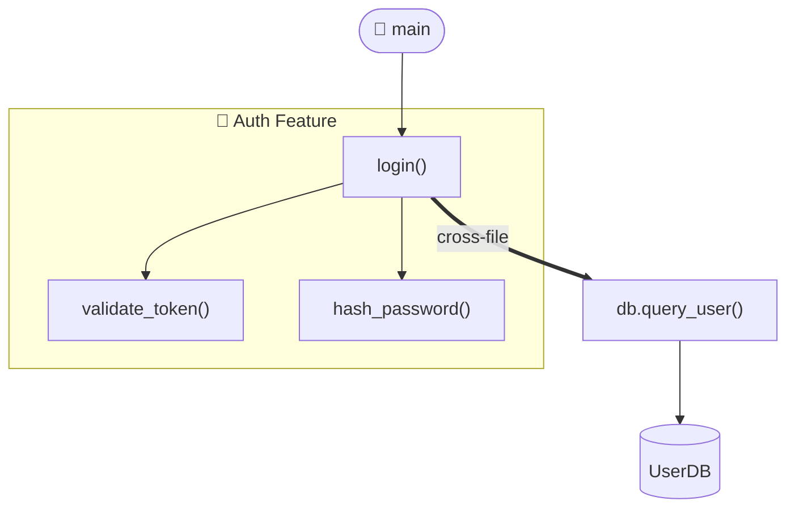

# Code Graph Skill

Generates Mermaid diagrams that visualize codebase structure — call graphs, dependency trees, feature flows — from entry point down to individual features.

## Two Core Modes

### 1. Full Codebase Graph
Traces from all entry point(s) outward, showing all modules/functions/classes and their relationships.

### 2. Feature / Sub-graph
Focuses on a specific function, class, module, or feature and shows only its call tree and dependencies.

---

## Workflow

### Step 1: Understand the Input

The user may provide:
- **Uploaded files** — read from `/mnt/user-data/uploads/`
- **Pasted code** — already in context
- **A directory path** — scan with bash tools

If files are uploaded but not yet read, check `/mnt/user-data/uploads/` first.

Clarify if unclear:
- Entry point file? (e.g., `main.py`, `index.js`) — or auto-detect
- Full graph or specific feature name?
- Depth limit? (default: 5 hops from entry)
- Which language(s)?

### Step 2: Parse the Code Using the Extraction Script

**Always use `scripts/extract_graph.py` for directory-based codebases.** This handles cross-file call resolution, entry point detection, depth limiting, and feature scoping automatically.

```bash
# Full codebase graph (auto-detect entry)
python scripts/extract_graph.py <directory> --depth 5

# Explicit entry point
python scripts/extract_graph.py <directory> --entry main.py --depth 5

# Feature sub-graph
python scripts/extract_graph.py <directory> --feature auth --depth 3

# Shallow overview (module-level only)
python scripts/extract_graph.py <directory> --depth 1
```

The script outputs JSON:
```json
{
  "nodes": [{ "id": "...", "label": "...", "type": "entrypoint|module|func|class|external", "file": "..." }],
  "edges": [{ "from": "...", "to": "...", "label": "calls|imports|inherits", "cross_file": true }],
  "entry_points": ["..."],
  "warnings": ["..."],
  "stats": { "total_files": 12, "total_nodes": 47, "total_edges": 63 }
}
```

For **pasted/uploaded code snippets** (not a directory), parse manually using the strategies in `references/parsers.md`.

**Cross-file calls**: The script resolves these automatically — when `login()` in `auth.py` calls `query_user()` in `db.py`, the edge is marked `cross_file: true` and rendered as a bold edge in the diagram.

### Step 3: Handle Multiple Entry Points (Monorepos / Frameworks)

When the script detects multiple entry points, treat each as a root and generate:
1. One **unified overview graph** showing all entry points and their downstream modules
2. One **per-entry-point sub-graph** if the user wants drill-down detail

**Common multi-entry patterns:**

| Project Type | Entry Points | Strategy |
|---|---|---|
| Next.js | Every file in `pages/` | Group pages into a `[Pages]` cluster node; graph routes → components |
| Django | Each app's `views.py` + `urls.py` | One sub-graph per Django app |
| Microservices | Each `main.go` / `index.js` per service | One overview graph per service |
| React | `<App>` component tree | Component hierarchy graph |
| Spring Boot | Each `@RestController` | One sub-graph per controller |

### Step 4: Apply Depth Control

Always respect the `--depth` flag. Default is **5 hops**. Advise the user:

| Depth | Best For |
|---|---|
| 1 | Module/file-level overview only |
| 2–3 | Feature sub-graphs, focused areas |
| 4–5 | Full codebase with reasonable detail |
| 6+ | Only on user request; warn about large graphs |

If the graph exceeds **50 nodes** after depth limiting, automatically fall back to depth-1 (module-level) and tell the user:
> "The full graph has X nodes — showing module-level overview. Use `--feature <n>` or `--depth 3` to drill in."

### Step 5: Build and Render the Mermaid Diagram

Use `flowchart TD` for call graphs. Use `flowchart LR` for flat import/dependency graphs.

#### Node Styling

```
classDef entry    fill:#4f46e5,color:#fff,stroke:#3730a3
classDef module   fill:#0ea5e9,color:#fff,stroke:#0284c7
classDef func     fill:#10b981,color:#fff,stroke:#059669
classDef class_   fill:#f59e0b,color:#fff,stroke:#d97706
classDef external fill:#6b7280,color:#fff,stroke:#4b5563,stroke-dasharray:5 3
classDef async_   fill:#8b5cf6,color:#fff,stroke:#7c3aed
```

Node shapes:
- Entry point: `A([🚀 main.py]):::entry`
- Module/file: `A[auth_module]:::module`
- Function: `A["login()"]:::func`
- Class: `A["UserService"]:::class_`
- External/DB: `A[(PostgreSQL)]:::external` or `A>requests]:::external`

Edge types:
```
A -->|calls| B          # normal call
A ==>|cross-file| B     # cross-file call (bold)
A -.->|imports| B       # import / dependency
A ==>|inherits| B       # class inheritance
A -.->|async| B         # async/event call
```

#### Feature Sub-graph with Subgraph Block



### Step 6: Save Graphs to ./docs/graphs/

**Always** save every generated graph. Never silently overwrite — check first.

```bash
mkdir -p ./docs/graphs
```

**File naming:**
- Full overview: `./docs/graphs/overview.md`
- Feature sub-graph: `./docs/graphs/<feature-name>.md`
- Entry-point graph: `./docs/graphs/<entry-filename>.md`

**Before writing, check if file exists:**
```bash
[ -f ./docs/graphs/<name>.md ] && echo "EXISTS" || echo "NEW"
```
- If **NEW**: write directly.
- If **EXISTS**: tell the user: *"`./docs/graphs/<name>.md` already exists — overwrite or save as `<name>-<timestamp>.md`?"* then follow their choice.

**File format:**
````markdown
# Graph: <Title>
_Generated: <YYYY-MM-DD>_
_Entry: <entry file(s)>_
_Depth: <n>_


````

After saving, confirm: *"Saved to `./docs/graphs/<filename>.md`"*

### Step 7: Update the Graph Index

After every run, update `./docs/graphs/README.md` with a table of all saved graphs:

```markdown
# Code Graphs Index
_Last updated: <date>_

| Graph | Description | Entry Point | Depth | Generated |
|---|---|---|---|---|
| [overview](./overview.md) | Full codebase | main.py | 5 | 2024-01-15 |
| [auth](./auth.md) | Auth feature | auth.py | 3 | 2024-01-15 |
```

Create it if it doesn't exist. Append new rows; update existing rows matched by filename.

---

## Multiple Graphs in One Response

For complex codebases, generate in this order:
1. **Overview graph** — module-level, all entry points
2. **Per-feature graphs** — one per major feature (auth, db, API, etc.)

Each with a heading and one-sentence explanation. Save each separately and update the index.

---

## Handling Large Codebases

If more than ~20 files or ~100 functions:
1. Run script at `--depth 1` for module-level overview first
2. Render and save that
3. Ask: *"Which module or feature would you like to drill into?"*
4. Rerun with `--feature <n> --depth 3`

---

## Edge Cases

- **Circular dependencies**: `A -->|↩ circular| A` or `A <--> B` with a warning comment
- **Dynamic calls** (`eval`, reflection, `__getattr__`): dashed edge with `?` label
- **Async/await**: `-.->|async|` dashed edges, `:::async_` node style
- **Unknown entry point**: Ask the user, or default to file with most outgoing edges
- **Minified/transpiled code**: Note limitation, parse source if available
- **No files found**: Confirm directory path and language extensions

---

## Reference Files

- `references/parsers.md` — Manual parsing strategies per language (for snippets/uploads)
- `references/mermaid-patterns.md` — Advanced Mermaid patterns: subgraphs, async, circular deps, layered arch
- `scripts/extract_graph.py` — Automated multi-language static analysis script
