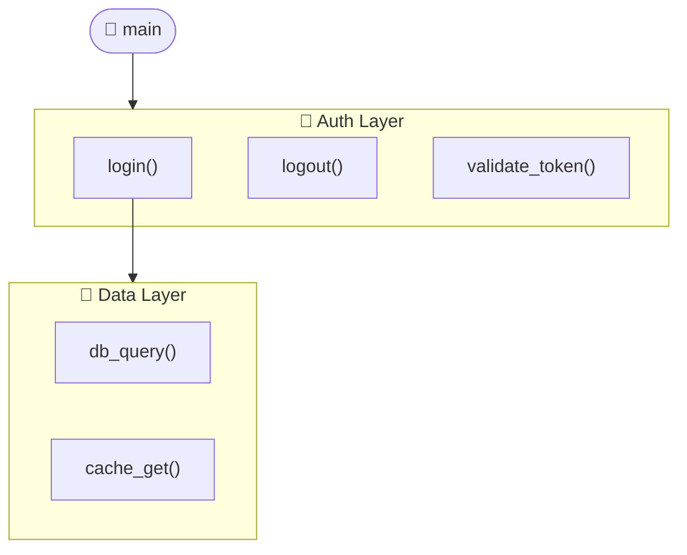
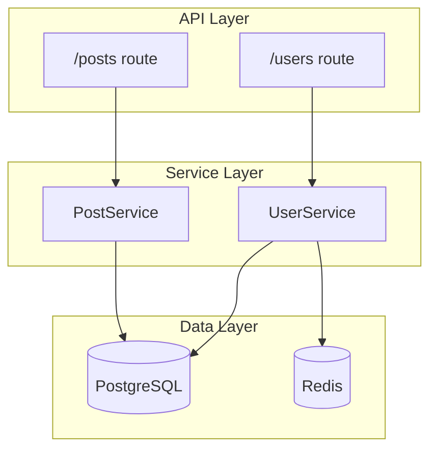
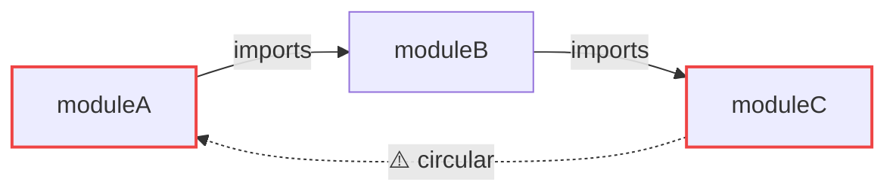
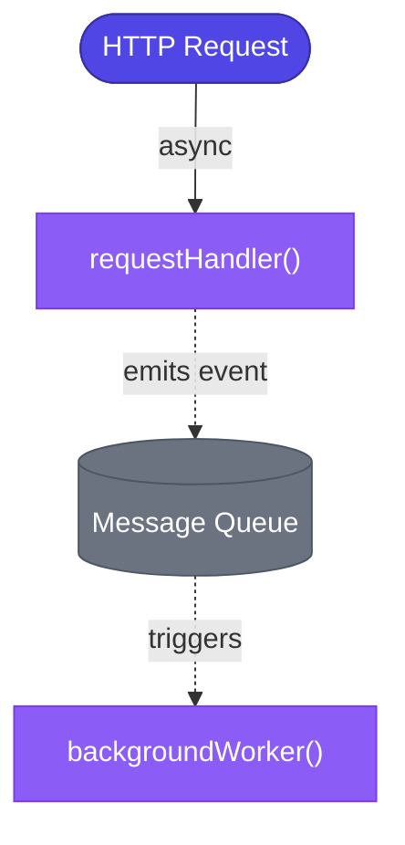
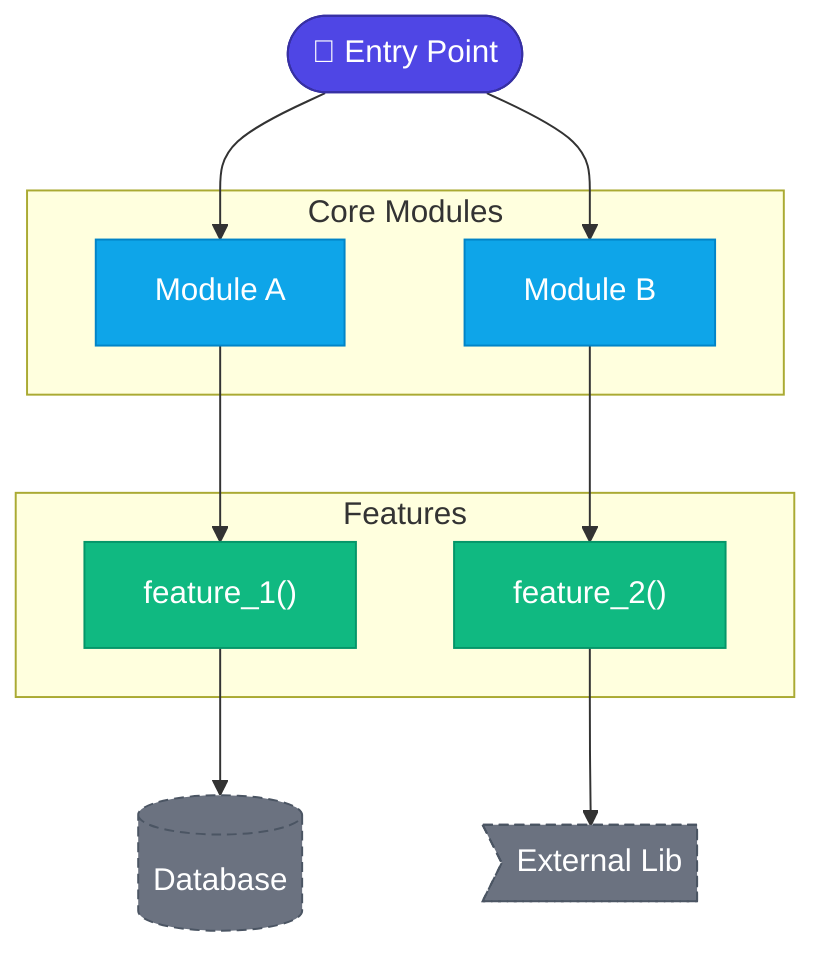
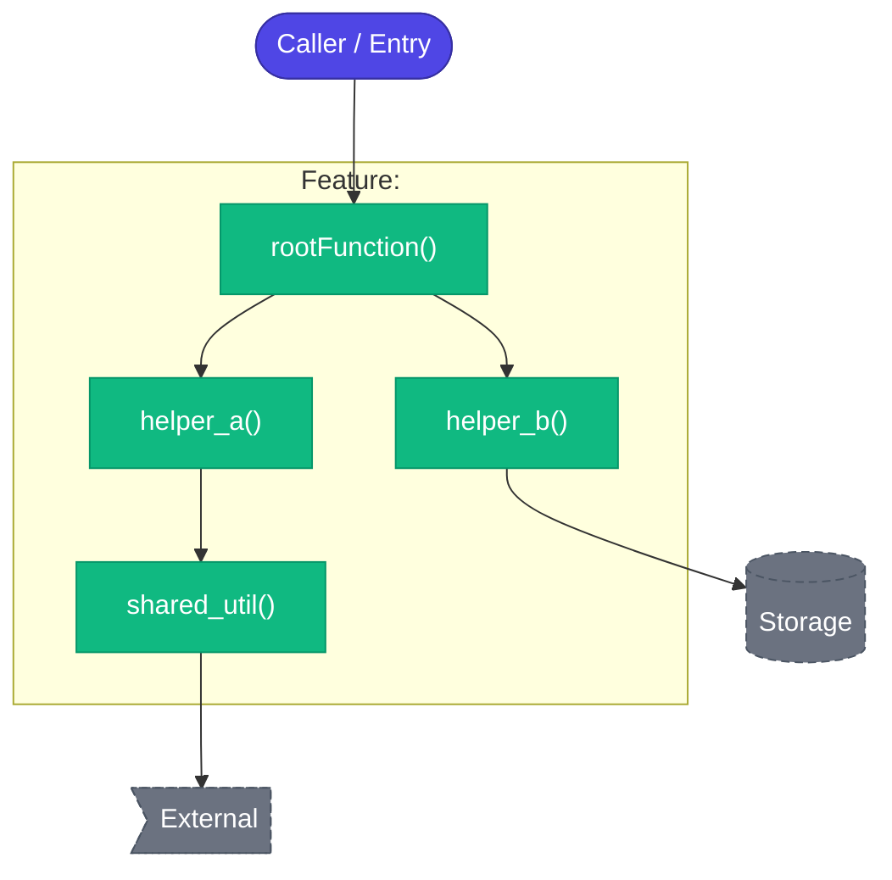

# Advanced Mermaid Patterns for Code Graphs

## Node Shape Reference

| Shape | Mermaid Syntax | Best For |
|---|---|---|
| Rectangle | `A[label]` | Modules, files |
| Rounded rect | `A(label)` | Functions, methods |
| Stadium/pill | `A([label])` | Entry points |
| Cylinder | `A[(label)]` | Databases, storage |
| Diamond | `A{label}` | Conditionals, branches |
| Parallelogram | `A[/label/]` | I/O, data |
| Flag | `A>label]` | External libs/services |
| Hexagon | `A{{label}}` | Config, constants |
| Circle | `A((label))` | Events |

## Color Schemes (classDef)

### Standard Code Graph Palette
```
classDef entry     fill:#4f46e5,color:#fff,stroke:#3730a3
classDef module    fill:#0ea5e9,color:#fff,stroke:#0284c7
classDef func      fill:#10b981,color:#fff,stroke:#059669
classDef class_    fill:#f59e0b,color:#fff,stroke:#d97706
classDef external  fill:#6b7280,color:#fff,stroke:#4b5563,stroke-dasharray:5 3
classDef error     fill:#ef4444,color:#fff,stroke:#dc2626
classDef async_    fill:#8b5cf6,color:#fff,stroke:#7c3aed
```

### Dark-friendly variant
```
classDef entry     fill:#6d28d9,color:#fff,stroke:#5b21b6
classDef module    fill:#1d4ed8,color:#fff,stroke:#1e40af
classDef func      fill:#065f46,color:#fff,stroke:#064e3b
classDef external  fill:#374151,color:#9ca3af,stroke:#4b5563,stroke-dasharray:4
```

## Subgraph Patterns

### Feature grouping


### Layer architecture


## Edge Label Patterns

```
A -->|calls| B           # solid arrow with label
A -.->|imports| B        # dashed (weak/optional dependency)
A ==>|inherits| B        # thick arrow (strong relationship)
A --o B                  # circle end (aggregation)
A --x B                  # cross end (blocked/excluded)
A <-->|bidirectional| B  # two-way
```

## Handling Scale

### For 30–60 nodes: Use subgraphs to reduce visual noise
Group low-level utilities under a single collapsed node, then offer a drill-down graph.

### For 60+ nodes: Two-tier approach
**Tier 1** — Module graph (1 node per file/package)
**Tier 2** — Function graph per module (generated on demand)

Example transition message:
> "Here's the high-level module map. Which module would you like to drill into?"

## Circular Dependency Display



## Async / Event-Driven Patterns



## Quick Template: Full Codebase Graph



## Quick Template: Feature Sub-graph


