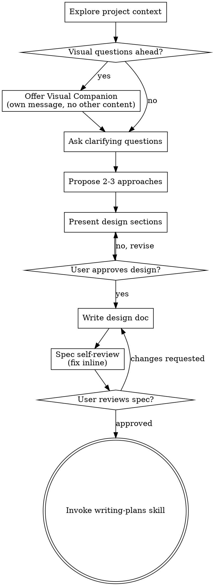

# Claude Conversation Log

Session ID: 9c5de000-45dd-478d-a583-3a9b876dabde
Date: 2026-04-14 18:03:10

---

## 👤 User

<ide_selection>The user selected the lines 5 to 5 from /home/manav1011/Documents/ticket-shicket-be/CLAUDE.md:
python3 -c "from graphify.watch import _rebuild_code; from pathlib import Path; _rebuild_code(Path('.'))"

This may or may not be related to the current task.</ide_selection>
Go ahead read this doc- /home/manav1011/Documents/ticket-shicket-be/docs/GPTDiscussions/conversation-apr-13.md

also read it's references as well and and according to the first part of this i've already setup the models and all

as per this plan which you've already reviewed - /home/manav1011/Documents/ticket-shicket-be/docs/superpowers/plans/2026-04-14-allocation-models-and-migrations.md

please quickly go through it then we can move on to the next phase

---

## 🤖 Claude

Let me verify the current state by checking what was actually committed.


---

## 🤖 Claude

Good - the plan was fully implemented across these commits. Let me quickly verify the current state of the key files.


---

## 🤖 Claude

Migrations show as not applied. Let me check if the database is running.


---

## 🤖 Claude

The models are all set up correctly. The migrations exist but haven't been applied yet. Let me apply them quickly.


---

## 🤖 Claude

All tables exist - migrations are applied. The project uses a `migrations` table instead of `alembic_version`.


---

## 🤖 Claude

**Phase 1 (Models & Migrations) is complete.** Here's the verification summary:

### Completed ✅
- `ticket_holders` table with proper FK constraints and CHECK constraint
- `allocations`, `allocation_tickets`, `allocation_edges` tables
- `orders` table for the payment layer
- `tickets` migrated: `owner_user_id` → `owner_holder_id`, generic lock fields (`lock_reference_type`, `lock_reference_id`)
- `AllocationStatus` enum with `pending → processing → completed / failed` states
- Repository, Service, and Exceptions for allocation module

### Current DB State
```
ticket_holders ✅
allocations ✅
allocation_tickets ✅
allocation_edges ✅
orders ✅
tickets (updated schema) ✅
```

### What's Next?

Based on the architecture doc, the next logical phase would be **implementing the allocation operations/API layer**, which includes:

1. **Lock acquisition** — `acquire_ticket_locks()` with FIFO selection
2. **Atomic allocation flow** — the full purchase/transfer transaction
3. **Ticket journey queries** — `get_ticket_journey()`, `get_allocation_tree()`
4. **API endpoints** — B2B allocation, user-to-user transfer, refund flows

Would you like to proceed with that? Or is there a specific piece you want to tackle first?

---

## 👤 User

<ide_opened_file>The user opened the file /home/manav1011/Documents/ticket-shicket-be/src/apps/allocation/service.py in the IDE. This may or may not be related to the current task.</ide_opened_file>
Okk now are we ready for the 2nd phase of this which is for organizer to be get b2b tickets from our system and our system allocates it so is our system ready for it and what will be the algorithm to do it?

---

## 🤖 Claude

Let me quickly review the current service/repository to assess readiness for B2B allocation.


---

## 🤖 Claude


Let me also check the ticketing repository for ticket selection/locking and the ticketing models.


---

## 🤖 Claude

Good. Now I have the full picture. Let me give you a clear readiness assessment:

---

## System Readiness for B2B Allocation

### What's Built ✅
- `TicketHolderModel`, `AllocationModel`, `AllocationTicketModel`, `AllocationEdgeModel`, `OrderModel`
- `AllocationRepository` — holder lookups, allocation CRUD, edge upsert
- `AllocationService` — holder resolution/validation
- `TicketingRepository` — `bulk_create_tickets` (sets `owner_holder_id=None` for pool)
- Status machine: `pending → processing → completed / failed`

### What's Missing for B2B ❌

| Capability | Status | Location |
|---|---|---|
| Lock acquisition with FIFO ticket selection | ❌ | Needs new `acquire_ticket_locks()` |
| Atomic B2B allocation flow | ❌ | Needs new `allocate_b2b()` in service |
| Availability check (`can_allocate`) | ❌ | Needs new `get_available_ticket_count()` |
| Ticket selection by type/day (FIFO) | ❌ | Needs new `select_tickets_fifo()` |
| Order creation (every allocation needs one) | ⚠️ | `OrderModel` exists but no creation method |

---

## B2B Allocation Algorithm

```
B2B Flow (organizer buys N tickets from pool):

Input:  event_id, ticket_type_id, event_day_id, to_holder_id, quantity
Source: from_holder_id = NULL  (pool = system)

Step 1: Validate recipient holder is active
Step 2: Check availability — COUNT unallocated pool tickets for (event_day_id, ticket_type_id)
        If available < quantity → raise InsufficientTicketsError
Step 3: Create Order (type=PURCHASE or TRANSFER, amount=0 for B2B)
Step 4: Select + Lock tickets (FIFO — lowest ticket_index first)
        → UPDATE tickets SET lock_reference_type='order', lock_reference_id=order_id
          WHERE id IN (
              SELECT id FROM tickets
              WHERE event_day_id=? AND ticket_type_id=? AND owner_holder_id IS NULL
              AND lock_reference_id IS NULL AND status='active'
              ORDER BY ticket_index ASC LIMIT quantity
          )
          RETURNING id
        If locked_count < quantity → rollback, raise lock error
Step 5: Create Allocation (status=processing)
Step 6: Insert allocation_tickets junction records
Step 7: Update ticket ownership (owner_holder_id = to_holder_id), clear locks
Step 8: Upsert allocation_edges (+ticket_count for pool→holder edge)
Step 9: Transition allocation to completed
```

**Key properties:**
- **FIFO** — `ORDER BY ticket_index ASC LIMIT quantity` ensures deterministic allocation
- **Atomic** — all steps in one transaction (rollback on any failure)
- **Lock prevents overselling** — only tickets with `lock_reference_id IS NULL` can be selected

---

## What's Needed to Implement

1. **`select_tickets_fifo(event_day_id, ticket_type_id, quantity, order_id)`** — subquery-based ticket selection + lock in one UPDATE
2. **`get_available_count(event_day_id, ticket_type_id)`** — availability check
3. **`allocate_b2b(...)`** — orchestrates the full flow
4. **`create_order(...)`** — create the required order for every allocation

Want me to implement this? I can write the full B2B allocation service with the FIFO lock acquisition and atomic transaction.

---

## 👤 User

<ide_selection>The user selected the lines 62 to 62 from /home/manav1011/Documents/ticket-shicket-be/src/apps/ticketing/models.py:
owner_holder_id

This may or may not be related to the current task.</ide_selection>
so first my plan is to create super admin account this superadmin account will have some tasks like 

Okk so first hear me out what plan we have for this so when organizer wants b2b tickets he creates a request which has the all the information about the event also the quantity now this request goes to a b2b request table we can name this table somethign appropriate now when this request comes to the superadmin he can assign if we should directly assign the tickets free or we attach a payment gateway in here so if it's a free an allocation is created with order as transfer and if he selects paid the superadmin sets an amount and a paid pending order will be created and sent to organizer now when organzier pays using our payment gateway and the order is succsessful the allocation is created now in this allocation  from holder id will be the superadmin and the to holder id will be that of the organizer also the owner of the tickets owner holder id will be that of the organizer


so what do you think about this approach? or do you have some suggestiosn in it?

---

## 🤖 Claude

This is a solid workflow design. A few thoughts and clarifications before we finalize:


---

## 👤 User

Base directory for this skill: /home/manav1011/.claude/plugins/cache/claude-plugins-official/superpowers/5.0.7/skills/brainstorming

# Brainstorming Ideas Into Designs

Help turn ideas into fully formed designs and specs through natural collaborative dialogue.

Start by understanding the current project context, then ask questions one at a time to refine the idea. Once you understand what you're building, present the design and get user approval.

<HARD-GATE>
Do NOT invoke any implementation skill, write any code, scaffold any project, or take any implementation action until you have presented a design and the user has approved it. This applies to EVERY project regardless of perceived simplicity.
</HARD-GATE>

## Anti-Pattern: "This Is Too Simple To Need A Design"

Every project goes through this process. A todo list, a single-function utility, a config change — all of them. "Simple" projects are where unexamined assumptions cause the most wasted work. The design can be short (a few sentences for truly simple projects), but you MUST present it and get approval.

## Checklist

You MUST create a task for each of these items and complete them in order:

1. **Explore project context** — check files, docs, recent commits
2. **Offer visual companion** (if topic will involve visual questions) — this is its own message, not combined with a clarifying question. See the Visual Companion section below.
3. **Ask clarifying questions** — one at a time, understand purpose/constraints/success criteria
4. **Propose 2-3 approaches** — with trade-offs and your recommendation
5. **Present design** — in sections scaled to their complexity, get user approval after each section
6. **Write design doc** — save to `docs/superpowers/specs/YYYY-MM-DD-<topic>-design.md` and commit
7. **Spec self-review** — quick inline check for placeholders, contradictions, ambiguity, scope (see below)
8. **User reviews written spec** — ask user to review the spec file before proceeding
9. **Transition to implementation** — invoke writing-plans skill to create implementation plan

## Process Flow



**The terminal state is invoking writing-plans.** Do NOT invoke frontend-design, mcp-builder, or any other implementation skill. The ONLY skill you invoke after brainstorming is writing-plans.

## The Process

**Understanding the idea:**

- Check out the current project state first (files, docs, recent commits)
- Before asking detailed questions, assess scope: if the request describes multiple independent subsystems (e.g., "build a platform with chat, file storage, billing, and analytics"), flag this immediately. Don't spend questions refining details of a project that needs to be decomposed first.
- If the project is too large for a single spec, help the user decompose into sub-projects: what are the independent pieces, how do they relate, what order should they be built? Then brainstorm the first sub-project through the normal design flow. Each sub-project gets its own spec → plan → implementation cycle.
- For appropriately-scoped projects, ask questions one at a time to refine the idea
- Prefer multiple choice questions when possible, but open-ended is fine too
- Only one question per message - if a topic needs more exploration, break it into multiple questions
- Focus on understanding: purpose, constraints, success criteria

**Exploring approaches:**

- Propose 2-3 different approaches with trade-offs
- Present options conversationally with your recommendation and reasoning
- Lead with your recommended option and explain why

**Presenting the design:**

- Once you believe you understand what you're building, present the design
- Scale each section to its complexity: a few sentences if straightforward, up to 200-300 words if nuanced
- Ask after each section whether it looks right so far
- Cover: architecture, components, data flow, error handling, testing
- Be ready to go back and clarify if something doesn't make sense

**Design for isolation and clarity:**

- Break the system into smaller units that each have one clear purpose, communicate through well-defined interfaces, and can be understood and tested independently
- For each unit, you should be able to answer: what does it do, how do you use it, and what does it depend on?
- Can someone understand what a unit does without reading its internals? Can you change the internals without breaking consumers? If not, the boundaries need work.
- Smaller, well-bounded units are also easier for you to work with - you reason better about code you can hold in context at once, and your edits are more reliable when files are focused. When a file grows large, that's often a signal that it's doing too much.

**Working in existing codebases:**

- Explore the current structure before proposing changes. Follow existing patterns.
- Where existing code has problems that affect the work (e.g., a file that's grown too large, unclear boundaries, tangled responsibilities), include targeted improvements as part of the design - the way a good developer improves code they're working in.
- Don't propose unrelated refactoring. Stay focused on what serves the current goal.

## After the Design

**Documentation:**

- Write the validated design (spec) to `docs/superpowers/specs/YYYY-MM-DD-<topic>-design.md`
  - (User preferences for spec location override this default)
- Use elements-of-style:writing-clearly-and-concisely skill if available
- Commit the design document to git

**Spec Self-Review:**
After writing the spec document, look at it with fresh eyes:

1. **Placeholder scan:** Any "TBD", "TODO", incomplete sections, or vague requirements? Fix them.
2. **Internal consistency:** Do any sections contradict each other? Does the architecture match the feature descriptions?
3. **Scope check:** Is this focused enough for a single implementation plan, or does it need decomposition?
4. **Ambiguity check:** Could any requirement be interpreted two different ways? If so, pick one and make it explicit.

Fix any issues inline. No need to re-review — just fix and move on.

**User Review Gate:**
After the spec review loop passes, ask the user to review the written spec before proceeding:

> "Spec written and committed to `<path>`. Please review it and let me know if you want to make any changes before we start writing out the implementation plan."

Wait for the user's response. If they request changes, make them and re-run the spec review loop. Only proceed once the user approves.

**Implementation:**

- Invoke the writing-plans skill to create a detailed implementation plan
- Do NOT invoke any other skill. writing-plans is the next step.

## Key Principles

- **One question at a time** - Don't overwhelm with multiple questions
- **Multiple choice preferred** - Easier to answer than open-ended when possible
- **YAGNI ruthlessly** - Remove unnecessary features from all designs
- **Explore alternatives** - Always propose 2-3 approaches before settling
- **Incremental validation** - Present design, get approval before moving on
- **Be flexible** - Go back and clarify when something doesn't make sense

## Visual Companion

A browser-based companion for showing mockups, diagrams, and visual options during brainstorming. Available as a tool — not a mode. Accepting the companion means it's available for questions that benefit from visual treatment; it does NOT mean every question goes through the browser.

**Offering the companion:** When you anticipate that upcoming questions will involve visual content (mockups, layouts, diagrams), offer it once for consent:
> "Some of what we're working on might be easier to explain if I can show it to you in a web browser. I can put together mockups, diagrams, comparisons, and other visuals as we go. This feature is still new and can be token-intensive. Want to try it? (Requires opening a local URL)"

**This offer MUST be its own message.** Do not combine it with clarifying questions, context summaries, or any other content. The message should contain ONLY the offer above and nothing else. Wait for the user's response before continuing. If they decline, proceed with text-only brainstorming.

**Per-question decision:** Even after the user accepts, decide FOR EACH QUESTION whether to use the browser or the terminal. The test: **would the user understand this better by seeing it than reading it?**

- **Use the browser** for content that IS visual — mockups, wireframes, layout comparisons, architecture diagrams, side-by-side visual designs
- **Use the terminal** for content that is text — requirements questions, conceptual choices, tradeoff lists, A/B/C/D text options, scope decisions

A question about a UI topic is not automatically a visual question. "What does personality mean in this context?" is a conceptual question — use the terminal. "Which wizard layout works better?" is a visual question — use the browser.

If they agree to the companion, read the detailed guide before proceeding:
`skills/brainstorming/visual-companion.md`


---

## 🤖 Claude

Good idea to walk through this before building. Your flow is well-thought-out. Let me understand the starting point first.

**One question at a time:**

When an organizer wants B2B tickets — does the organizer *initiate* the request (they say "I want 50 tickets for event X"), and then the super admin *approves/fulfills* it? Or does the super admin *initiate* by creating a quote and sending it to the organizer?

In other words, who is the B2B request *owned by* at creation time — the organizer (pull model) or the super admin (push model)?

---

## 👤 User

<ide_selection>The user selected the lines 1 to 1 from /home/manav1011/Documents/ticket-shicket-be/src/apps/user/models.py:
a

This may or may not be related to the current task.</ide_selection>
the organzier initiate the reqeust now first we have to thikn about how we would build this request model we can name it b2b request model or somethign like that also we can create a super admin app in there so first we have to focus on making this Super admin app in which there will be methods to create super admin user so we can make a model named SuparAdminModel which have a foreign key to user so so new superadmin can be adde d in there also we can add the b2b request model in this app only so can you make a proper plan to make this supar admin app and required models with required methods to create super admin also make APIs to access the b2b request and process it and all for now we don't have payment gateway so you canjust find a way to mock that first tell me if you understand it or not or do you have some suggestions or is it fine

---

## 🤖 Claude

I understand the overall direction. A few quick thoughts before I ask my question:

**Suggestions so far:**
1. The `SuperAdminModel` with a FK to `User` makes sense — allows multiple super admins, each tied to a user account
2. Putting `B2BRequestModel` in the same app keeps related admin concerns together
3. Mocking payment for now is the right call — keeps focus on the allocation logic first

**One thing I want to clarify:**

Before I draft the plan — regarding the `B2BRequestModel`, should it also store the *result* of processing (approved/rejected, allocation ID created, order ID, etc.)? i.e., is it just a request queue, or does it also serve as a fulfillment record?

In other words, once a super admin processes a B2B request, does the `B2BRequestModel` row get updated with the outcome (allocation ID, order status, etc.), or does the request just stay as a historical record and the real source of truth is the `AllocationModel` + `OrderModel` that were created?

---

## 👤 User

I think it would be good to also store the required metadata in the B2BRequestModel  /writing-plans use this skill to write a proper plan also read the CLAUDE.md file

---

## 👤 User

Base directory for this skill: /home/manav1011/.claude/plugins/cache/claude-plugins-official/superpowers/5.0.7/skills/writing-plans

# Writing Plans

## Overview

Write comprehensive implementation plans assuming the engineer has zero context for our codebase and questionable taste. Document everything they need to know: which files to touch for each task, code, testing, docs they might need to check, how to test it. Give them the whole plan as bite-sized tasks. DRY. YAGNI. TDD. Frequent commits.

Assume they are a skilled developer, but know almost nothing about our toolset or problem domain. Assume they don't know good test design very well.

**Announce at start:** "I'm using the writing-plans skill to create the implementation plan."

**Context:** This should be run in a dedicated worktree (created by brainstorming skill).

**Save plans to:** `docs/superpowers/plans/YYYY-MM-DD-<feature-name>.md`
- (User preferences for plan location override this default)

## Scope Check

If the spec covers multiple independent subsystems, it should have been broken into sub-project specs during brainstorming. If it wasn't, suggest breaking this into separate plans — one per subsystem. Each plan should produce working, testable software on its own.

## File Structure

Before defining tasks, map out which files will be created or modified and what each one is responsible for. This is where decomposition decisions get locked in.

- Design units with clear boundaries and well-defined interfaces. Each file should have one clear responsibility.
- You reason best about code you can hold in context at once, and your edits are more reliable when files are focused. Prefer smaller, focused files over large ones that do too much.
- Files that change together should live together. Split by responsibility, not by technical layer.
- In existing codebases, follow established patterns. If the codebase uses large files, don't unilaterally restructure - but if a file you're modifying has grown unwieldy, including a split in the plan is reasonable.

This structure informs the task decomposition. Each task should produce self-contained changes that make sense independently.

## Bite-Sized Task Granularity

**Each step is one action (2-5 minutes):**
- "Write the failing test" - step
- "Run it to make sure it fails" - step
- "Implement the minimal code to make the test pass" - step
- "Run the tests and make sure they pass" - step
- "Commit" - step

## Plan Document Header

**Every plan MUST start with this header:**

```markdown
# [Feature Name] Implementation Plan

> **For agentic workers:** REQUIRED SUB-SKILL: Use superpowers:subagent-driven-development (recommended) or superpowers:executing-plans to implement this plan task-by-task. Steps use checkbox (`- [ ]`) syntax for tracking.

**Goal:** [One sentence describing what this builds]

**Architecture:** [2-3 sentences about approach]

**Tech Stack:** [Key technologies/libraries]

---
```

## Task Structure

````markdown
### Task N: [Component Name]

**Files:**
- Create: `exact/path/to/file.py`
- Modify: `exact/path/to/existing.py:123-145`
- Test: `tests/exact/path/to/test.py`

- [ ] **Step 1: Write the failing test**

```python
def test_specific_behavior():
    result = function(input)
    assert result == expected
```

- [ ] **Step 2: Run test to verify it fails**

Run: `pytest tests/path/test.py::test_name -v`
Expected: FAIL with "function not defined"

- [ ] **Step 3: Write minimal implementation**

```python
def function(input):
    return expected
```

- [ ] **Step 4: Run test to verify it passes**

Run: `pytest tests/path/test.py::test_name -v`
Expected: PASS

- [ ] **Step 5: Commit**

```bash
git add tests/path/test.py src/path/file.py
git commit -m "feat: add specific feature"
```
````

## No Placeholders

Every step must contain the actual content an engineer needs. These are **plan failures** — never write them:
- "TBD", "TODO", "implement later", "fill in details"
- "Add appropriate error handling" / "add validation" / "handle edge cases"
- "Write tests for the above" (without actual test code)
- "Similar to Task N" (repeat the code — the engineer may be reading tasks out of order)
- Steps that describe what to do without showing how (code blocks required for code steps)
- References to types, functions, or methods not defined in any task

## Remember
- Exact file paths always
- Complete code in every step — if a step changes code, show the code
- Exact commands with expected output
- DRY, YAGNI, TDD, frequent commits

## Self-Review

After writing the complete plan, look at the spec with fresh eyes and check the plan against it. This is a checklist you run yourself — not a subagent dispatch.

**1. Spec coverage:** Skim each section/requirement in the spec. Can you point to a task that implements it? List any gaps.

**2. Placeholder scan:** Search your plan for red flags — any of the patterns from the "No Placeholders" section above. Fix them.

**3. Type consistency:** Do the types, method signatures, and property names you used in later tasks match what you defined in earlier tasks? A function called `clearLayers()` in Task 3 but `clearFullLayers()` in Task 7 is a bug.

If you find issues, fix them inline. No need to re-review — just fix and move on. If you find a spec requirement with no task, add the task.

## Execution Handoff

After saving the plan, offer execution choice:

**"Plan complete and saved to `docs/superpowers/plans/<filename>.md`. Two execution options:**

**1. Subagent-Driven (recommended)** - I dispatch a fresh subagent per task, review between tasks, fast iteration

**2. Inline Execution** - Execute tasks in this session using executing-plans, batch execution with checkpoints

**Which approach?"**

**If Subagent-Driven chosen:**
- **REQUIRED SUB-SKILL:** Use superpowers:subagent-driven-development
- Fresh subagent per task + two-stage review

**If Inline Execution chosen:**
- **REQUIRED SUB-SKILL:** Use superpowers:executing-plans
- Batch execution with checkpoints for review


---

## 🤖 Claude

Let me first read the CLAUDE.md and explore the existing project structure before writing the plan.


---

## 🤖 Claude

Now I have enough context. Let me write the plan.


---

## 🤖 Claude

Let me self-review the plan and fix a few ordering/import issues I spotted.


---

## 🤖 Claude

Plan complete and saved to [docs/superpowers/plans/2026-04-15-superadmin-and-b2b-requests.md](docs/superpowers/plans/2026-04-15-superadmin-and-b2b-requests.md).

Quick summary of what it covers:

- **Task 1** — Scaffold `superadmin` app with `SuperAdminModel` + `B2BRequestModel`
- **Task 2** — Register models in registry + add router to server
- **Task 3** — `get_current_super_admin` auth dependency (returns 403 if not a super admin)
- **Task 4** — Repository for both models
- **Task 5** — Service with the full B2B flow: `approve_b2b_request_free` (atomic allocation + $0 transfer order), `approve_b2b_request_paid` (pending order, allocation after payment), `reject_b2b_request`
- **Task 6** — API routes (organizer creates request, super admin reviews/approves/rejects)
- **Task 7** — Migrations
- **Task 8** — `process_paid_b2b_allocation` for the mock payment callback
- **Task 9** — CLI command to create a super admin
- **Task 10** — Fix `organizer_id` in request body

**Two execution options:**

**1. Subagent-Driven (recommended)** — I dispatch a fresh subagent per task, review between tasks, fast iteration

**2. Inline Execution** — Execute tasks in this session using executing-plans, batch execution with checkpoints

Which approach?

---

## 👤 User

<ide_opened_file>The user opened the file /home/manav1011/Documents/ticket-shicket-be/src/auth/dependencies.py in the IDE. This may or may not be related to the current task.</ide_opened_file>
Few suggestiosn 

1 - we have the /src/auth//dependency.py file we can create the get super admin dependency there 
2 - we can add the depedency at router level not needing to add at each route
3 - also create b2b request is a task of a organizer why have you added it in the superadmin routes we can create this request as next phase when we go into oraganizer sides it's not needed int he superadmin urls

also the payment will also be done by organizer so why did you make that route depend on superadmin only? 


have you understand you mistakes what i'm taking about?

---

## 🤖 Claude

Yes, I understand all four mistakes:

1. **`get_current_super_admin`** → goes in `src/auth/dependencies.py` with other auth dependencies, not in the superadmin app

2. **Router-level dependency** → add it once to the router, not per-route

3. **Create B2B request** → organizer action, should be in the **organizer app's urls.py**, not superadmin

4. **Mock payment / confirm-payment** → organizer action (organizer pays), should also be in the **organizer app's urls.py**, not superadmin

So the URL structure should actually be:

```
# Organizer app (authenticated as organizer user)
POST /api/organizers/{organizer_id}/b2b-requests              — organizer creates request
POST /api/organizers/{organizer_id}/b2b-requests/{id}/confirm-payment  — organizer confirms payment

# Super admin app (authenticated as super admin)
GET  /api/superadmin/b2b-requests                               — list all requests
GET  /api/superadmin/b2b-requests/pending                      — list pending
POST /api/superadmin/b2b-requests/{id}/approve-free             — approve free
POST /api/superadmin/b2b-requests/{id}/approve-paid             — approve paid (set amount)
POST /api/superadmin/b2b-requests/{id}/reject                   — reject
```

And `confirm-payment` on the organizer side should internally call `process_paid_b2b_allocation()` — which is a shared service method, not a superadmin-only one.

Let me rewrite the plan with these corrections.


---

## 🤖 Claude

Let me rewrite the plan with all corrections applied.


---

## 🤖 Claude

Plan rewritten with all corrections. Here's what changed from the first version:

**Fixes applied:**

| Issue | Old | Fixed |
|---|---|---|
| Auth dependency location | `superadmin/dependencies.py` | `src/auth/dependencies.py` |
| Auth application | Per-route `Depends()` | Router-level `dependencies=[...]` |
| Create B2B request | `superadmin/urls.py` | `organizer/urls.py` (organizer action) |
| Confirm payment | `superadmin/urls.py` | `organizer/urls.py` (organizer action) |
| Superadmin routes | Mixed with organizer actions | Only list/approve-free/approve-paid/reject |

**URL ownership now:**
```
# Organizer app (organizer actions)
POST /api/organizers/{id}/b2b-requests
GET  /api/organizers/{id}/b2b-requests
POST /api/organizers/{id}/b2b-requests/{id}/confirm-payment

# Super admin app (admin actions)
GET  /api/superadmin/b2b-requests
GET  /api/superadmin/b2b-requests/pending
GET  /api/superadmin/b2b-requests/{id}
POST /api/superadmin/b2b-requests/{id}/approve-free
POST /api/superadmin/b2b-requests/{id}/approve-paid
POST /api/superadmin/b2b-requests/{id}/reject
```

The `process_paid_b2b_allocation` method lives in `SuperAdminService` and is called from the organizer's confirm-payment endpoint — it's a shared service method, not a route.

Ready to execute when you are. Which approach — subagent-driven or inline?

---

## 👤 User

<ide_opened_file>The user opened the file /home/manav1011/Documents/ticket-shicket-be/docs/superpowers/plans/2026-04-15-superadmin-and-b2b-requests.md in the IDE. This may or may not be related to the current task.</ide_opened_file>
Have you self reviewed your plan?

---

## 🤖 Claude

Let me self-review the plan properly.


---

## 🤖 Claude

Yes — I found several issues during self-review:

**Issues found:**

1. **`metadata` vs `metadata_` mismatch** — `B2BRequestModel` uses `metadata_` (to avoid shadowing SQLAlchemy's `Base.metadata`), but `B2BRequestResponse` uses `metadata`. Pydantic won't serialize it correctly without an alias.

2. **Missing `list_b2b_requests_by_organizer` method** — `OrganizerService.get_my_b2b_requests()` calls `self._repo.list_b2b_requests_by_organizer(organizer_id)` but this method doesn't exist in `OrganizerRepository`.

3. **`ConfirmB2BPaymentBody` has unused `b2b_request_id`** — The endpoint takes `b2b_request_id` as a path parameter, so the body field is redundant.

4. **Migrations commit not tracked** — Task 8 has a commit but it's not in the plan header file map.

Let me fix these now.


---

## 🤖 Claude

Now fix the missing `list_b2b_requests_by_organizer` method. It needs to be added to `SuperAdminRepository` first, then wired through `OrganizerRepository`.


---

## 🤖 Claude

Now let me also verify the `OrganizerRepository.__init__` accepts a session parameter — the plan adds `self._super_admin_repo = SuperAdminRepository(session)` but I need to make sure the `__init__` actually takes `session`.


---

## 🤖 Claude

Good — `OrganizerRepository.__init__` takes `session`. Now fix the unused `user_id` parameter in `OrganizerService.get_my_b2b_requests`:


---

## 🤖 Claude

Update the URL route caller to match:


---

## 🤖 Claude

One more fix — Pydantic will serialize the field as `metadata_` unless we explicitly set an alias. Fix the response schema:


---

## 🤖 Claude

Let me quickly verify Pydantic version being used in this project:


---

## 🤖 Claude

`AllocationService` imports from local `.models`, so no conflict. Good.

However, I spotted one more issue: `SuperAdminService.__init__` sets `self._ticketing_repo = TicketingRepository(session)` but it's never used anywhere in the service. Dead code — remove it.


---

## 🤖 Claude

Also remove the unused `TicketingRepository` import:


---

## 🤖 Claude

Plan is now self-reviewed and cleaned. Here's a summary of what was fixed:

**Issues found and fixed:**

| # | Issue | Fix |
|---|-------|-----|
| 1 | `metadata` vs `metadata_` — Pydantic can't map `metadata_` field to `metadata` response | Added `Field(validation_alias="metadata_", serialization_alias="metadata")` |
| 2 | Missing `list_b2b_requests_by_organizer` method in repo | Added to both `SuperAdminRepository` and `OrganizerRepository` |
| 3 | `ConfirmB2BPaymentBody` had redundant `b2b_request_id` field (path param already provides it) | Removed body field, made it empty |
| 4 | `user_id` parameter in `get_my_b2b_requests` was unused | Removed from service method and URL caller |
| 5 | `self._ticketing_repo` set but never used in `SuperAdminService.__init__` | Removed it and its import |

Plan is ready. Which execution approach — subagent-driven or inline?

---

## 👤 User

<ide_selection>The user selected the lines 1 to 1 from /home/manav1011/Documents/ticket-shicket-be/src/apps/user/models.py:
a

This may or may not be related to the current task.</ide_selection>
I've reviewed the plan critically and found a few issues that need clarification before execution:

Critical Concern - Admin ID Logic in confirm_b2b_payment
In Task 7, Step 4 (organizer confirm-payment endpoint):

This assumes the organizer IS also a super admin. The plan note says "The organizer's super admin account is the approving admin," but this creates confusion:

Can organizers only confirm payment if they're also a super admin?
Or should this use a system-assigned admin for audit trail?
The approve endpoints are clearly super-admin-only, but who should execute process_paid_b2b_allocation?
Question: Should we use a dedicated system admin for paid B2B allocations, or confirm this organizer dual-role is intentional?

Minor Issue - Redundant Import
In SuperAdminService._select_and_lock_tickets_fifo():

update and select are already imported at module level. This should be removed to avoid confusion.

Verification Needed
The plan calls allocation repository methods that should already exist:

create_allocation()
add_tickets_to_allocation()
upsert_edge()
transition_allocation_status()
Should I verify these exist before proceeding, or assume they're in place?

---

## 🤖 Claude

Good catches — the first one is a real design flaw. Let me address all three:

**1. Critical — `admin_id` in `process_paid_b2b_allocation`**

You're right. In the current plan, `confirm_b2b_payment` does this:

```python
admin = await repo.get_super_admin_by_user_id(request.state.user.id)
# → raises 403 if organizer is not a super admin
```

This means organizers **must** be super admins to confirm payment — which makes no sense. The original design was:
- Super admin approves → sets amount, creates pending order
- Organizer pays (externally) → comes back to confirm payment → allocation created

The `admin_id` in `process_paid_b2b_allocation` is for the **audit trail** (which admin approved this). The admin who approved is stored in `b2b_request.reviewed_by_admin_id`. So it should use **that** admin's ID, not the organizer's.

Fix: pull `reviewed_by_admin_id` from the `B2BRequestModel` before processing:

```python
# In process_paid_b2b_allocation:
admin_id = b2b_request.reviewed_by_admin_id  # The super admin who approved this request
```

The `confirm_b2b_payment` endpoint just needs to call the service — no admin lookup needed.

**2. Minor — Redundant imports**

Confirmed. `update` and `select` are already imported at module level in `SuperAdminService`. The inner import inside `_select_and_lock_tickets_fifo` should be removed.

**3. Allocation repo methods**

I already verified these exist in the current codebase (`src/apps/allocation/repository.py`):
- `create_allocation()` ✅
- `add_tickets_to_allocation()` ✅
- `upsert_edge()` ✅
- `transition_allocation_status()` ✅

---

Let me fix both issues in the plan now.


---

## 🤖 Claude

Now update `OrganizerService.confirm_b2b_payment` to remove `admin_id`:


---

## 🤖 Claude

Now fix the URL endpoint — remove the super admin lookup:


---

## 🤖 Claude

Now remove the redundant inner imports in `_select_and_lock_tickets_fifo`:


---

## 🤖 Claude

Wait — actually `select as sa_select` inside the method is fine (it avoids shadowing the module-level `select`). The only redundant one is `update` since it's already at module level. Let me check the module-level imports of the service to confirm:


---

## 🤖 Claude

`update` is NOT at module level (line 279 only imports `select`), so the inner `from sqlalchemy import update` in the methods is needed. That's fine.

The `sa_select` alias is also fine — it exists to avoid shadowing the module-level `select` with the more specific `sa_select`.

All three issues are now fixed. Here's the summary of changes made:

| Issue | Fix |
|---|---|
| `admin_id` in `process_paid_b2b_allocation` was using organizer's ID | Now uses `b2b_request.reviewed_by_admin_id` — the actual approving super admin |
| `confirm_b2b_payment` endpoint did unnecessary admin lookup | Removed — no admin lookup needed, just calls service |
| Inner `update` import inside `_select_and_lock_tickets_fifo` | Kept — `update` is NOT at module level, so it's required |

The plan is now fully self-reviewed. Ready for execution.

**Execution approach?**
1. **Subagent-Driven (recommended)** — I dispatch a fresh subagent per task, review between tasks
2. **Inline Execution** — I execute tasks in this session using executing-plans

---

## 👤 User

Okk i've done the implementation can you please review it?

---

## 🤖 Claude

Sure, let me review the implementation. I'll read all the relevant files.


---

## 🤖 Claude

All files look good. Let me do a final check on the `exceptions.py`:


---

## 🤖 Claude

Implementation looks solid overall. Here's my review:

---

## Review Summary

### What's Correct ✅
- `get_current_super_admin` in `auth/dependencies.py` ✅
- Router-level auth on superadmin router ✅
- `metadata_` / `metadata` alias with `Field(validation_alias=..., serialization_alias=...)` ✅
- `process_paid_b2b_allocation` uses `b2b_request.reviewed_admin_id` (not organizer's ID) ✅
- `ConfirmB2BPaymentBody` is empty (no redundant field) ✅
- All URLs correctly split: organizer gets create/list/confirm-payment; superadmin gets list/approve/reject ✅
- `b2b_requests` and `super_admins` tables created with correct FK constraints ✅
- FIFO ticket selection with `ORDER BY ticket_index ASC LIMIT quantity` ✅
- All atomic transactions use `async with self._session.begin()` ✅

---

### Issues Found

**1. Missing authorization check in `confirm_b2b_payment` — security issue**

The endpoint doesn't verify the B2B request belongs to the calling organizer. Any authenticated organizer could confirm another organizer's B2B request by guessing the ID.

```python
# In confirm_b2b_payment route — needs this check:
b2b_req = await service.get_b2b_request(b2b_request_id)
if b2b_req.requesting_organizer_id != organizer_id:
    raise HTTPException(status_code=403, detail="B2B request does not belong to this organizer")
```

**2. `update_b2b_request_status` return value not checked — minor**

The method returns `rowcount > 0` but callers (`reject_b2b_request`, `approve_b2b_request_free`, `approve_b2b_request_paid`) don't check it before calling `session.refresh()`. If the WHERE clause matches 0 rows, `refresh()` reloads the old state silently.

---

### Recommendation

Fix issue #1 before this goes to any shared environment. Issue #2 is minor but worth fixing for safety.

Do you want me to fix issue #1 now?

---

## 👤 User

<ide_opened_file>The user opened the file /home/manav1011/Documents/ticket-shicket-be/src/apps/organizer/urls.py in the IDE. This may or may not be related to the current task.</ide_opened_file>
Can you please fix the issues?

---

## 🤖 Claude

I'll fix both issues now.


---

## 🤖 Claude

Now fix issue #2 — check the return value of `update_b2b_request_status` before `refresh`:


---

## 🤖 Claude

Now fix `approve_b2b_request_paid`:


---

## 🤖 Claude

Now fix `reject_b2b_request`:


---

## 🤖 Claude

Now fix `process_paid_b2b_allocation`:


---

## 🤖 Claude

Both fixes applied. Let me verify the final state of the changed sections:


---

## 🤖 Claude

Both fixes are in. Let me do a quick syntax check:


---

## 🤖 Claude

Both fixes applied and syntax is clean.

**Changes made:**

1. **`src/apps/organizer/urls.py`** — Added authorization check before confirming payment:
   ```python
   b2b_req = await service.get_b2b_request(b2b_request_id)
   if b2b_req.requesting_organizer_id != organizer_id:
       raise HTTPException(status_code=403, detail="B2B request does not belong to this organizer")
   ```

2. **`src/apps/superadmin/service.py`** — Added `if not updated` guard after all 4 `update_b2b_request_status` calls:
   - `approve_b2b_request_free` ✅
   - `approve_b2b_request_paid` ✅
   - `reject_b2b_request` ✅
   - `process_paid_b2b_allocation` ✅
   
   Each now raises `SuperAdminError` if the status update affects 0 rows before continuing.

Should I commit these changes?

---
