# Frontend Integration Document

> Comprehensive API documentation for frontend developers. Each module contains flow diagrams, API references, and integration guides.

---

# Module 1: Authentication (Auth)

## 1. Overview

The auth system handles two types of actors:

| Actor | Description | Token For |
|-------|-------------|-----------|
| **User** | Registered user with email/phone/password | `user` |
| **Guest** | Anonymous user identified by device UUID | `guest` |

Tokens are HTTP-only cookies (set by backend). The frontend stores nothing in localStorage — cookies handle everything.

### Token Types

| Token | Lifetime | Purpose |
|-------|----------|---------|
| **Access** | 1 hour (configurable) | Authenticated API requests |
| **Refresh** | 24 hours (configurable) | Rotate access token when expired |

### Token Flow Summary

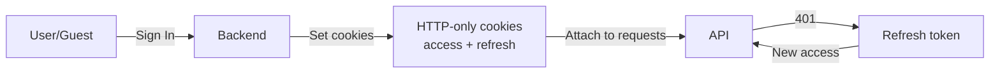

---

## 2. Authentication Flow Diagrams

### 2.1 User Sign-In Flow

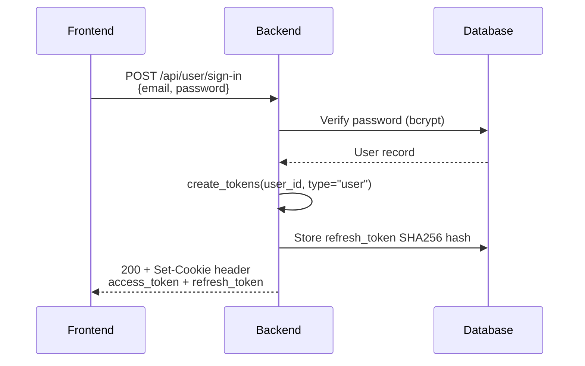

### 2.2 Guest Login Flow

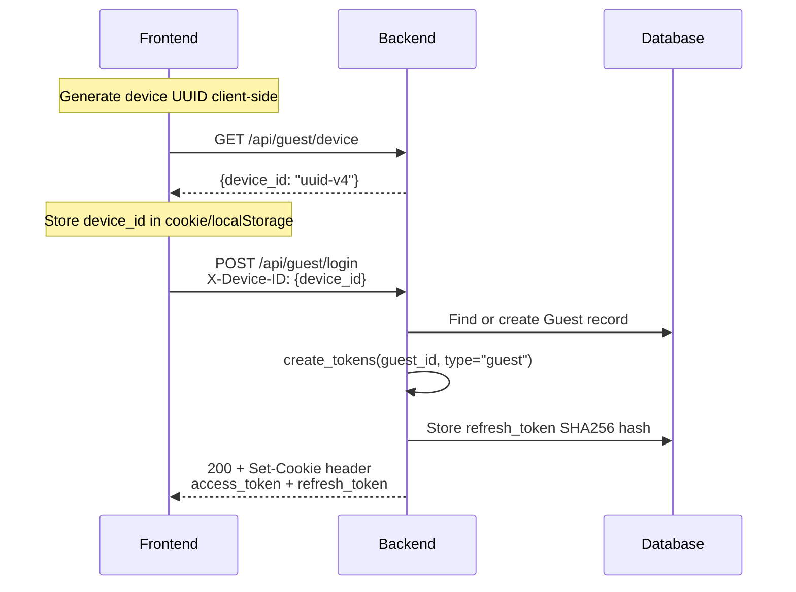

### 2.3 Token Refresh Flow

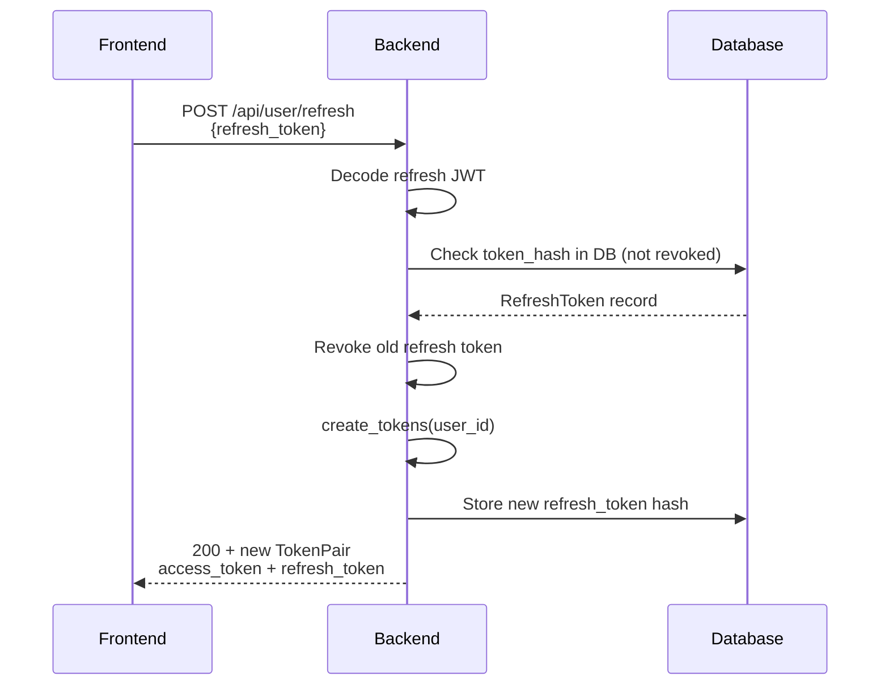

### 2.4 Logout Flow

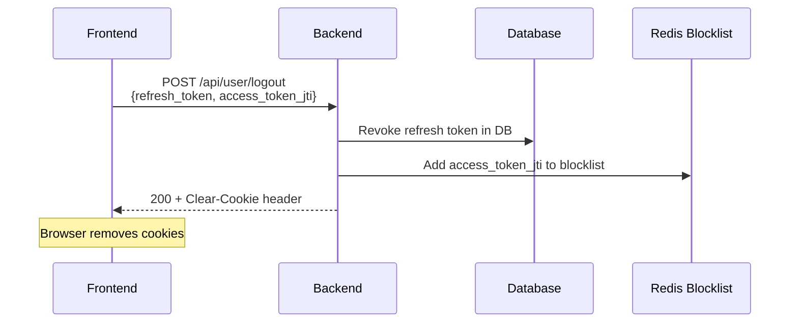

### 2.5 Guest Conversion Flow (Guest → User)

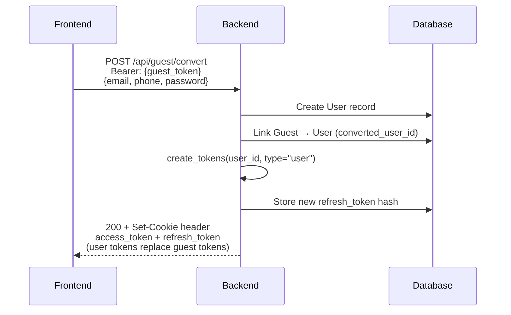

---

## 3. Token Structure

### 3.1 JWT Payload

**Access Token Payload:**
```json
{
  "sub": "user-uuid-or-guest-uuid",
  "user_type": "user" | "guest",
  "type": "access",
  "exp": 1712345678
}
```

**Refresh Token Payload:**
```json
{
  "sub": "user-uuid-or-guest-uuid",
  "user_type": "user" | "guest",
  "type": "refresh",
  "exp": 1712432078
}
```

### 3.2 Token Storage

- **Storage:** HTTP-only cookies (not localStorage)
- **Refresh token hash:** SHA256 stored in `refresh_tokens` table (DB)
- **Access token blocklist:** JTI stored in Redis (optional, for immediate revocation)

### 3.3 Cookie Configuration

| Setting | Value |
|---------|-------|
| `HttpOnly` | `true` |
| `Secure` | `true` (in production) |
| `SameSite` | `Lax` |
| Domain | Configurable via `COOKIES_DOMAIN` |

---

## 4. API Endpoints

### 4.1 User Sign-In

**Endpoint:** `POST /api/user/sign-in`

**Auth Required:** No

**Request Body:**
```json
{
  "email": "user@example.com",
  "password": "string"
}
```

**Response (200):**
```json
{
  "success": true,
  "data": {
    "access_token": "eyJ...",
    "refresh_token": "eyJ...",
    "token_type": "bearer"
  }
}
```

**Response Headers:**
```
Set-Cookie: access_token=eyJ...; HttpOnly; SameSite=Lax; Path=/
Set-Cookie: refresh_token=eyJ...; HttpOnly; SameSite=Lax; Path=/
```

**Errors:**
| Status | Body | Cause |
|--------|------|-------|
| 422 | `BaseValidationResponse` | Invalid email/password format |

---

### 4.2 User Sign-Up

**Endpoint:** `POST /api/user/create`

**Auth Required:** No

**Request Body:**
```json
{
  "email": "user@example.com",
  "phone": "+1234567890",
  "password": "string",
  "first_name": "John",
  "last_name": "Doe"
}
```

**Response (201):**
```json
{
  "success": true,
  "data": {
    "id": "uuid",
    "email": "user@example.com",
    "phone": "+1234567890",
    "first_name": "John",
    "last_name": "Doe"
  }
}
```

---

### 4.3 Token Refresh (User)

**Endpoint:** `POST /api/user/refresh`

**Auth Required:** No

**Request Body:**
```json
{
  "refresh_token": "eyJ..."
}
```

**Response (200):**
```json
{
  "access_token": "eyJ...",
  "refresh_token": "eyJ...",
  "token_type": "bearer"
}
```

**Note:** Old refresh token is revoked and new pair issued (token rotation).

---

### 4.4 Logout (User)

**Endpoint:** `POST /api/user/logout`

**Auth Required:** Yes (Bearer token)

**Request Body:**
```json
{
  "refresh_token": "eyJ...",
  "access_token_jti": "jti-string-or-null"
}
```

**Response (200):**
```json
{
  "success": true
}
```

**Response Headers:**
```
Set-Cookie: access_token=; Max-Age=0; HttpOnly
Set-Cookie: refresh_token=; Max-Age=0; HttpOnly
```

---

### 4.5 Get Current User

**Endpoint:** `GET /api/user/self`

**Auth Required:** Yes (Bearer token)

**Response (200):**
```json
{
  "success": true,
  "data": {
    "id": "uuid",
    "email": "user@example.com",
    "phone": "+1234567890",
    "first_name": "John",
    "last_name": "Doe"
  }
}
```

---

### 4.6 Guest: Generate Device ID

**Endpoint:** `GET /api/guest/device`

**Auth Required:** No

**Response (200):**
```json
{
  "success": true,
  "data": {
    "device_id": "550e8400-e29b-41d4-a716-446655440000"
  }
}
```

**Frontend Note:** Store this `device_id` — send it in `X-Device-ID` header on all guest requests.

---

### 4.7 Guest Login

**Endpoint:** `POST /api/guest/login`

**Auth Required:** No

**Headers:**
```
X-Device-ID: 550e8400-e29b-41d4-a716-446655440000
```

**Request Body:** None

**Response (200):**
```json
{
  "success": true,
  "data": {
    "guest_id": "uuid",
    "device_id": "uuid",
    "access_token": "eyJ...",
    "refresh_token": "eyJ..."
  }
}
```

**Fields:** `guest_id` — the guest user's ID. `device_id` — the device identifier to include in `X-Device-ID` header for subsequent requests.

---

### 4.8 Token Refresh (Guest)

**Endpoint:** `POST /api/guest/refresh`

**Auth Required:** No

**Request Body:**
```json
{
  "refresh_token": "eyJ..."
}
```

**Response (200):**
```json
{
  "access_token": "eyJ...",
  "refresh_token": "eyJ...",
  "token_type": "bearer"
}
```

---

### 4.9 Guest Logout

**Endpoint:** `POST /api/guest/logout`

**Auth Required:** Yes (Bearer token)

**Request Body:**
```json
{
  "refresh_token": "eyJ..."
}
```

**Response (200):**
```json
{
  "success": true,
  "data": {}
}
```

---

### 4.10 Get Current Guest

**Endpoint:** `GET /api/guest/self`

**Auth Required:** Yes (Bearer token)

**Response (200):**
```json
{
  "success": true,
  "data": {
    "id": "uuid",
    "device_id": "550e8400-e29b-41d4-a716-446655440000",
    "is_converted": false,
    "converted_user_id": null
  }
}
```

---

### 4.11 Guest Conversion

**Endpoint:** `POST /api/guest/convert`

**Auth Required:** Yes (Bearer token — guest token)

**Request Body:**
```json
{
  "email": "user@example.com",
  "phone": "+1234567890",
  "password": "string"
}
```

**Response (200):**
```json
{
  "success": true,
  "data": {
    "access_token": "eyJ...",
    "refresh_token": "eyJ...",
    "token_type": "bearer"
  }
}
```

**Note:** Returns user tokens. Guest is marked `is_converted=true` and linked to new user.

---

## 5. Cross-References

### OpenAPI Schema
- Base URL: `http://localhost:8080/openapi.json`
- Auth tag: `["User", "Guest"]`

### Related Files
- `src/auth/jwt.py` — Token creation and decoding
- `src/auth/schemas.py` — Request/response Pydantic models
- `src/auth/dependencies.py` — `get_current_user`, `get_current_guest`
- `src/auth/middleware.py` — Authentication middleware
- `src/apps/user/urls.py` — User auth endpoints
- `src/apps/guest/urls.py` — Guest auth endpoints

---

### 4.12 Find User

**Endpoint:** `GET /api/user/find`

**Auth Required:** No

**Query Parameters:**
| Param | Type | Description |
|-------|------|-------------|
| `email` | string | User's email (optional) |
| `phone` | string | User's phone (optional) |

At least one of `email` or `phone` must be provided.

**Response (200):**
```json
{
  "success": true,
  "data": {
    "id": "uuid",
    "email": "user@example.com",
    "phone": "+1234567890"
  }
}
```

---

### 4.13 Get User Profile

**Endpoint:** `GET /api/user/`

**Auth Required:** Yes (Bearer token)

**Response (200):**
```json
{
  "success": true,
  "data": {
    "id": "uuid",
    "email": "user@example.com",
    "phone": "+1234567890",
    "first_name": "John",
    "last_name": "Doe"
  }
}
```

---

### 4.14 Delete User Account

**Endpoint:** `DELETE /api/user/`

**Auth Required:** Yes (Bearer token)

**Response (200):**
```json
{
  "success": true,
  "data": {}
}
```

---

*Last updated: 2026-04-27*

---

# Module 2: Organizer Pages

## 1. Overview

An **Organizer Page** is the top-level container for an event organizer. A user can own multiple organizer pages. Each organizer page owns events.

**Hierarchy:**
```
User → Organizer Page → Event
```

**Key concepts:**
- Organizer page has a publicly visible slug (e.g., `my-org`)
- Pages can be `public` or `private` (default: `private`)
- Pages can have logo, cover image, bio, and social links
- Public endpoints allow unauthenticated browsing of public organizers

---

## 2. Flow Diagram

### 2.1 Create Organizer Page

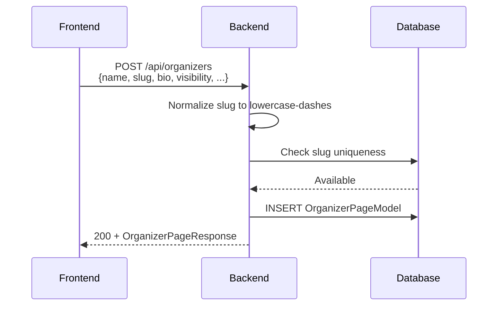

### 2.2 Upload Logo / Cover Image

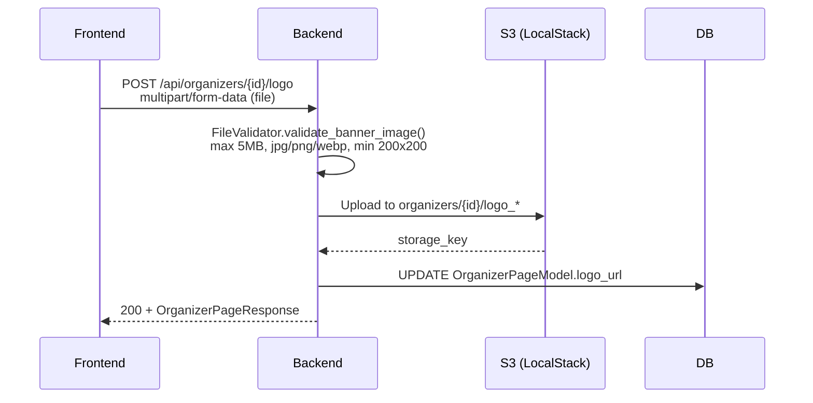

---

## 3. Data Model

### OrganizerPageModel

| Field | Type | Description |
|-------|------|-------------|
| `id` | UUID | Auto-generated primary key |
| `owner_user_id` | UUID | FK to `users.id` — the page owner |
| `name` | str(255) | Display name |
| `slug` | str(255), unique | URL-safe identifier (lowercase, dashes) |
| `bio` | str \| null | Organizer biography |
| `logo_url` | str \| null | S3 URL for logo image |
| `cover_image_url` | str \| null | S3 URL for cover/banner image |
| `website_url` | str \| null | External website |
| `instagram_url` | str \| null | Instagram profile link |
| `facebook_url` | str \| null | Facebook page link |
| `youtube_url` | str \| null | YouTube channel link |
| `visibility` | enum | `public` or `private` (default: `private`) |
| `status` | enum | `active` or `archived` (default: `active`) |
| `created_at` | datetime | Auto-generated |
| `updated_at` | datetime | Auto-generated |

### Enums

**OrganizerVisibility:** `public`, `private`
**OrganizerStatus:** `active`, `archived`

---

## 4. API Endpoints (Authenticated)

### 4.1 List Organizers

**Endpoint:** `GET /api/organizers`

**Auth Required:** Yes (Bearer token)

**Description:** List all organizer pages owned by the current user.

**Response (200):**
```json
{
  "success": true,
  "data": [
    {
      "id": "uuid",
      "owner_user_id": "uuid",
      "name": "My Organizer",
      "slug": "my-organizer",
      "bio": "We organize great events",
      "logo_url": "https://...",
      "cover_image_url": "https://...",
      "website_url": "https://myorg.com",
      "instagram_url": "https://instagram.com/myorg",
      "facebook_url": null,
      "youtube_url": null,
      "visibility": "private",
      "status": "active",
      "created_at": "2026-04-01T10:00:00Z",
      "updated_at": "2026-04-01T10:00:00Z"
    }
  ]
}
```

---

### 4.2 Create Organizer

**Endpoint:** `POST /api/organizers`

**Auth Required:** Yes (Bearer token)

**Request Body:**
```json
{
  "name": "My Organizer",
  "slug": "my-organizer",
  "bio": "We organize great events",
  "logo_url": "https://example.com/logo.png",
  "cover_image_url": "https://example.com/cover.jpg",
  "website_url": "https://myorg.com",
  "instagram_url": "https://instagram.com/myorg",
  "facebook_url": null,
  "youtube_url": null,
  "visibility": "private"
}
```

| Field | Required | Notes |
|-------|----------|-------|
| `name` | Yes | Max 255 chars |
| `slug` | No | Auto-generated from name if not provided. Must be unique, lowercase, alphanumeric with dashes |
| `bio` | No | |
| `logo_url` | No | Must start with `http://` or `https://` |
| `cover_image_url` | No | Must start with `http://` or `https://` |
| `website_url` | No | Must match URL regex |
| `instagram_url` | No | Must match URL regex |
| `facebook_url` | No | Must match URL regex |
| `youtube_url` | No | Must match URL regex |
| `visibility` | No | Default: `private` |

**Response (200):**
```json
{
  "success": true,
  "data": {
    "id": "uuid",
    "owner_user_id": "uuid",
    "name": "My Organizer",
    "slug": "my-organizer",
    "bio": "We organize great events",
    "logo_url": null,
    "cover_image_url": null,
    "website_url": "https://myorg.com",
    "instagram_url": null,
    "facebook_url": null,
    "youtube_url": null,
    "visibility": "private",
    "status": "active",
    "created_at": "2026-04-26T10:00:00Z",
    "updated_at": "2026-04-26T10:00:00Z"
  }
}
```

**Errors:**
| Status | Cause |
|--------|-------|
| 422 | Validation error (missing name, invalid URL format) |
| 409 | Slug already exists |

---

### 4.3 Update Organizer

**Endpoint:** `PATCH /api/organizers/{organizer_id}`

**Auth Required:** Yes (Bearer token)

**Path Parameters:**
| Param | Type | Description |
|-------|------|-------------|
| `organizer_id` | UUID | Organizer page ID |

**Request Body:** (all fields optional)
```json
{
  "name": "Updated Organizer Name",
  "slug": "updated-slug",
  "bio": "Updated bio",
  "logo_url": "https://...",
  "cover_image_url": "https://...",
  "website_url": "https://...",
  "instagram_url": "https://...",
  "facebook_url": "https://...",
  "youtube_url": "https://...",
  "visibility": "public"
}
```

**Response (200):**
```json
{
  "success": true,
  "data": {
    "id": "uuid",
    "owner_user_id": "uuid",
    "name": "Updated Organizer Name",
    "slug": "updated-slug",
    "visibility": "public",
    ...
  }
}
```

**Errors:**
| Status | Cause |
|--------|-------|
| 404 | Organizer not found |
| 409 | Slug already taken |
| 403 | User does not own this organizer |

---

### 4.4 List Organizer Events

**Endpoint:** `GET /api/organizers/{organizer_id}/events`

**Auth Required:** Yes (Bearer token)

**Description:** List events owned by a specific organizer page. Only returns events if the current user owns the organizer.

**Path Parameters:**
| Param | Type | Description |
|-------|------|-------------|
| `organizer_id` | UUID | Organizer page ID |

**Query Parameters:**
| Param | Type | Required | Description |
|-------|------|----------|-------------|
| `status` | string | No | Filter by event status |

**Response (200):**
```json
{
  "success": true,
  "data": [
    {
      "id": "uuid",
      "name": "My Event",
      "status": "draft",
      ...
    }
  ]
}
```

---

### 4.5 List My Events (All Organizers)

**Endpoint:** `GET /api/organizers/events`

**Auth Required:** Yes (Bearer token)

**Description:** Aggregate all events across all organizer pages owned by the current user. Supports filtering, search, sorting, and pagination.

**Query Parameters:**
| Param | Type | Default | Description |
|-------|------|---------|-------------|
| `status` | string | — | Filter by event status |
| `event_access_type` | string | — | Filter by access type |
| `date_from` | date | — | Filter events from this date |
| `date_to` | date | — | Filter events until this date |
| `search` | string | — | Search by event title |
| `sort_by` | string | `created_at` | Sort field: `created_at`, `start_date`, `title`, `status` |
| `order` | string | `desc` | `asc` or `desc` |
| `limit` | int | 20 | Max results |
| `offset` | int | 0 | Skip count |

**Response (200):**
```json
{
  "success": true,
  "data": {
    "events": [...],
    "total": 5,
    "limit": 20,
    "offset": 0,
    "has_more": false
  }
}
```

---

### 4.6 Upload Organizer Logo

**Endpoint:** `POST /api/organizers/{organizer_id}/logo`

**Auth Required:** Yes (Bearer token)

**Content-Type:** `multipart/form-data`

**Request Body (form data):**
| Field | Type | Description |
|-------|------|-------------|
| `file` | binary | Image file (jpg/png/webp) |

**Validation:**
- Max file size: 5MB
- Allowed formats: jpg, jpeg, png, webp
- Minimum dimensions: 200×200 pixels

**Response (200):**
```json
{
  "success": true,
  "data": {
    "id": "uuid",
    "logo_url": "https://s3.../organizers/{id}/logo_*",
    ...
  }
}
```

**Errors:**
| Status | Cause |
|--------|-------|
| 400 | File too large, invalid format, or dimensions too small |
| 404 | Organizer not found |
| 403 | User does not own this organizer |

---

### 4.7 Upload Organizer Cover

**Endpoint:** `POST /api/organizers/{organizer_id}/cover`

**Auth Required:** Yes (Bearer token)

**Content-Type:** `multipart/form-data`

**Request Body (form data):**
| Field | Type | Description |
|-------|------|-------------|
| `file` | binary | Image file (jpg/png/webp) |

**Validation:** Same as logo upload (5MB max, jpg/png/webp, min 200×200)

**Response (200):**
```json
{
  "success": true,
  "data": {
    "id": "uuid",
    "cover_image_url": "https://s3.../organizers/{id}/cover_*",
    ...
  }
}
```

---

## 5. API Endpoints (Public — No Auth)

### 5.1 List Public Organizers

**Endpoint:** `GET /api/open/organizers`

**Auth Required:** No

**Response (200):**
```json
{
  "success": true,
  "data": [
    {
      "id": "uuid",
      "name": "Public Organizer",
      "slug": "public-org",
      "bio": "...",
      "logo_url": "https://...",
      "cover_image_url": "https://...",
      "visibility": "public",
      "status": "active",
      ...
    }
  ]
}
```

**Note:** Only returns organizers with `visibility = "public"`.

---

### 5.2 Get Public Organizer

**Endpoint:** `GET /api/open/organizers/{organizer_page_id}`

**Auth Required:** No

**Path Parameters:**
| Param | Type | Description |
|-------|------|-------------|
| `organizer_page_id` | UUID | Organizer page ID |

**Response (200):**
```json
{
  "success": true,
  "data": {
    "id": "uuid",
    "name": "Public Organizer",
    "slug": "public-org",
    "bio": "...",
    "logo_url": "https://...",
    "cover_image_url": "https://...",
    "website_url": "https://...",
    "instagram_url": "https://...",
    "facebook_url": null,
    "youtube_url": null,
    "visibility": "public",
    "status": "active",
    "created_at": "...",
    "updated_at": "..."
  }
}
```

**Errors:**
| Status | Cause |
|--------|-------|
| 404 | Organizer not found |

---

### 5.3 List Organizer Public Events

**Endpoint:** `GET /api/open/organizers/{organizer_page_id}/events`

**Auth Required:** No

**Description:** List published events for a public organizer page.

**Path Parameters:**
| Param | Type | Description |
|-------|------|-------------|
| `organizer_page_id` | UUID | Organizer page ID |

**Response (200):**
```json
{
  "success": true,
  "data": [
    {
      "id": "uuid",
      "title": "Concert Night",
      "status": "published",
      "start_date": "2026-05-01",
      ...
    }
  ]
}
```

---

*Last updated: 2026-04-26*

---

# Module 3: Events (Critical Module)

> This is the most critical module in the system. It covers the entire event lifecycle: creation → day management → publishing → ticket setup → media assets.

## 1. Overview

### 1.1 Event Hierarchy

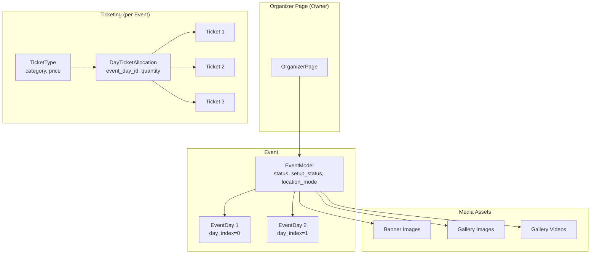

### 1.2 Event Lifecycle

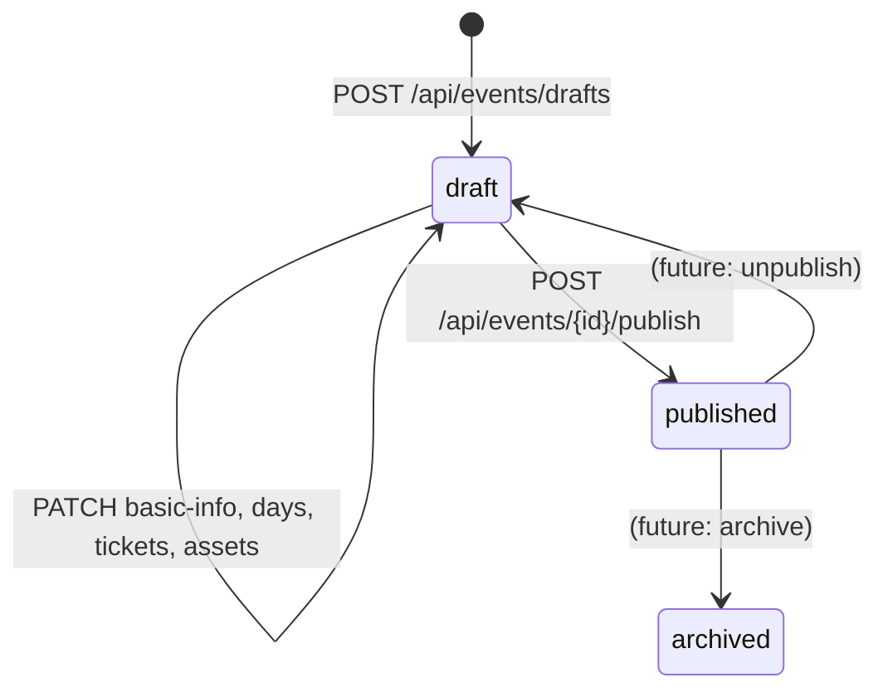

### 1.3 Setup Status Tracking

Events track completeness across 4 sections. `setup_status` is a JSONB dict that starts as an empty object `{}` after event creation. It is populated with boolean fields after the first call to `_refresh_setup_status()` (triggered when basic-info is first patched or a day is added).

| Section | Completion Criteria |
|---------|---------------------|
| `basic_info` | `title`, `event_access_type`, `location_mode`, `timezone` all set |
| `schedule` | At least 1 event day exists |
| `tickets` | `event_access_type == open` OR (ticket types exist AND allocations exist AND `show_tickets == true`) |
| `assets` | At least 1 banner image uploaded |

---

## 2. Data Model

### 2.1 EventModel

| Field | Type | Description |
|-------|------|-------------|
| `id` | UUID | Auto-generated primary key |
| `organizer_page_id` | UUID | FK to organizer_pages |
| `created_by_user_id` | UUID | FK to users |
| `title` | str \| null | Event title |
| `slug` | str \| null, unique | URL-safe identifier |
| `description` | str \| null | Full event description |
| `event_type` | str \| null | `concert`, `conference`, `meetup`, `workshop`, `custom` |
| `status` | enum | `draft`, `published`, `archived` |
| `event_access_type` | enum | `open` (free) or `ticketed` |
| `setup_status` | JSONB | `{"basic_info": bool, "schedule": bool, "tickets": bool, "assets": bool}` |
| `location_mode` | enum | `venue`, `online`, `recorded`, `hybrid` |
| `timezone` | str \| null | e.g., `Asia/Kolkata` |
| `start_date` | date \| null | |
| `end_date` | date \| null | |
| `venue_name` | str \| null | |
| `venue_address` | str \| null | |
| `venue_city` | str \| null | |
| `venue_state` | str \| null | |
| `venue_country` | str \| null | |
| `venue_latitude` | float \| null | |
| `venue_longitude` | float \| null | |
| `venue_google_place_id` | str \| null | |
| `online_event_url` | str \| null | For online/hybrid events |
| `recorded_event_url` | str \| null | For recorded events |
| `published_at` | datetime \| null | When event was published |
| `is_published` | bool | Whether event is publicly visible |
| `show_tickets` | bool | Whether to display tickets on public page |
| `interested_counter` | int | Count of users who marked interest |
| `days_count` | int | Number of event days |

### 2.2 EventDayModel

| Field | Type | Description |
|-------|------|-------------|
| `id` | UUID | Auto-generated primary key |
| `event_id` | UUID | FK to events |
| `day_index` | int | Sequential index (0, 1, 2...), unique per event |
| `date` | date | The date of this event day |
| `start_time` | datetime \| null | Start time (required for ticketed events) |
| `end_time` | datetime \| null | End time |
| `scan_status` | enum | `not_started`, `active`, `paused`, `ended` |
| `scan_started_at` | datetime \| null | When scanning began |
| `scan_paused_at` | datetime \| null | When scanning was paused |
| `scan_ended_at` | datetime \| null | When scanning ended |
| `next_ticket_index` | int | Counter for ticket indexing |

**Constraint:** `UNIQUE(event_id, day_index)`

### 2.3 Enums

**EventStatus:** `draft`, `published`, `archived`
**EventAccessType:** `open` (free event), `ticketed` (paid tickets)
**LocationMode:** `venue` (physical), `online` (livestream), `recorded` (ondemand), `hybrid` (venue + online)
**ScanStatus:** `not_started`, `active`, `paused`, `ended`

### 2.4 EventDay Scan State Machine

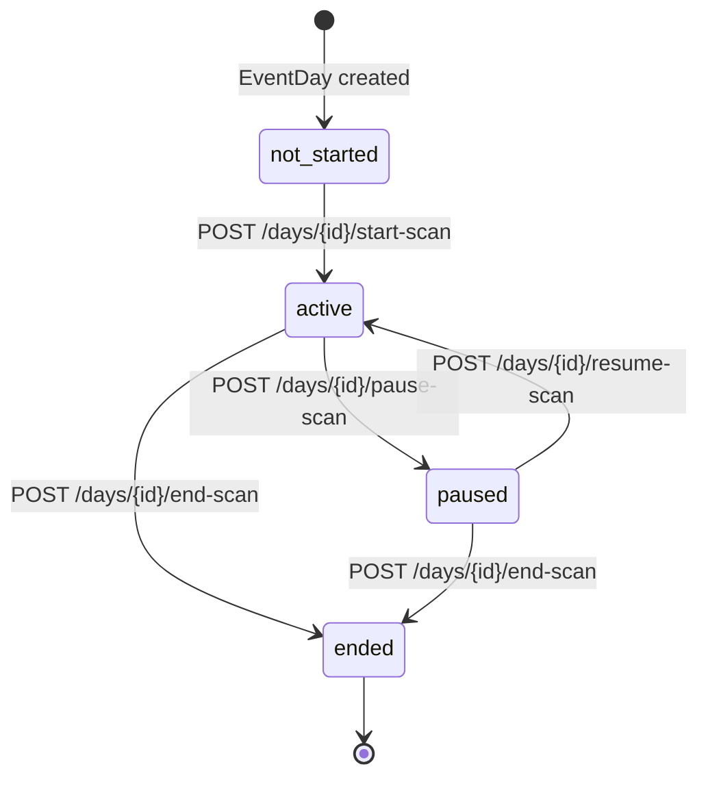

---

## 3. Event Management Flow Diagrams

### 3.1 Create Draft Event

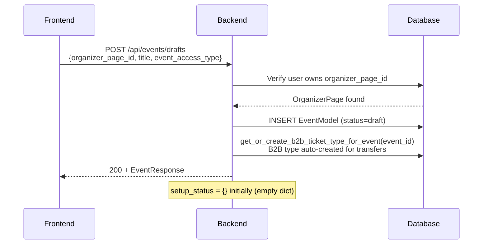

**Important:** When an event is created, a B2B ticket type is automatically created. This allows B2B transfers to work immediately without manual ticket type setup.

### 3.2 Update Basic Info

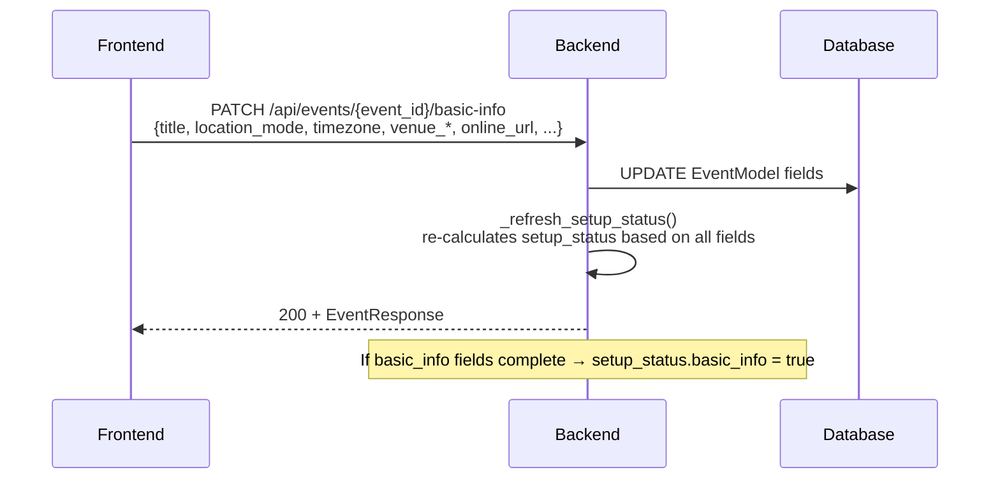

**Location-Mode Specific Validation:**

| location_mode | Required Fields |
|---------------|-----------------|
| `venue` | venue_name, venue_address, venue_city, venue_country |
| `online` | online_event_url |
| `recorded` | recorded_event_url |
| `hybrid` | venue_name, venue_address, venue_city, venue_country + online_event_url |

**Publish Gate:** An event can be published if `basic_info`, `schedule`, and `assets` sections are complete. The `tickets` section does **not** block publishing — an event can be published with no ticket types, and tickets can be added later.

### 3.3 Publish Event Flow

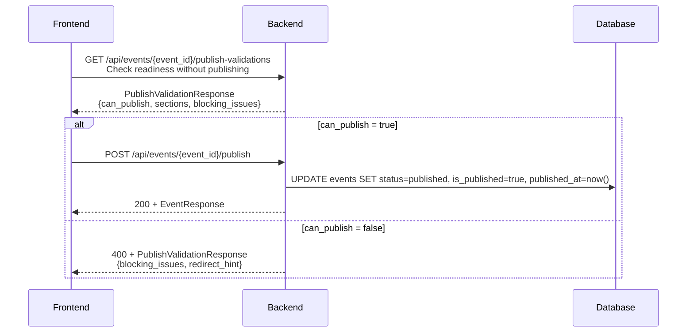

### 3.4 Event Readiness Check

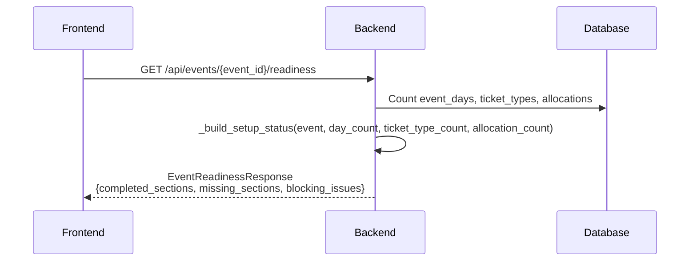

---

## 4. API Endpoints — Event Management

### 4.1 Create Draft Event

**Endpoint:** `POST /api/events/drafts`

**Auth Required:** Yes (Bearer token)

**Request Body:**
```json
{
  "organizer_page_id": "uuid",
  "title": "My Event",
  "event_access_type": "ticketed"
}
```

| Field | Required | Notes |
|-------|----------|-------|
| `organizer_page_id` | Yes | Must be owned by current user |
| `title` | Yes | Event title |
| `event_access_type` | Yes | `open` (free) or `ticketed` |

**Response (200):**
```json
{
  "success": true,
  "data": {
    "id": "uuid",
    "organizer_page_id": "uuid",
    "created_by_user_id": "uuid",
    "title": "My Event",
    "status": "draft",
    "event_access_type": "ticketed",
    "setup_status": {
      "basic_info": false,
      "schedule": false,
      "tickets": false,
      "assets": false
    },
    "show_tickets": false,
    "is_published": false,
    "interested_counter": 0,
    "days_count": -1,
    ...
  }
}
```

**Side Effect:** B2B ticket type auto-created for this event.

---

### 4.2 Get Event Detail

**Endpoint:** `GET /api/events/{event_id}`

**Auth Required:** Yes (Bearer token)

**Description:** Get full event details including media assets, event days, setup_status.

**Response (200):**
```json
{
  "success": true,
  "data": {
    "id": "uuid",
    "title": "Concert Night",
    "slug": "concert-night-2026",
    "description": "...",
    "event_type": "concert",
    "status": "draft",
    "event_access_type": "ticketed",
    "setup_status": {
      "basic_info": true,
      "schedule": true,
      "tickets": false,
      "assets": false
    },
    "location_mode": "venue",
    "timezone": "Asia/Kolkata",
    "start_date": "2026-05-01",
    "end_date": "2026-05-01",
    "venue_name": "Arena Hall",
    "venue_address": "123 Main St",
    "venue_city": "Mumbai",
    "venue_state": "Maharashtra",
    "venue_country": "India",
    "published_at": null,
    "is_published": false,
    "show_tickets": false,
    "interested_counter": 0,
    "media_assets": [
      {
        "id": "uuid",
        "asset_type": "banner",
        "public_url": "https://s3.../events/{id}/banner_*",
        "title": "Concert Banner",
        "sort_order": 0,
        "is_primary": true,
        ...
      }
    ],
    "days": [
      {
        "id": "uuid",
        "day_index": 0,
        "date": "2026-05-01",
        "start_time": "2026-05-01T18:00:00Z",
        "end_time": "2026-05-01T23:00:00Z",
        "scan_status": "not_started"
      }
    ]
  }
}
```

---

### 4.3 Update Basic Info

**Endpoint:** `PATCH /api/events/{event_id}/basic-info`

**Auth Required:** Yes (Bearer token)

**Request Body:** (all fields optional)
```json
{
  "title": "Updated Concert",
  "description": "An updated description",
  "event_type": "concert",
  "event_access_type": "ticketed",
  "location_mode": "venue",
  "timezone": "Asia/Kolkata",
  "venue_name": "Arena Hall",
  "venue_address": "456 New St",
  "venue_city": "Mumbai",
  "venue_state": "Maharashtra",
  "venue_country": "India",
  "venue_latitude": 19.076,
  "venue_longitude": 72.8777,
  "venue_google_place_id": "ChIJ...",
  "online_event_url": "https://zoom.us/...",
  "recorded_event_url": "https://youtube.com/..."
}
```

**Response (200):** Returns full updated `EventResponse`.

**Validation Rules:**
- If `location_mode = venue` or `hybrid` → `venue_name`, `venue_address`, `venue_city`, `venue_country` required
- If `location_mode = online` or `hybrid` → `online_event_url` required
- If `location_mode = recorded` → `recorded_event_url` required

---

### 4.4 Update Show Tickets

**Endpoint:** `PATCH /api/events/{event_id}/show-tickets`

**Auth Required:** Yes (Bearer token)

**Description:** Toggle whether tickets are displayed on the public event page.

**Request Body:**
```json
{
  "show_tickets": true
}
```

**Response (200):** Returns full updated `EventResponse`.

---

### 4.5 Get Event Readiness

**Endpoint:** `GET /api/events/{event_id}/readiness`

**Auth Required:** Yes (Bearer token)

**Response (200):**
```json
{
  "success": true,
  "data": {
    "completed_sections": ["basic_info", "schedule"],
    "missing_sections": ["tickets", "assets"],
    "blocking_issues": [
      "Add ticket types and allocations or switch event to open",
      "Upload a banner image"
    ]
  }
}
```

---

### 4.6 Get Publish Validations

**Endpoint:** `GET /api/events/{event_id}/publish-validations`

**Auth Required:** Yes (Bearer token)

**Description:** Detailed section-by-section validation before publishing.

**Response (200):**
```json
{
  "success": true,
  "data": {
    "can_publish": false,
    "event_id": "uuid",
    "published_at": null,
    "sections": {
      "basic_info": {
        "complete": true,
        "errors": []
      },
      "schedule": {
        "complete": true,
        "errors": []
      },
      "tickets": {
        "complete": false,
        "errors": []
      },
      "assets": {
        "complete": false,
        "errors": [
          {"field": "banner", "message": "At least 1 banner image is required", "code": "MISSING_REQUIRED_FIELD"}
        ]
      }
    },
    "blocking_issues": [
      "Upload a banner image"
    ],
    "redirect_hint": {
      "section": "assets",
      "fields": ["banner"]
    }
  }
}
```

---

### 4.7 Publish Event

**Endpoint:** `POST /api/events/{event_id}/publish`

**Auth Required:** Yes (Bearer token)

**Description:** Publish event. Fails if any validation fails.

**Response (200) — Success:**
```json
{
  "success": true,
  "data": {
    "id": "uuid",
    "status": "published",
    "is_published": true,
    "published_at": "2026-04-26T12:00:00Z",
    ...
  }
}
```

**Response (400) — Validation Failed:**
```json
{
  "success": false,
  "detail": "Cannot publish event. Missing required sections: assets"
}
```

---

## 5. API Endpoints — Event Days

### 5.1 Create Event Day

**Endpoint:** `POST /api/events/{event_id}/days`

**Auth Required:** Yes (Bearer token)

**Request Body:**
```json
{
  "date": "2026-05-01",
  "start_time": "2026-05-01T18:00:00",
  "end_time": "2026-05-01T23:00:00"
}
```

| Field | Required | Notes |
|-------|----------|-------|
| `date` | Yes | Must be a valid date |
| `start_time` | No | Required if event_access_type = `ticketed` |
| `end_time` | No | Optional |

**Response (200):**
```json
{
  "success": true,
  "data": {
    "id": "uuid",
    "event_id": "uuid",
    "day_index": 0,
    "date": "2026-05-01",
    "start_time": "2026-05-01T18:00:00Z",
    "end_time": "2026-05-01T23:00:00Z",
    "scan_status": "not_started",
    "scan_started_at": null,
    "scan_paused_at": null,
    "scan_ended_at": null,
    "next_ticket_index": 1
  }
}
```

**Note:** `day_index` auto-assigned as `max(existing day_index) + 1`.

---

### 5.2 List Event Days

**Endpoint:** `GET /api/events/{event_id}/days`

**Auth Required:** Yes (Bearer token)

**Response (200):**
```json
{
  "success": true,
  "data": [
    {
      "id": "uuid",
      "event_id": "uuid",
      "day_index": 0,
      "date": "2026-05-01",
      "start_time": "2026-05-01T18:00:00Z",
      "end_time": "2026-05-01T23:00:00Z",
      "scan_status": "not_started",
      "scan_started_at": null,
      "scan_paused_at": null,
      "scan_ended_at": null,
      "next_ticket_index": 1
    },
    {
      "id": "uuid",
      "event_id": "uuid",
      "day_index": 1,
      "date": "2026-05-02",
      "start_time": "2026-05-02T14:00:00Z",
      "end_time": "2026-05-02T20:00:00Z",
      "scan_status": "not_started",
      "scan_started_at": null,
      "scan_paused_at": null,
      "scan_ended_at": null,
      "next_ticket_index": 1
    }
  ]
}
```

---

### 5.3 Update Event Day

**Endpoint:** `PATCH /api/events/days/{event_day_id}`

**Auth Required:** Yes (Bearer token)

**Request Body:** (all fields optional)
```json
{
  "day_index": 0,
  "date": "2026-05-03",
  "start_time": "2026-05-03T16:00:00",
  "end_time": "2026-05-03T22:00:00"
}
```

**Response (200):** Returns updated `EventDayResponse`.

---

### 5.4 Delete Event Day

**Endpoint:** `DELETE /api/events/days/{event_day_id}`

**Auth Required:** Yes (Bearer token)

**Response (200):**
```json
{
  "success": true,
  "data": {}
}
```

**Note:** Updates `setup_status.schedule` after deletion.

---

## 6. API Endpoints — Media Assets

### 6.1 Media Asset Architecture

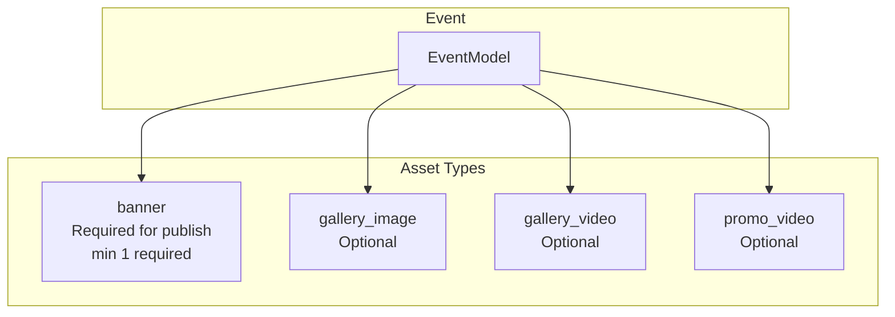

### 6.2 Upload Media Asset

**Endpoint:** `POST /api/events/{event_id}/media-assets`

**Auth Required:** Yes (Bearer token)

**Content-Type:** `multipart/form-data`

**Request Body (form data):**
| Field | Type | Description |
|-------|------|-------------|
| `file` | binary | Image/video file |
| `asset_type` | string | `banner`, `gallery_image`, `gallery_video`, `promo_video` |
| `title` | string | Optional title |
| `caption` | string | Optional caption |
| `alt_text` | string | Optional alt text |

**Validation by asset_type:**

| asset_type | Max Size | Formats | Dimensions |
|------------|----------|---------|------------|
| `banner` | 10MB | jpg, jpeg, png, webp | min 1200×630 |
| `gallery_image` | 10MB | jpg, jpeg, png, webp | min 800×600 |
| `gallery_video` | 100MB | mp4, mov, webm | — |
| `promo_video` | 100MB | mp4, mov, webm | — |

**Response (200):**
```json
{
  "success": true,
  "data": {
    "id": "uuid",
    "event_id": "uuid",
    "asset_type": "banner",
    "storage_key": "events/{event_id}/banner_{uuid}_{filename}",
    "public_url": "https://s3.../events/{event_id}/banner_*",
    "title": "Event Banner",
    "caption": null,
    "alt_text": null,
    "sort_order": 0,
    "is_primary": false,
    "created_at": "2026-04-26T10:00:00Z",
    "updated_at": "2026-04-26T10:00:00Z"
  }
}
```

**Side Effect:** If `asset_type = banner`, `setup_status.assets` is re-evaluated.

---

### 6.3 List Media Assets

**Endpoint:** `GET /api/events/{event_id}/media-assets`

**Auth Required:** Yes (Bearer token)

**Query Parameters:**
| Param | Type | Description |
|-------|------|-------------|
| `asset_type` | string | Filter by type: `banner`, `gallery_image`, `gallery_video`, `promo_video` |

**Response (200):**
```json
{
  "success": true,
  "data": [
    {
      "id": "uuid",
      "asset_type": "banner",
      "storage_key": "...",
      "public_url": "https://s3...",
      "title": "Main Banner",
      "caption": null,
      "alt_text": "Concert promotional banner",
      "sort_order": 0,
      "is_primary": true,
      "created_at": "...",
      "updated_at": "..."
    }
  ]
}
```

---

### 6.4 Delete Media Asset

**Endpoint:** `DELETE /api/events/{event_id}/media-assets/{asset_id}`

**Auth Required:** Yes (Bearer token)

**Response (200):**
```json
{
  "success": true,
  "data": {}
}
```

**Side Effects:**
- Deletes file from S3
- Deletes metadata from DB
- If deleted asset was `banner`, re-evaluates `setup_status.assets`

---

### 6.5 Update Media Asset Metadata

**Endpoint:** `PATCH /api/events/{event_id}/media-assets/{asset_id}`

**Auth Required:** Yes (Bearer token)

**Request Body:**
```json
{
  "title": "Updated Title",
  "caption": "Updated caption",
  "alt_text": "Updated alt text",
  "sort_order": 1,
  "is_primary": true
}
```

**Response (200):** Returns updated `MediaAssetResponse`.

---

## 7. API Endpoints — Ticket Types & Allocations

### 7.1 Ticketing Architecture

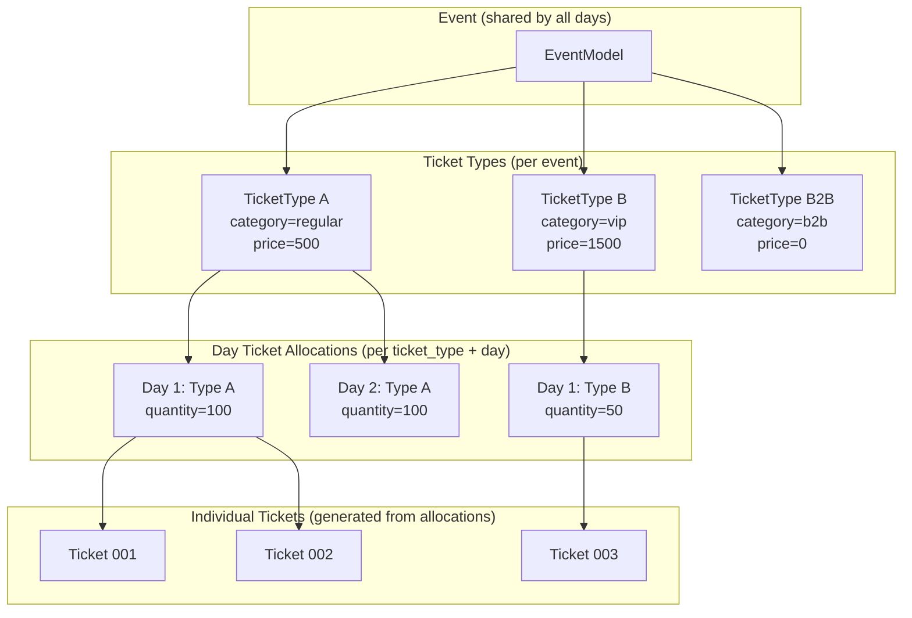

### 7.2 Ticket Type Model

| Field | Type | Description |
|-------|------|-------------|
| `id` | UUID | Auto-generated primary key |
| `event_id` | UUID | FK to events |
| `name` | str | Ticket type name (e.g., "General Admission") |
| `category` | enum | `regular`, `vip`, `backstage`, `b2b` |
| `price` | float | Price in currency |
| `currency` | str | Currency code (default: `INR`) |

### 7.3 Day Ticket Allocation Model

| Field | Type | Description |
|-------|------|-------------|
| `id` | UUID | Auto-generated primary key |
| `event_day_id` | UUID | FK to event_days |
| `ticket_type_id` | UUID | FK to ticket_types |
| `quantity` | int | Number of tickets to generate |

### 7.4 Create Ticket Type

**Endpoint:** `POST /api/events/{event_id}/ticket-types`

**Auth Required:** Yes (Bearer token)

**Request Body:**
```json
{
  "name": "General Admission",
  "category": "regular",
  "price": 499.00,
  "currency": "INR"
}
```

| Field | Required | Notes |
|-------|----------|-------|
| `name` | Yes | Ticket type name |
| `category` | Yes | `regular`, `vip`, `backstage` |
| `price` | Yes | Must be > 0 |
| `currency` | No | Default: `INR` |

**Response (201):**
```json
{
  "success": true,
  "data": {
    "id": "uuid",
    "event_id": "uuid",
    "name": "General Admission",
    "category": "regular",
    "price": 499.00,
    "currency": "INR"
  }
}
```

**Note:** B2B ticket type is auto-created on event creation and cannot be modified via this endpoint.

---

### 7.5 List Ticket Types

**Endpoint:** `GET /api/events/{event_id}/ticket-types`

**Auth Required:** Yes (Bearer token)

**Response (200):**
```json
{
  "success": true,
  "data": [
    {
      "id": "uuid",
      "event_id": "uuid",
      "name": "General Admission",
      "category": "regular",
      "price": 499.00,
      "currency": "INR"
    },
    {
      "id": "uuid",
      "event_id": "uuid",
      "name": "VIP",
      "category": "vip",
      "price": 1499.00,
      "currency": "INR"
    },
    {
      "id": "uuid",
      "event_id": "uuid",
      "name": "B2B",
      "category": "b2b",
      "price": 0.00,
      "currency": "INR"
    }
  ]
}
```

**Note:** B2B type is always listed.

---

### 7.6 Create Ticket Allocation

**Endpoint:** `POST /api/events/{event_id}/ticket-allocations`

**Auth Required:** Yes (Bearer token)

**Request Body:**
```json
{
  "event_day_id": "uuid",
  "ticket_type_id": "uuid",
  "quantity": 100
}
```

| Field | Required | Notes |
|-------|----------|-------|
| `event_day_id` | Yes | Must belong to this event |
| `ticket_type_id` | Yes | Must belong to this event |
| `quantity` | Yes | Must be > 0 |

**Response (200):**
```json
{
  "success": true,
  "data": {
    "id": "uuid",
    "event_day_id": "uuid",
    "ticket_type_id": "uuid",
    "quantity": 100
  }
}
```

**Side Effect:** Generates `quantity` individual `TicketModel` records in DB.

---

### 7.7 List Ticket Allocations

**Endpoint:** `GET /api/events/{event_id}/ticket-allocations`

**Auth Required:** Yes (Bearer token)

**Response (200):**
```json
{
  "success": true,
  "data": [
    {
      "id": "uuid",
      "event_day_id": "uuid",
      "ticket_type_id": "uuid",
      "quantity": 100
    },
    {
      "id": "uuid",
      "event_day_id": "uuid",
      "ticket_type_id": "uuid",
      "quantity": 50
    }
  ]
}
```

---

### 7.8 Update Allocation Quantity

**Endpoint:** `PATCH /api/events/{event_id}/ticket-allocations/{allocation_id}`

**Auth Required:** Yes (Bearer token)

**Request Body:**
```json
{
  "quantity": 150
}
```

**Response (200):**
```json
{
  "success": true,
  "data": {
    "id": "uuid",
    "event_day_id": "uuid",
    "ticket_type_id": "uuid",
    "quantity": 150
  }
}
```

---

## 8. Public API Endpoints

### 8.1 Public Events Architecture

```mermaid
graph TB
    subgraph PublicUser["Public User (No Auth)"]
        P[Browse Events]
    end

    subgraph PublicAPI["Public API Layer"]
        PE1[/api/open/events]
        PE2[/api/open/events/{id}]
        PE3[/api/open/organizers/{id}/events]
        PE4[/api/open/events/{id}/interest]
    end

    subgraph Response["Public Response Shapes"]
        ER[EventDetailResponse<br/>includes days, media, ticket_types, allocations]
        EL[EventListResponse<br/>summary only]
        EI[EventInterestResponse<br/>interested_counter]
    end

    P --> PE1
    P --> PE2
    P --> PE3
    P --> PE4

    PE1 --> EL
    PE2 --> ER
    PE4 --> EI
```

### 8.2 List Public Events

**Endpoint:** `GET /api/open/events`

**Auth Required:** No

**Description:** List all published events. Supports filtering and search.

**Query Parameters:**
| Param | Type | Description |
|-------|------|-------------|
| `status` | string | `published` (only published events returned) |
| `event_access_type` | string | `open` or `ticketed` |
| `date_from` | date | Filter events from this date |
| `date_to` | date | Filter events until this date |
| `search` | string | Search by event title |
| `sort_by` | string | `created_at`, `start_date`, `title`, `status` |
| `order` | string | `asc` or `desc` |
| `limit` | int | Default 20, max 100 |
| `offset` | int | Default 0 |

**Response (200):**
```json
{
  "success": true,
  "data": {
    "events": [
      {
        "id": "uuid",
        "organizer_page_id": "uuid",
        "title": "Concert Night",
        "status": "published",
        "event_access_type": "ticketed",
        "setup_status": {},
        "created_at": "2026-04-20T10:00:00Z"
      }
    ],
    "pagination": {
      "total": 5,
      "limit": 20,
      "offset": 0,
      "has_more": false
    }
  }
}
```

---

### 8.3 Get Public Event Detail

**Endpoint:** `GET /api/open/events/{event_id}`

**Auth Required:** No

**Response (200):**
```json
{
  "success": true,
  "data": {
    "id": "uuid",
    "title": "Concert Night",
    "slug": "concert-night-2026",
    "description": "Join us for an amazing night...",
    "event_type": "concert",
    "status": "published",
    "event_access_type": "ticketed",
    "location_mode": "venue",
    "timezone": "Asia/Kolkata",
    "start_date": "2026-05-01",
    "end_date": "2026-05-01",
    "venue_name": "Arena Hall",
    "venue_address": "123 Main St",
    "venue_city": "Mumbai",
    "venue_country": "India",
    "online_event_url": null,
    "recorded_event_url": null,
    "published_at": "2026-04-25T10:00:00Z",
    "is_published": true,
    "interested_counter": 42,
    "days": [
      {
        "id": "uuid",
        "day_index": 0,
        "date": "2026-05-01",
        "start_time": "2026-05-01T18:00:00Z",
        "end_time": "2026-05-01T23:00:00Z",
        "scan_status": "not_started"
      }
    ],
    "media_assets": [
      {
        "id": "uuid",
        "asset_type": "banner",
        "public_url": "https://s3.../banner.jpg",
        "title": "Concert Banner",
        "caption": null,
        "alt_text": null,
        "sort_order": 0,
        "is_primary": true
      }
    ],
    "ticket_types": [
      {
        "id": "uuid",
        "name": "General Admission",
        "description": null,
        "price": "499.00",
        "currency": "INR"
      }
    ],
    "ticket_allocations": [
      {
        "id": "uuid",
        "ticket_type_id": "uuid",
        "event_day_id": "uuid",
        "quantity": 100,
        "price": "499.00"
      }
    ]
  }
}
```

**Note:** Only returns data if `is_published = true`. Non-published events return 404.

---

### 8.4 Mark Event Interest

**Endpoint:** `POST /api/open/events/{event_id}/interest`

**Auth Required:** Optional (Bearer token if logged in, else guest identified by device)

**Description:** Mark interest in an event. Can be called multiple times — only first call creates a record, subsequent calls just increment counter.

**Response (200):**
```json
{
  "success": true,
  "data": {
    "created": true,
    "interested_counter": 43
  }
}
```

**Note:** If user/guest already marked interest, `created = false` but counter is returned.

---

## 9. Complete Event Creation Walkthrough

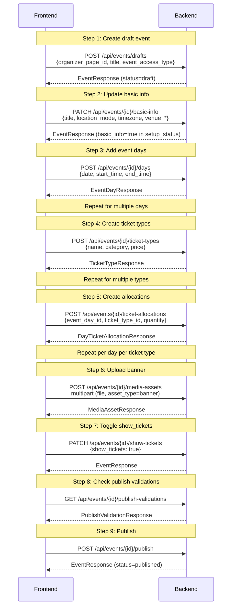

---

## 10. Cross-References

### OpenAPI Schema
- Base URL: `http://localhost:8080/openapi.json`
- Auth tag: `["Event"]`
- Public tag: `["Public Events"]`
- Ticketing tag: `["Ticketing"]`

### Related Files
- `src/apps/event/models.py` — `EventModel`, `EventDayModel`, `EventMediaAssetModel`
- `src/apps/event/enums.py` — `EventStatus`, `EventAccessType`, `LocationMode`, `ScanStatus`, `AssetType`
- `src/apps/event/request.py` — `CreateDraftEventRequest`, `UpdateEventBasicInfoRequest`, `CreateEventDayRequest`, `UpdateEventDayRequest`, etc.
- `src/apps/event/response.py` — `EventResponse`, `EventDayResponse`, `MediaAssetResponse`, `PublishValidationResponse`, `EventReadinessResponse`
- `src/apps/event/service.py` — `EventService` (all business logic)
- `src/apps/event/repository.py` — `EventRepository`
- `src/apps/event/urls.py` — Authenticated endpoints
- `src/apps/event/public_urls.py` — Public endpoints
- `src/apps/ticketing/models.py` — `TicketTypeModel`, `DayTicketAllocationModel`, `TicketModel`
- `src/apps/ticketing/repository.py` — `TicketingRepository`
- `src/apps/ticketing/request.py` — `CreateTicketTypeRequest`, `AllocateTicketTypeRequest`
- `src/apps/ticketing/response.py` — `TicketTypeResponse`, `DayTicketAllocationResponse`

---

# Module 4: Resellers & Invite System

> This module covers two interconnected concepts: (1) the generic invite system used across the platform, and (2) the reseller-specific workflow where organizers add resellers to events.

## 1. Overview

### 1.1 What is a Reseller?

A **Reseller** is a user who has been invited by an event organizer to manage ticket sales for a specific event. Resellers receive B2B tickets from the organizer and can transfer them to end customers (Customer A, Customer B, etc.).

**Reseller vs Organizer:**

| Aspect | Organizer | Reseller |
|--------|-----------|----------|
| Creates events | Yes | No |
| Owns tickets | Yes | No (receives from organizer) |
| Can transfer to customers | Yes | Yes |
| Can invite other resellers | No | No |
| Associated to event | Via OrganizerPage | Via EventReseller record |

### 1.2 Invite System Architecture

The invite system is a **generic platform-wide mechanism** used for resellers, but designed to support other invite types in the future.

```mermaid
graph TB
    subgraph InviteSystem["Invite System (Generic)"]
        IM[InviteModel<br/>target_user_id<br/>invite_type<br/>status<br/>meta]
        IS[InviteStatus<br/>pending | accepted<br/>declined | cancelled]
    end

    subgraph ResellerFlow["Reseller Flow"]
        Org[Organizer]
        Inv[Invite Created<br/>invite_type=reseller<br/>meta={event_id, permissions}]
        ER[EventResellerModel<br/>Created on accept<br/>permissions stored]
        Res[Reseller User]
        Ev[Event]
    end

    Org -->|POST /events/{id}/reseller-invites| Inv
    Inv -->|status=pending| Res
    Res -->|POST /user/invites/{id}/accept| ER
    ER -->|linked to| Ev
    Res -->|POST /resellers/b2b/events/{id}/transfers/customer| Ev
```

**Key Design Principle:** The `InviteModel` is generic. `invite_type` determines the meaning (currently only `reseller`). The `meta` field carries type-specific data (for resellers: `event_id`, `permissions`).

---

## 2. Data Models

### 2.1 InviteModel

**File:** `src/apps/user/invite/models.py`

| Field | Type | Description |
|-------|------|-------------|
| `id` | UUID | Auto-generated primary key |
| `target_user_id` | UUID | FK to users — the invite recipient |
| `created_by_id` | UUID | FK to users — who sent the invite |
| `status` | str | `pending`, `accepted`, `declined`, `cancelled` |
| `invite_type` | str | `reseller` (expandable to other types) |
| `meta` | JSONB | `{event_id: uuid, permissions: [...], ...}` |
| `expires_at` | datetime \| null | Optional expiration |
| `created_at` | datetime | Auto-generated |
| `updated_at` | datetime | Auto-generated |

**Constraint:** Unique on `(target_user_id, event_id)` for same invite_type (via meta).

### 2.2 EventResellerModel

**File:** `src/apps/event/models.py`

| Field | Type | Description |
|-------|------|-------------|
| `id` | UUID | Auto-generated primary key |
| `user_id` | UUID | FK to users — the reseller |
| `event_id` | UUID | FK to events — the event they're associated with |
| `invited_by_id` | UUID | FK to users — who invited them |
| `permissions` | JSONB | Dict of permissions granted |
| `accepted_at` | datetime \| null | When the invite was accepted |

**Constraint:** Unique on `(user_id, event_id)`.

### 2.3 InviteStatus Enum

**File:** `src/apps/user/invite/enums.py`

| Value | Description |
|-------|-------------|
| `pending` | Invite sent, awaiting response |
| `accepted` | User accepted, EventReseller created |
| `declined` | User declined |
| `cancelled` | Organizer cancelled the invite |

### 2.4 InviteType Enum

**File:** `src/apps/user/invite/enums.py`

| Value | Description |
|-------|-------------|
| `reseller` | Reseller invite for event management |

---

## 3. Reseller Invite Flow

### 3.1 Full Reseller Lifecycle

```mermaid
sequenceDiagram
    participant Org as Organizer
    participant BE as Backend
    participant Inv as InviteModel
    participant Res as Reseller User
    participant ER as EventResellerModel
    participant Ev as Event

    Note over Org,Ev: Step 1: Organizer creates reseller invite
    Org->>BE: POST /api/events/{event_id}/reseller-invites<br/>{user_ids: [uuid1, uuid2], permissions: [...]}
    BE->>Inv: Create InviteModel records (status=pending)
    Inv-->>BE: invite records created
    Note over BE: meta = {event_id, permissions}

    Note over Org,Ev: Step 2: Reseller sees pending invite
    Res->>BE: GET /api/user/me/invites
    BE-->>Res: list of pending invites

    Note over Org,Ev: Step 3: Reseller accepts invite
    Res->>BE: POST /api/user/invites/{invite_id}/accept
    BE->>ER: Create EventResellerModel (accepted_at=now)
    BE->>Inv: Update status=accepted
    ER-->>BE: EventReseller created
    BE-->>Res: ResellerResponse

    Note over Org,Ev: Step 4: Reseller operates on event
    Res->>BE: GET /api/resellers/events
    BE-->>Res: list of events where user is reseller

    Note over Org,Ev: Step 5: Reseller transfers to customer
    Res->>BE: POST /api/resellers/b2b/events/{event_id}/transfers/customer<br/>{phone, email, quantity, event_day_id}
    BE-->>Res: CustomerTransferResponse
```

### 3.2 Reseller Decline Flow

```mermaid
sequenceDiagram
    participant Res as Reseller User
    participant BE as Backend
    participant Inv as InviteModel

    Res->>BE: POST /api/user/invites/{invite_id}/decline
    BE->>Inv: Update status=declined
    BE-->>Res: 200 + {}
```

### 3.3 Organizer Cancels Invite

```mermaid
sequenceDiagram
    participant Org as Organizer
    participant BE as Backend
    participant Inv as InviteModel

    Org->>BE: DELETE /api/user/invites/{invite_id}
    BE->>Inv: Update status=cancelled
    BE-->>Org: 200 + {}
```

---

## 4. API Endpoints

### 4.1 User — List Pending Invites

**Endpoint:** `GET /api/user/me/invites`

**Auth Required:** Yes (Bearer token)

**Description:** List all pending invites for the current user. Includes reseller invites and any future invite types.

**Response (200):**
```json
{
  "success": true,
  "data": [
    {
      "id": "uuid",
      "target_user_id": "uuid",
      "created_by_id": "uuid",
      "status": "pending",
      "invite_type": "reseller",
      "meta": {
        "event_id": "uuid",
        "permissions": []
      },
      "expires_at": null,
      "created_at": "2026-04-26T10:00:00Z",
      "updated_at": "2026-04-26T10:00:00Z"
    }
  ]
}
```

**Note:** Only returns invites where `status = pending` and `target_user_id = current_user`.

---

### 4.2 User — Accept Invite

**Endpoint:** `POST /api/user/invites/{invite_id}/accept`

**Auth Required:** Yes (Bearer token)

**Description:** Accept a reseller invite. Creates an `EventResellerModel` record linking the user to the event.

**Path Parameters:**
| Param | Type | Description |
|-------|------|-------------|
| `invite_id` | UUID | The invite ID |

**Response (200):**
```json
{
  "success": true,
  "data": {
    "id": "uuid",
    "user_id": "uuid",
    "event_id": "uuid",
    "invited_by_id": "uuid",
    "permissions": {},
    "accepted_at": "2026-04-26T12:00:00Z"
  }
}
```

**Validation:**
- Invite must exist
- Current user must be the `target_user_id`
- Invite status must be `pending`
- User cannot already be a reseller for this event

**Side Effects:**
- Creates `EventResellerModel` record with `accepted_at = now`
- Updates `InviteModel.status = accepted`

---

### 4.3 User — Decline Invite

**Endpoint:** `POST /api/user/invites/{invite_id}/decline`

**Auth Required:** Yes (Bearer token)

**Description:** Decline a reseller invite.

**Path Parameters:**
| Param | Type | Description |
|-------|------|-------------|
| `invite_id` | UUID | The invite ID |

**Response (200):**
```json
{
  "success": true,
  "data": {}
}
```

**Validation:**
- Invite must exist
- Current user must be the `target_user_id`
- Invite status must be `pending`

**Side Effects:**
- Updates `InviteModel.status = declined`

---

### 4.4 User — Cancel Invite

**Endpoint:** `DELETE /api/user/invites/{invite_id}`

**Auth Required:** Yes (Bearer token)

**Description:** Cancel a pending invite. Only the invite creator can cancel.

**Path Parameters:**
| Param | Type | Description |
|-------|------|-------------|
| `invite_id` | UUID | The invite ID |

**Response (200):**
```json
{
  "success": true,
  "data": {}
}
```

**Validation:**
- Invite must exist
- Current user must be the `created_by_id`

**Side Effects:**
- Updates `InviteModel.status = cancelled`

---

## 5. API Endpoints — Event Reseller Management

### 5.1 Event — Create Reseller Invite

**Endpoint:** `POST /api/events/{event_id}/reseller-invites`

**Auth Required:** Yes (Bearer token)

**Description:** Create reseller invites for one or more users. Organizer must own the event.

**Path Parameters:**
| Param | Type | Description |
|-------|------|-------------|
| `event_id` | UUID | The event ID |

**Request Body:**
```json
{
  "user_ids": ["uuid-1", "uuid-2"],
  "permissions": []
}
```

| Field | Required | Notes |
|-------|----------|-------|
| `user_ids` | Yes | List of user IDs to invite (must exist in system) |
| `permissions` | No | Optional permissions array (currently unused) |

**Response (200):**
```json
{
  "success": true,
  "data": [
    {
      "id": "uuid",
      "target_user_id": "uuid-1",
      "created_by_id": "uuid",
      "status": "pending",
      "invite_type": "reseller",
      "meta": {
        "event_id": "uuid",
        "permissions": []
      },
      "created_at": "2026-04-26T10:00:00Z",
      "accepted_at": null
    },
    {
      "id": "uuid",
      "target_user_id": "uuid-2",
      "created_by_id": "uuid",
      "status": "pending",
      "invite_type": "reseller",
      "meta": {
        "event_id": "uuid",
        "permissions": []
      },
      "created_at": "2026-04-26T10:00:00Z",
      "accepted_at": null
    }
  ]
}
```

**Validation:**
- User must own the event (via organizer page)
- All `user_ids` must be valid users in the system

**Note:** If an invite already exists for a user+event combination (pending), a duplicate is not created.

---

### 5.2 Event — List Reseller Invites

**Endpoint:** `GET /api/events/{event_id}/reseller-invites`

**Auth Required:** Yes (Bearer token)

**Description:** List all reseller invites for an event (all statuses).

**Path Parameters:**
| Param | Type | Description |
|-------|------|-------------|
| `event_id` | UUID | The event ID |

**Query Parameters:**
| Param | Type | Description |
|-------|------|-------------|
| `status` | string | Filter by status: `pending`, `accepted`, `declined`, `cancelled` |

**Response (200):**
```json
{
  "success": true,
  "data": [
    {
      "id": "uuid",
      "target_user_id": "uuid-1",
      "created_by_id": "uuid",
      "status": "pending",
      "invite_type": "reseller",
      "meta": {
        "event_id": "uuid",
        "permissions": []
      },
      "created_at": "2026-04-26T10:00:00Z",
      "accepted_at": null
    },
    {
      "id": "uuid",
      "target_user_id": "uuid-2",
      "created_by_id": "uuid",
      "status": "accepted",
      "invite_type": "reseller",
      "meta": {
        "event_id": "uuid",
        "permissions": []
      },
      "created_at": "2026-04-26T10:00:00Z",
      "accepted_at": "2026-04-26T12:00:00Z"
    }
  ]
}
```

---

### 5.3 Event — List Event Resellers

**Endpoint:** `GET /api/events/{event_id}/resellers`

**Auth Required:** Yes (Bearer token)

**Description:** List all resellers for an event (only accepted resellers, not pending invites).

**Path Parameters:**
| Param | Type | Description |
|-------|------|-------------|
| `event_id` | UUID | The event ID |

**Response (200):**
```json
{
  "success": true,
  "data": [
    {
      "id": "uuid",
      "user_id": "uuid-1",
      "event_id": "uuid",
      "invited_by_id": "uuid",
      "permissions": {}
    }
  ]
}
```

**Note:** Returns only `EventResellerModel` records (accepted resellers), not pending invites.

---

### 5.4 Reseller — List My Reseller Events

**Endpoint:** `GET /api/resellers/events`

**Auth Required:** Yes (Bearer token)

**Description:** List all events where the current user is a reseller.

**Response (200):**
```json
{
  "success": true,
  "data": {
    "events": [
      {
        "event_id": "uuid",
        "event_name": "Concert Night",
        "organizer_name": "My Organizer",
        "event_status": "published",
        "my_role": "reseller",
        "accepted_at": "2026-04-26T12:00:00Z"
      }
    ],
    "total": 1
  }
}
```

---

## 6. Reseller Capabilities (Post-Acceptance)

Once a user accepts a reseller invite, they can:

| Capability | Endpoint | Description |
|------------|----------|-------------|
| View event details | `GET /api/resellers/events` | Get event info |
| View my tickets | `GET /api/resellers/events/{event_id}/tickets` | See B2B tickets owned by reseller |
| View allocation history | `GET /api/resellers/events/{event_id}/my-allocations` | See received/transferred tickets |
| Transfer to customer | `POST /api/resellers/b2b/events/{event_id}/transfers/customer` | Transfer to end customer |

**Note:** Resellers do NOT have permission to:
- Create new reseller invites
- Publish/unpublish events
- Modify event details
- Access organizer-only endpoints

---

## 7. Reseller Transfer to Customer

**Endpoint:** `POST /api/resellers/b2b/events/{event_id}/transfers/customer`

**Auth Required:** Yes (Bearer token — reseller)

**Request Body:**
```json
{
  "phone": "+919876543210",
  "email": null,
  "quantity": 2,
  "event_day_id": "uuid",
  "mode": "free"
}
```

**Response (200):**
```json
{
  "success": true,
  "data": {
    "transfer_id": "uuid",
    "status": "completed",
    "ticket_count": 2,
    "mode": "free"
  }
}
```

Full details in **Module 5: B2B Transfers**.

---

## 8. Cross-References

### OpenAPI Schema
- Base URL: `http://localhost:8080/openapi.json`
- Auth tags: `["User"]`, `["Event"]`, `["Reseller"]`

### Related Files

**Invite System:**
- `src/apps/user/invite/models.py` — `InviteModel`
- `src/apps/user/invite/enums.py` — `InviteStatus`, `InviteType`
- `src/apps/user/invite/service.py` — `InviteService`
- `src/apps/user/invite/repository.py` — `InviteRepository`
- `src/apps/user/invite/request.py` — Request schemas
- `src/apps/user/invite/response.py` — `InviteResponse`
- `src/apps/user/invite/exceptions.py` — `InviteNotFound`, `InviteAlreadyProcessed`, `NotInviteRecipient`

**Reseller System:**
- `src/apps/event/models.py` — `EventResellerModel`
- `src/apps/resellers/service.py` — `ResellerService`
- `src/apps/resellers/repository.py` — `ResellerRepository`
- `src/apps/resellers/response.py` — `ResellerEventsResponse`, `ResellerEventItem`
- `src/apps/event/urls.py` — `/api/events/{event_id}/reseller-invites`, `/api/events/{event_id}/resellers`
- `src/apps/resellers/urls.py` — `/api/resellers/events`
- `src/apps/user/urls.py` — `/api/user/me/invites`, `/api/user/invites/{invite_id}/accept|decline|cancel`

*Last updated: 2026-04-27*

---

# Module 5: B2B Requests

## 1. Overview

B2B Requests is how an **organizer requests bulk tickets** from the platform for their event. A Super Admin then **reviews and approves/rejects** the request. Tickets are fulfilled either as **free transfers** or **paid purchases**.

This is distinct from B2B Transfers (covered separately) which moves already-owned tickets to resellers/customers.

### Key Concepts

| Concept | Description |
|---------|-------------|
| **B2B Request** | Organizer's application for bulk tickets from the platform |
| **Free Fulfillment** | Super Admin approves → tickets allocated immediately at $0 |
| **Paid Fulfillment** | Super Admin sets price → Organizer pays → then tickets allocated |
| **Super Admin** | Platform admin who reviews and fulfills B2B requests |

### B2B Request Lifecycle

```mermaid
stateDiagram-v2
    [*] --> pending: Organizer submits request
    pending --> approved_free: SuperAdmin approves (free)
    pending --> approved_paid: SuperAdmin approves (paid)
    pending --> rejected: SuperAdmin rejects
    approved_paid --> approved_free: Organizer confirms payment
    approved_free --> [*]
    rejected --> [*]
```

---

## 2. B2B Request Data Model

### B2BRequestResponse

```json
{
  "id": "uuid",
  "requesting_user_id": "uuid",
  "event_id": "uuid",
  "event_day_id": "uuid",
  "ticket_type_id": "uuid",
  "quantity": 10,
  "status": "pending | approved_free | approved_paid | rejected | expired",
  "reviewed_by_admin_id": "uuid | null",
  "admin_notes": "string | null",
  "allocation_id": "uuid | null",
  "order_id": "uuid | null",
  "metadata": {},
  "created_at": "datetime",
  "updated_at": "datetime"
}
```

### B2BRequestStatus Enum

| Status | Description |
|--------|-------------|
| `pending` | Awaiting Super Admin review |
| `approved_free` | Approved, tickets allocated (free) |
| `approved_paid` | Approved with price, pending payment |
| `rejected` | Denied by Super Admin |
| `expired` | Payment timeout expired |

---

## 3. Organizer B2B Request Endpoints

### 3.1 Submit B2B Request

**Endpoint:** `POST /api/organizers/b2b/events/{event_id}/requests`

**Auth Required:** Yes (Bearer token — organizer)

**Path Parameters:**
| Param | Type | Description |
|-------|------|-------------|
| `event_id` | UUID | Target event |

**Request Body:**
```json
{
  "event_id": "uuid",
  "event_day_id": "uuid",
  "quantity": 10
}
```

> **Note:** `event_id` is required in the body even though it appears in the URL path. The backend validates that the body `event_id` matches the URL `event_id`.

**Business Logic:**
1. Validates `event_day_id` belongs to `event_id`
2. Verifies authenticated user owns the organizer page that owns the event
3. Auto-derives the B2B ticket type for the event day (system-managed)
4. Creates B2B request with `status: pending`

**Response (200):**
```json
{
  "success": true,
  "data": {
    "id": "uuid",
    "requesting_user_id": "uuid",
    "event_id": "uuid",
    "event_day_id": "uuid",
    "ticket_type_id": "uuid",
    "quantity": 10,
    "status": "pending",
    "reviewed_by_admin_id": null,
    "admin_notes": null,
    "allocation_id": null,
    "order_id": null,
    "metadata": {},
    "created_at": "datetime",
    "updated_at": "datetime"
  }
}
```

---

### 3.2 List B2B Requests For Event

**Endpoint:** `GET /api/organizers/b2b/events/{event_id}/requests`

**Auth Required:** Yes (Bearer token — organizer)

**Path Parameters:**
| Param | Type | Description |
|-------|------|-------------|
| `event_id` | UUID | Target event |

**Business Logic:**
1. Verifies authenticated user owns the organizer page that owns the event
2. Returns all B2B requests for the event (all statuses)

**Response (200):**
```json
{
  "success": true,
  "data": [
    { "id": "uuid", "status": "pending", "quantity": 10, ... },
    { "id": "uuid", "status": "approved_free", "quantity": 5, ... }
  ]
}
```

---

### 3.3 Confirm B2B Payment

**Endpoint:** `POST /api/organizers/b2b/events/{event_id}/requests/{b2b_request_id}/confirm-payment`

**Auth Required:** Yes (Bearer token — organizer)

**Path Parameters:**
| Param | Type | Description |
|-------|------|-------------|
| `event_id` | UUID | Target event |
| `b2b_request_id` | UUID | B2B request to fulfill |

**Request Body:** Empty (`{}`)

**Trigger:** Called after Super Admin approved the request as `paid` — simulates organizer completing payment.

**Business Logic:**
1. Validates the B2B request is in `approved_paid` status
2. Gets the existing pending PURCHASE order
3. Marks order as `paid`
4. Creates tickets on-the-fly (B2B tickets are not pre-allocated)
5. Creates allocation (from pool → organizer)
6. Updates B2B request with `allocation_id`

**Response (200):**
```json
{
  "success": true,
  "data": {
    "id": "uuid",
    "status": "approved_free",
    "allocation_id": "uuid",
    "order_id": "uuid",
    ...
  }
}
```

---

## 4. Super Admin B2B Request Endpoints

### 4.1 List All B2B Requests

**Endpoint:** `GET /api/superadmin/b2b/requests`

**Auth Required:** Yes (Bearer token — superadmin)

**Query Parameters:**
| Param | Type | Default | Description |
|-------|------|---------|-------------|
| `status` | string | null | Filter by `B2BRequestStatus` (optional) |
| `limit` | int | 50 | Max results (1-100) |
| `offset` | int | 0 | Pagination offset |

**Response (200):**
```json
{
  "success": true,
  "data": [
    { "id": "uuid", "status": "pending", ... },
    { "id": "uuid", "status": "approved_free", ... }
  ]
}
```

---

### 4.2 List Pending B2B Requests

**Endpoint:** `GET /api/superadmin/b2b/requests/pending`

**Auth Required:** Yes (Bearer token — superadmin)

**Query Parameters:**
| Param | Type | Default | Description |
|-------|------|---------|-------------|
| `limit` | int | 50 | Max results (1-100) |
| `offset` | int | 0 | Pagination offset |

**Response (200):**
```json
{
  "success": true,
  "data": [
    { "id": "uuid", "status": "pending", ... }
  ]
}
```

---

### 4.3 Get Single B2B Request

**Endpoint:** `GET /api/superadmin/b2b/requests/{request_id}`

**Auth Required:** Yes (Bearer token — superadmin)

**Path Parameters:**
| Param | Type | Description |
|-------|------|-------------|
| `request_id` | UUID | B2B request ID |

**Response (200):**
```json
{
  "success": true,
  "data": {
    "id": "uuid",
    "requesting_user_id": "uuid",
    "event_id": "uuid",
    "event_day_id": "uuid",
    "ticket_type_id": "uuid",
    "quantity": 10,
    "status": "pending",
    "reviewed_by_admin_id": null,
    "admin_notes": null,
    "allocation_id": null,
    "order_id": null,
    "metadata": {},
    "created_at": "datetime",
    "updated_at": "datetime"
  }
}
```

---

### 4.4 Approve B2B Request (Free)

**Endpoint:** `POST /api/superadmin/b2b/requests/{request_id}/approve-free`

**Auth Required:** Yes (Bearer token — superadmin)

**Path Parameters:**
| Param | Type | Description |
|-------|------|-------------|
| `request_id` | UUID | B2B request ID |

**Request Body:**
```json
{
  "admin_notes": "Approved as per discussion with organizer"
}
```

**Business Logic:**
1. Validates request is in `pending` status
2. Creates `$0 TRANSFER order` with `status: paid`
3. Creates tickets on-the-fly for the event day
4. Creates allocation (from pool → organizer)
5. Marks allocation as `completed`
6. Updates B2B request with `status: approved_free`, `allocation_id`, `order_id`

**Response (200):**
```json
{
  "success": true,
  "data": {
    "id": "uuid",
    "status": "approved_free",
    "allocation_id": "uuid",
    "order_id": "uuid",
    ...
  }
}
```

---

### 4.5 Approve B2B Request (Paid)

**Endpoint:** `POST /api/superadmin/b2b/requests/{request_id}/approve-paid`

**Auth Required:** Yes (Bearer token — superadmin)

**Path Parameters:**
| Param | Type | Description |
|-------|------|-------------|
| `request_id` | UUID | B2B request ID |

**Request Body:**
```json
{
  "amount": 500.00,
  "admin_notes": "Price agreed at $50/ticket"
}
```

**Business Logic:**
1. Validates request is in `pending` status
2. Creates `PURCHASE order` with `status: pending` and the specified `amount`
3. Updates B2B request with `status: approved_paid`, `order_id`
4. **Note:** Tickets are NOT allocated yet — waiting for organizer's `confirm-payment`

**Response (200):**
```json
{
  "success": true,
  "data": {
    "id": "uuid",
    "status": "approved_paid",
    "order_id": "uuid",
    ...
  }
}
```

---

### 4.6 Reject B2B Request

**Endpoint:** `POST /api/superadmin/b2b/requests/{request_id}/reject`

**Auth Required:** Yes (Bearer token — superadmin)

**Path Parameters:**
| Param | Type | Description |
|-------|------|-------------|
| `request_id` | UUID | B2B request ID |

**Request Body:**
```json
{
  "reason": "Insufficient ticket inventory"
}
```

**Business Logic:**
1. Validates request is in `pending` status
2. Updates B2B request with `status: rejected`, stores `admin_notes` as reason

**Response (200):**
```json
{
  "success": true,
  "data": {
    "id": "uuid",
    "status": "rejected",
    "admin_notes": "Insufficient ticket inventory",
    ...
  }
}
```

---

## 5. B2B Request Flow Diagrams

### 5.1 Free Fulfillment Path

```mermaid
sequenceDiagram
    participant Org as Organizer
    participant API as Backend API
    participant SA as Super Admin
    participant DB as Database

    Org->>API: POST /api/organizers/b2b/events/{event_id}/requests<br/>{event_id, event_day_id, quantity}
    API->>DB: Create B2B request (status=pending)
    API-->>Org: 200: B2BRequestResponse (pending)

    Org->>API: GET /api/organizers/b2b/events/{event_id}/requests
    API-->>Org: 200: List of requests

    Note over SA,DB: Super Admin reviews
    SA->>API: GET /api/superadmin/b2b/requests/pending
    API-->>SA: 200: Pending requests
    SA->>API: POST /api/superadmin/b2b/requests/{id}/approve-free<br/>{admin_notes}
    API->>DB: Create $0 TRANSFER order (paid)<br/>Create tickets, allocation
    API->>DB: Update request status=approved_free
    API-->>SA: 200: B2BRequestResponse (approved_free)

    Org->>API: GET /api/organizers/b2b/events/{event_id}/requests
    API-->>Org: 200: B2BRequestResponse (approved_free)
```

### 5.2 Paid Fulfillment Path

```mermaid
sequenceDiagram
    participant Org as Organizer
    participant API as Backend API
    participant SA as Super Admin
    participant DB as Database

    Org->>API: POST /api/organizers/b2b/events/{event_id}/requests<br/>{event_id, event_day_id, quantity}
    API->>DB: Create B2B request (status=pending)
    API-->>Org: 200: B2BRequestResponse (pending)

    Note over SA,DB: Super Admin approves with price
    SA->>API: POST /api/superadmin/b2b/requests/{id}/approve-paid<br/>{amount: 500.00}
    API->>DB: Create PURCHASE order (status=pending)
    API->>DB: Update request status=approved_paid
    API-->>SA: 200: B2BRequestResponse (approved_paid)

    Note over Org,DB: Organizer confirms payment (mock)
    Org->>API: POST /api/organizers/b2b/events/{event_id}/requests/{id}/confirm-payment
    API->>DB: Mark order as paid<br/>Create tickets, allocation
    API->>DB: Update request status=approved_free, allocation_id
    API-->>Org: 200: B2BRequestResponse (approved_free)
```

---

## 6. Cross-References

### OpenAPI Schema
- Base URL: `http://localhost:8080/openapi.json`
- Organizer B2B tags: `["Organizer"]`
- Super Admin B2B tags: `["SuperAdmin"]`

### Related Files

**B2B Request Model:**
- `src/apps/superadmin/models.py` — `B2BRequestModel`
- `src/apps/superadmin/enums.py` — `B2BRequestStatus`

**Organizer B2B:**
- `src/apps/organizer/urls.py` — B2B request endpoints
- `src/apps/organizer/request.py` — `CreateB2BRequestBody`, `ConfirmB2BPaymentBody`
- `src/apps/organizer/response.py` — `B2BRequestResponse`
- `src/apps/organizer/repository.py` — `create_b2b_request()`, `list_b2b_requests_by_event()`

**Super Admin B2B:**
- `src/apps/superadmin/urls.py` — All superadmin B2B endpoints
- `src/apps/superadmin/request.py` — `ApproveB2BRequestFreeBody`, `ApproveB2BRequestPaidBody`, `RejectB2BRequestBody`
- `src/apps/superadmin/response.py` — `B2BRequestResponse` (shared)
- `src/apps/superadmin/service.py` — `SuperAdminService`
- `src/apps/superadmin/repository.py` — `SuperAdminRepository`

---

# Module 6: B2B Transfers

B2B Transfers move **already-owned B2B tickets** from one holder to another. This is distinct from B2B Requests (Module 5) where the organizer **acquires** tickets from the platform.

## 1. Organizer → Reseller Transfer

### Overview

An organizer transfers B2B tickets to a **reseller** who has already accepted their reseller invite for the event. The reseller must have an accepted `EventResellerModel` record (invite accepted in Module 4).

### Prerequisites

Before an organizer can transfer to a reseller, all of the following must be true:

| Prerequisite | How Satisfied |
|-------------|---------------|
| Organizer owns the event | Event is under the organizer's OrganizerPage |
| Reseller is an accepted reseller for this event | Reseller accepted the invite via `POST /api/user/invites/{id}/accept` |
| Organizer has a TicketHolder account | Created automatically when organizer receives B2B tickets (via Module 5 fulfillment) |
| A B2B ticket type exists for the event | Created automatically on event creation or B2B Request fulfillment |
| Organizer has enough available B2B tickets | Unlocked tickets only — tickets locked in pending transfers don't count |

### 1.1 Transfer B2B Tickets to Reseller

**Endpoint:** `POST /api/organizers/b2b/events/{event_id}/transfers/reseller`

**Auth Required:** Yes (Bearer token — organizer)

**Path Parameters:**
| Param | Type | Description |
|-------|------|-------------|
| `event_id` | UUID | Target event |

**Request Body:**
```json
{
  "reseller_id": "uuid",
  "quantity": 10,
  "event_day_id": "uuid | null",
  "mode": "free"
}
```

| Field | Type | Required | Description |
|-------|------|----------|-------------|
| `reseller_id` | UUID | Yes | Reseller user ID (must be accepted for this event) |
| `quantity` | int | Yes | Number of tickets to transfer (`> 0`) |
| `event_day_id` | UUID | No | Specific event day to transfer from. Omit for single-day events or to transfer across all days |
| `mode` | string | No | `"free"` (default) — paid mode returns `not_implemented` |

**Business Logic:**
1. Validates `reseller_id` is not the organizer themselves (cannot self-transfer)
2. Verifies reseller is an **accepted** reseller for this event (`EventReseller.accepted_at IS NOT NULL`)
3. Verifies organizer owns the event
4. Gets organizer's `TicketHolder` account
5. Gets the B2B `TicketType` for the event
6. Counts organizer's **available** (unlocked) B2B tickets for that day/type
7. If `available < quantity` → 400 error
8. Creates a `$0 TRANSFER order` (`status: paid`)
9. **Locks** tickets with `FOR UPDATE` (FIFO by ticket_index) using a 30-minute TTL lock
10. Creates an `Allocation` (from organizer → reseller, type: `b2b`)
11. Transfers ticket ownership to reseller (clears lock fields, does NOT set claim_link_id)
12. Upserts `AllocationEdge` (organizer → reseller) to track net flow
13. Marks allocation `completed`
14. Returns `B2BTransferResponse`

**Error Responses:**
| Status | Condition |
|--------|-----------|
| `400` | `"Cannot transfer tickets to yourself"` |
| `400` | `"Only {N} B2B tickets available, requested {quantity}"` |
| `403` | `"Reseller is not associated with this event"` (not invited or invite not accepted) |
| `403` | `"You do not own this event's organizer page"` |
| `404` | `"No B2B ticket type found for this event"` |
| `404` | `"Event day not found or does not belong to this event"` |

**Response (200) — Free Transfer:**
```json
{
  "success": true,
  "data": {
    "transfer_id": "uuid",
    "status": "completed",
    "ticket_count": 10,
    "reseller_id": "uuid",
    "mode": "free"
  }
}
```

**Response (200) — Paid Transfer:**
```json
{
  "success": true,
  "data": {
    "transfer_id": "uuid",
    "status": "not_implemented",
    "ticket_count": 0,
    "reseller_id": "uuid",
    "mode": "paid",
    "message": "Paid transfer mode is not yet implemented"
  }
}
```

**Note:** Paid mode is a stub. Free mode does the full ticket transfer.

---

### 1.2 Reseller Views Their B2B Tickets

**Endpoint:** `GET /api/resellers/b2b/events/{event_id}/tickets`

**Auth Required:** Yes (Bearer token — reseller)

**Path Parameters:**
| Param | Type | Description |
|-------|------|-------------|
| `event_id` | UUID | Target event |

**Business Logic:**
1. Verifies user is an **accepted** reseller for this event
2. Gets reseller's `TicketHolder` account (returns empty if none yet)
3. Gets B2B `TicketType` for the event (returns empty if none yet)
4. Counts owned tickets grouped by `event_day_id` — **includes locked tickets** (reseller sees all owned tickets, even those in transit)

**Response (200):**
```json
{
  "success": true,
  "data": {
    "event_id": "uuid",
    "holder_id": "uuid",
    "tickets": [
      { "event_day_id": "uuid", "count": 10 },
      { "event_day_id": "uuid", "count": 5 }
    ],
    "total": 15
  }
}
```

**Note:** Unlike the organizer's `my-tickets`, this endpoint does **NOT** filter out locked tickets. The reseller sees every ticket they own.

---

### 1.3 Reseller Views Allocation History

**Endpoint:** `GET /api/resellers/events/{event_id}/my-allocations`

**Auth Required:** Yes (Bearer token — reseller)

**Path Parameters:**
| Param | Type | Description |
|-------|------|-------------|
| `event_id` | UUID | Target event |

**Query Parameters:**
| Param | Type | Default | Description |
|-------|------|---------|-------------|
| `limit` | int | 50 | Max results |
| `offset` | int | 0 | Pagination offset |

**Business Logic:**
1. Verifies user is an **accepted** reseller for this event
2. Gets reseller's `TicketHolder`
3. Fetches all B2B allocations where reseller is either `to_holder_id` (received) or `from_holder_id` (transferred)
4. Derives `direction` from perspective of the reseller
5. Gets `event_day_id` from the first ticket in each allocation

**Response (200):**
```json
{
  "success": true,
  "data": {
    "event_id": "uuid",
    "allocations": [
      {
        "allocation_id": "uuid",
        "event_day_id": "uuid",
        "direction": "received",
        "from_holder_id": "uuid",
        "to_holder_id": "uuid",
        "ticket_count": 10,
        "status": "completed",
        "source": "b2b_free",
        "created_at": "datetime"
      }
    ],
    "total": 1
  }
}
```

| Field | Description |
|-------|-------------|
| `direction` | `"received"` if reseller is `to_holder_id`, `"transferred"` if reseller is `from_holder_id` |
| `source` | From `metadata.source` — e.g. `"b2b_free"`, `"organizer_transfer"` |
| `status` | Allocation status — `"completed"` for fulfilled transfers |

---

### 1.4 Organizer Views Their B2B Tickets (Reference)

**Endpoint:** `GET /api/organizers/b2b/events/{event_id}/my-tickets`

**Auth Required:** Yes (Bearer token — organizer)

**Key Difference from Reseller Tickets:**
- Organizer's query **filters out locked tickets** (`lock_reference_id IS NULL`)
- Only shows **available** tickets that can actually be transferred
- Grouped by `event_day_id`

---

### 1.5 Organizer Views Allocation History (Reference)

**Endpoint:** `GET /api/organizers/b2b/events/{event_id}/my-allocations`

**Auth Required:** Yes (Bearer token — organizer)

**Query Parameters:** `event_day_id`, `limit`, `offset`

**Same schema as reseller's `my-allocations`** — shows both received and transferred B2B allocations.

---

### 1.6 Organizer → Reseller Transfer Flow Diagram

```mermaid
sequenceDiagram
    participant Org as Organizer
    participant API as Backend API
    participant DB as Database

    Note over Org,DB: Transfer Flow (Free Mode)
    Org->>API: POST /api/organizers/b2b/events/{event_id}/transfers/reseller<br/>{reseller_id, quantity, event_day_id, mode: "free"}
    API->>API: Validate reseller is accepted for event
    API->>API: Count available (unlocked) B2B tickets
    API->>API: Validate quantity ≤ available

    API->>DB: Create $0 TRANSFER order (status=paid)
    API->>DB: Lock tickets with FOR UPDATE (FIFO, 30min TTL)

    API->>DB: Create Allocation<br/>(from=org_holder, to=reseller_holder, type=b2b)
    API->>DB: Update ticket ownership to reseller_holder
    API->>DB: Upsert AllocationEdge (org → reseller)
    API->>DB: Mark allocation completed

    API-->>Org: 200: B2BTransferResponse<br/>(status=completed, ticket_count=N)

    Note over Org,DB: Reseller Verification
    Org->>API: (Reseller calls GET /api/resellers/events/{event_id}/tickets)
    API-->>Org: 200: ResellerTicketsResponse<br/>(includes newly transferred tickets)
```

---

## 2. Organizer → Customer Transfer

### Overview

An organizer transfers B2B tickets directly to a **customer** identified by phone and/or email. The customer does **not need an account** — the system creates a `TicketHolder` for them automatically if one doesn't exist.

Upon transfer, the system generates a **claim link** (`/claim/{token}`) and sends it to the customer via mock SMS/WhatsApp/email. The customer uses this link to claim their tickets and receive a **scan JWT** for event entry.

### Claim Links: How They Work

| Property | Value |
|----------|-------|
| **Format** | 8-character lowercase alphanumeric string (e.g. `"a3f8b2c1"`) |
| **Storage** | Only the **SHA-256 hash** of the token is stored in `claim_links.token_hash` |
| **Delivery** | Raw token sent via mock SMS/WhatsApp/email notification to the customer |
| **URL Pattern** | `/claim/{raw_token}` — frontend opens this |
| **Lifetime** | Claim link is valid until revoked |
| **Reusability** | Can be called multiple times — returns a fresh scan JWT each time |

When the customer visits `/claim/{token}`, the system:
1. Hashes the token and looks up the `ClaimLink`
2. Returns a **scan JWT** tied to their `holder_id` and `event_day_id`
3. This JWT is what gets scanned at the event entrance gate

---

### 2.1 Transfer B2B Tickets to Customer

**Endpoint:** `POST /api/organizers/b2b/events/{event_id}/transfers/customer`

**Auth Required:** Yes (Bearer token — organizer)

**Path Parameters:**
| Param | Type | Description |
|-------|------|-------------|
| `event_id` | UUID | Target event |

**Request Body:**
```json
{
  "phone": "+919876543210",
  "email": "customer@example.com",
  "quantity": 2,
  "event_day_id": "uuid",
  "mode": "free"
}
```

| Field | Type | Required | Description |
|-------|------|----------|-------------|
| `phone` | string | Yes* | Customer phone number (*at least one of phone or email) |
| `email` | string | Yes* | Customer email (*at least one of phone or email) |
| `quantity` | int | Yes | Number of tickets to transfer (`> 0`) |
| `event_day_id` | UUID | Yes | Specific event day — claim link is per-day |
| `mode` | string | No | `"free"` (default) — paid returns `not_implemented` |

**Business Logic:**
1. Validates at least one of `phone` or `email` is provided
2. Verifies organizer owns the event
3. Validates `event_day_id` belongs to the event
4. **Resolves customer holder** (priority: phone+email → phone only → email only → create new)
5. Gets organizer's `TicketHolder` account
6. Counts available B2B tickets for the organizer's holder for that event_day
7. If `available < quantity` → 400 error
8. Creates `$0 TRANSFER order` (`status: paid`)
9. **Locks** tickets with `FOR UPDATE` (FIFO, 30-min TTL)
10. Creates `Allocation` + `ClaimLink` in one transaction:
    - Generates 8-char raw token → SHA-256 hash → stored as `token_hash`
    - Links `Allocation.to_holder_id = customer_holder.id`
11. Transfers ticket ownership to customer, tagging tickets with `claim_link_id`
12. Upserts `AllocationEdge` (organizer → customer)
13. Marks allocation `completed`
14. Sends mock SMS/WhatsApp/email to customer with claim URL `/claim/{raw_token}`

**Error Responses:**
| Status | Condition |
|--------|-----------|
| `400` | Neither phone nor email provided |
| `400` | `"Only {N} B2B tickets available, requested {quantity}"` |
| `403` | `"You do not own this event's organizer page"` |
| `404` | Event day not found / No B2B ticket type found |
| `400` | Organizer has no ticket holder account |

**Response (200):**
```json
{
  "success": true,
  "data": {
    "transfer_id": "uuid",
    "status": "completed",
    "ticket_count": 2,
    "mode": "free"
  }
}
```

---

## 3. Reseller → Customer Transfer

### Overview

Identical mechanism to the organizer transfer, but initiated by a **reseller** instead of the organizer. The reseller transfers B2B tickets they own to a customer by phone/email. A claim link is generated and sent to the customer.

### Key Differences from Organizer Transfer

| Aspect | Organizer Transfer | Reseller Transfer |
|--------|-------------------|-------------------|
| Authorization | Owns the event | Must be an accepted reseller for the event |
| Transferor's holder | `get_holder_by_user_id(user_id)` | `get_my_holder_for_event(user_id)` — reseller's holder for this event |
| Allocation metadata source | `"organizer_customer_free"` | `"reseller_customer_free"` |

### 3.1 Transfer B2B Tickets to Customer (Reseller)

**Endpoint:** `POST /api/resellers/b2b/events/{event_id}/transfers/customer`

**Auth Required:** Yes (Bearer token — reseller)

**Path Parameters:**
| Param | Type | Description |
|-------|------|-------------|
| `event_id` | UUID | Target event |

**Request Body:** Identical to organizer version
```json
{
  "phone": "+919876543210",
  "email": "customer@example.com",
  "quantity": 2,
  "event_day_id": "uuid",
  "mode": "free"
}
```

**Error Responses:** Same structure, different auth errors:
| Status | Condition |
|--------|-----------|
| `403` | `"You are not a reseller for this event"` |
| `400` | Neither phone nor email provided |
| `400` | `"Only {N} B2B tickets available, requested {quantity}"` |
| `404` | Event day not found / Reseller has no holder account |

**Response (200):** Identical schema to organizer transfer.

---

## 4. Claim Link Redemption

### Overview

The claim link is the customer's entry point to receive their tickets. When a customer (or their agent) visits the claim URL received via notification, the system verifies the token and returns a **scan JWT** — the credential used at event entry.

The customer does **not need an account**. They are identified by their `TicketHolder` record which was either created or matched during the transfer.

**Important:** The claim link can be used multiple times — each time it returns a fresh scan JWT. The old JWT is automatically invalidated when a new one is issued.

### 4.1 Verify and Redeem Claim Link

**Endpoint:** `GET /api/open/claim/{token}`

**Auth Required:** No — fully public endpoint

**Path Parameters:**
| Param | Type | Description |
|-------|------|-------------|
| `token` | string | The 8-char claim token from the notification URL |

**Business Logic:**
1. Hashes the raw token with SHA-256 to look up `ClaimLink`
2. Verifies claim link exists and is `active` status
3. Queries tickets matching `claim_link_id` AND `event_day_id` AND `owner_holder_id = to_holder_id`
4. Generates a scan JWT with:
   - `jti` — unique identifier for this JWT (stored on `ClaimLink.jwt_jti`)
   - `holder_id` — customer's ticket holder
   - `event_day_id` — the event day
   - `indexes` — list of ticket indexes for scanning
5. Persists the `jti` on the `ClaimLink` so old JWTs can be revoked on subsequent claims
6. Returns `ClaimRedemptionResponse`

**Error Responses:**
| Status | Condition |
|--------|-----------|
| `404` | Claim link token not found |
| `400` | Claim link has already been used or revoked |

**Response (200):**
```json
{
  "success": true,
  "data": {
    "ticket_count": 2,
    "jwt": "eyJhbGciOiJIUzI1NiIsInR5cCI6IkpXVCJ9..."
  }
}
```

**The Scan JWT:**
- Contains: `holder_id`, `event_day_id`, ticket `indexes`
- Used by door staff scanning tickets at event entry
- Can be revoked by generating a new JWT (old JTI becomes invalid)

---

## 5. Customer Transfer Flow Diagram

```mermaid
sequenceDiagram
    participant Org as Organizer/Reseller
    participant API as Backend API
    participant DB as Database
    participant Notif as Mock Notifications

    Note over Org,Notif: Customer Transfer Flow
    Org->>API: POST .../transfers/customer<br/>{phone, email, quantity, event_day_id}
    API->>API: Resolve/create customer TicketHolder<br/>(by phone+email, phone only, or email only)
    API->>API: Count available B2B tickets
    API->>DB: Create $0 TRANSFER order (status=paid)
    API->>DB: Lock tickets (FOR UPDATE, FIFO, 30min TTL)
    API->>DB: Create Allocation + ClaimLink<br/>(token: 8-char raw → SHA-256 hash)
    API->>DB: Transfer ticket ownership to customer<br/>(tagged with claim_link_id)
    API->>DB: Mark allocation completed
    API->>Notif: mock_send_sms/email<br/>(claim URL: /claim/{raw_token})
    API-->>Org: 200: CustomerTransferResponse (completed)

    Note over Notif,API: Customer Claims Tickets
    Customer->>API: GET /api/open/claim/{token}
    API->>DB: Lookup ClaimLink by SHA-256 hash
    API->>DB: Verify claim_link.status == active
    API->>DB: Query tickets by claim_link_id + event_day_id
    API->>DB: Generate scan JWT (jti stored on ClaimLink)
    API-->>Customer: 200: ClaimRedemptionResponse<br/>(ticket_count, jwt)
```

---

## 6. Cross-References

### OpenAPI Schema
- Base URL: `http://localhost:8080/openapi.json`
- Organizer tags: `["Organizer"]`
- Reseller tags: `["Reseller"]`
- Public tags: `["Public"]`

### Related Files

**Customer Transfer:**
- `src/apps/organizer/urls.py` — `POST .../transfers/customer`
- `src/apps/organizer/service.py` — `create_customer_transfer()`
- `src/apps/resellers/urls.py` — `POST .../transfers/customer`
- `src/apps/resellers/service.py` — `create_reseller_customer_transfer()`
- `src/apps/allocation/repository.py` — `create_allocation_with_claim_link()`, `lock_tickets_for_transfer()`
- `src/utils/claim_link_utils.py` — `generate_claim_link_token()`

**Claim Link Redemption:**
- `src/apps/event/public_urls.py` — `GET /api/open/claim/{token}`
- `src/apps/event/claim_service.py` — `get_claim_redemption()`
- `src/apps/allocation/models.py` — `ClaimLinkModel`, `ClaimLinkStatus`
- `src/apps/allocation/repository.py` — `ClaimLinkRepository`

### OpenAPI Schema
- Base URL: `http://localhost:8080/openapi.json`
- Reseller tags: `["Reseller"]`
- Organizer B2B tags: `["Organizer"]`

### Related Files

**Organizer B2B Transfer:**
- `src/apps/organizer/urls.py` — `POST .../transfers/reseller`, `GET .../my-tickets`, `GET .../my-allocations`
- `src/apps/organizer/service.py` — `create_b2b_transfer()`
- `src/apps/organizer/repository.py` — B2B transfer repository methods

**Reseller Verification:**
- `src/apps/resellers/urls.py` — `GET .../events/{event_id}/tickets`, `GET .../events/{event_id}/my-allocations`
- `src/apps/resellers/service.py` — `get_my_tickets()`, `get_my_allocations()`
- `src/apps/resellers/repository.py` — `list_b2b_tickets_by_holder()`, `list_b2b_allocations_for_holder()`

**Shared:**
- `src/apps/allocation/repository.py` — `lock_tickets_for_transfer()`, allocation edge methods
- `src/apps/ticketing/repository.py` — `get_b2b_ticket_type_for_event()`, `update_ticket_ownership_batch()`

---

# Module 7: Customer-to-Customer Split Claim

## 1. Overview

The split claim allows a customer who already has tickets (via a claim link) to **give a portion of those tickets to another customer** — without involving the organizer or reseller. This is a peer-to-peer split.

### Why This Is Different From Other Transfers

| Transfer Type | Who Initiates | Who Receives | Claim Link? | Auth Required? |
|---|---|---|---|---|
| Organizer → Reseller | Organizer | Existing reseller | No | Yes (organizer) |
| Organizer → Customer | Organizer | New customer (phone/email) | Yes — new one created | Yes (organizer) |
| Reseller → Customer | Reseller | New customer (phone/email) | Yes — new one created | Yes (reseller) |
| **Customer A → Customer B (Split)** | **Customer A** | **New customer (email)** | **Yes — new one for Customer B** | **No (public)** |

**Key difference:** The split is initiated by the ticket holder themselves via a public endpoint. No organizer or reseller involvement. Customer A uses their existing claim link token to initiate the split.

---

## 2. Concepts: Claim Links, JTIs, and JWT Revocation

Before understanding the split, three concepts need to be clear:

### Claim Link

The claim link (`GET /api/open/claim/{token}`) maps an 8-char token to a `TicketHolder` and `event_day_id`. It's the customer's identity in the ticket system. **The claim link URL never changes** — Customer A always uses the same `/claim/{token}` URL they received initially.

### `jwt_jti` on the Claim Link

When a customer redeems their claim link (`GET /api/open/claim/{token}`), the system stores a `jti` (JWT ID) on the `ClaimLink.jwt_jti` column. This JTI is then embedded into the scan JWT generated for that customer.

### Revoked Scan Tokens

When a split happens, the **old JTI is added to a `revoked_scan_tokens` table** with the `event_day_id`. At the door scan, the scanner checks this table — if the JWT's JTI appears there, the scan is rejected.

This means: **the old JWT stops working at the door**, but the claim link URL itself stays valid.

### The Flow of JTI During Split

```
Customer A redeems claim link:
  claim_link.jwt_jti = "abc123"  (stored)
  JWT issued with jti="abc123"

Customer A splits (sends 2 of 5 tickets to Customer B):
  revoked_scan_tokens += ("abc123", event_day_id)   ← old JWT now invalid at door
  claim_link.jwt_jti = "def456"                   ← updated to new JTI
  JWT returned in SplitClaimResponse has jti="def456"
  Customer B's new claim link has its own jwt_jti = "ghi789"
```

---

## 3. Example Walkthrough

**Scenario:** Customer A received 5 tickets via claim link from an organizer. They want to give 2 tickets to their friend Customer B.

```
BEFORE SPLIT:
┌─────────────────────────────────────────────────────────┐
│ Customer A's Claim Link                                 │
│ URL: /claim/a1b2c3d4                                    │
│ JWT (old, now revoked): jti="abc123"                    │
│ Tickets owned: #1, #2, #3, #4, #5 (all for Day 1)      │
│ jwt_jti on claim_link: "abc123"                         │
└─────────────────────────────────────────────────────────┘

AFTER SPLIT (Customer A sends 2 tickets to Customer B):
┌─────────────────────────────────────────────────────────┐
│ Customer A                                              │
│ URL: /claim/a1b2c3d4  ← UNCHANGED                      │
│ jwt_jti on claim_link: "def456"  ← NEW                 │
│ JWT (new, in SplitClaimResponse): jti="def456"         │
│ Tickets owned: #3, #4, #5  (3 remaining)              │
└─────────────────────────────────────────────────────────┘

┌─────────────────────────────────────────────────────────┐
│ Customer B (new customer, no prior account needed)       │
│ URL: /claim/x7y8z9w1  ← NEW claim link sent via email  │
│ jwt_jti on claim_link: "ghi789"                         │
│ Tickets owned: #1, #2  (2 transferred from A)          │
│ Must call GET /claim/x7y8z9w1 to get their scan JWT     │
└─────────────────────────────────────────────────────────┘
```

---

## 4. Split Claim Endpoint

### 4.1 Split Claim

**Endpoint:** `POST /api/open/claim/{token}/split`

**Auth Required:** No — fully public endpoint

**Path Parameters:**
| Param | Type | Description |
|-------|------|-------------|
| `token` | string | Customer A's existing 8-char claim token |

**Request Body:**
```json
{
  "to_email": "friend@example.com",
  "ticket_count": 2
}
```

| Field | Type | Required | Description |
|-------|------|----------|-------------|
| `to_email` | string | Yes | Customer B's email — used to resolve/create their TicketHolder |
| `ticket_count` | int | Yes | Number of tickets to transfer to Customer B (`> 0`) |

**Business Logic:**
1. Hash the raw token → look up `ClaimLink` (must be `active`)
2. Resolve Customer B's `TicketHolder` by email (create if not found)
3. Lock the first N tickets (FIFO by `ticket_index`) from Customer A for that `event_day_id`
4. Create new `Allocation` + `ClaimLink` for Customer B (new 8-char token, new JTI)
5. Transfer ticket ownership: move locked tickets from Customer A → Customer B, tag with Customer B's `claim_link_id`
6. **Revoke old JWT**: add old `claim_link.jwt_jti` to `revoked_scan_tokens` table
7. Generate new JWT for Customer A's remaining tickets (new JTI stored on Customer A's claim_link)
8. Send Customer B their claim link URL via email
9. Return `SplitClaimResponse`

**Error Responses:**
| Status | Condition |
|--------|-----------|
| `404` | Claim link token not found |
| `400` | Claim link already used/revoked |
| `400` | `ticket_count` exceeds tickets Customer A owns |

**Response (200):**
```json
{
  "success": true,
  "data": {
    "status": "completed",
    "tickets_transferred": 2,
    "remaining_ticket_count": 3,
    "new_jwt": "eyJhbGciOiJIUzI1NiIsInR5cCI6IkpXVCJ9...",
    "message": "Your previous QR code is no longer valid. Please use the new QR code for entry."
  }
}
```

---

## 5. After Split: Both Customers Check Their Claims

### Customer A — Uses Existing Claim Link URL

Customer A visits their **original** claim link URL: `GET /api/open/claim/{token}` (same token as before)

**Important:** The URL doesn't change — they use the exact same `/claim/a1b2c3d4` link.

**What happens:**
1. System looks up the claim link (still `active`, same token)
2. Queries tickets where `owner_holder_id = Customer A` and `claim_link_id = Customer A's claim_link.id`
3. Returns JWT signed with the **new JTI** ("def456") — old JWT is now invalid
4. Customer A's QR code is refreshed with the new JWT

```json
{
  "success": true,
  "data": {
    "ticket_count": 3,
    "jwt": "eyJhbGciOiJIUzI1NiIsInR5cCI6IkpXVCJ9..."
  }
}
```

### Customer B — Uses New Claim Link URL

Customer B receives an email with their **new** claim link: `/claim/x7y8z9w1`

They call: `GET /api/open/claim/{token}` with their new token.

```json
{
  "success": true,
  "data": {
    "ticket_count": 2,
    "jwt": "eyJhbGciOiJIUzI1NiIsInR5cCI6IkpXVCJ9..."
  }
}
```

**Customer B has no prior claim link** — this is a brand new claim link created during the split. Their JWT uses their own JTI ("ghi789").

---

## 6. Ticket State Changes During Split

```
BEFORE SPLIT:
Ticket #1: owner_holder_id=CustomerA, claim_link_id=CustomerA_claim_link
Ticket #2: owner_holder_id=CustomerA, claim_link_id=CustomerA_claim_link
Ticket #3: owner_holder_id=CustomerA, claim_link_id=CustomerA_claim_link
Ticket #4: owner_holder_id=CustomerA, claim_link_id=CustomerA_claim_link
Ticket #5: owner_holder_id=CustomerA, claim_link_id=CustomerA_claim_link

AFTER SPLIT (Customer A keeps #3, #4, #5 — sends #1, #2 to Customer B):

Ticket #1: owner_holder_id=CustomerB, claim_link_id=CustomerB_claim_link  (NEW)
Ticket #2: owner_holder_id=CustomerB, claim_link_id=CustomerB_claim_link  (NEW)
Ticket #3: owner_holder_id=CustomerA, claim_link_id=CustomerA_claim_link  (updated)
Ticket #4: owner_holder_id=CustomerA, claim_link_id=CustomerA_claim_link  (updated)
Ticket #5: owner_holder_id=CustomerA, claim_link_id=CustomerA_claim_link  (updated)
```

**Key details:**
- Tickets are **moved** (not copied) — `owner_holder_id` changes for transferred tickets
- Transferred tickets are tagged with Customer B's new `claim_link_id`
- Customer A's remaining tickets continue pointing to their claim link
- All of this happens inside a single database transaction with row-level locking (`FOR UPDATE`)

---

## 7. Split Claim Flow Diagram

```mermaid
sequenceDiagram
    participant CA as Customer A<br/>(ticket holder)
    participant API as Backend API
    participant DB as Database
    participant Notif as Email to<br/>Customer B

    Note over CA,Notif: Customer A Initiates Split
    CA->>API: POST /api/open/claim/{token}/split<br/>{to_email: "friend@example.com", ticket_count: 2}
    API->>API: Lookup claim link (token_hash = SHA-256)
    API->>API: Resolve Customer B's TicketHolder by email<br/>(creates new if not found)
    API->>DB: Lock tickets from Customer A (FOR UPDATE, FIFO)<br/>Lock 2 tickets: #1, #2

    Note over API,Notif: New Claim Link for Customer B
    API->>API: Generate new 8-char token for Customer B
    API->>DB: Create Allocation + ClaimLink for Customer B
    API->>DB: Transfer ownership: #1, #2 → Customer B<br/>Tag with Customer B's claim_link_id

    Note over API,Notif: Revoke Customer A's Old JWT
    API->>DB: Add old JTI to revoked_scan_tokens<br/>(old JWT now rejected at door scan)

    Note over API,Notif: Give Customer A a New JWT
    API->>DB: Update claim_link.jwt_jti = new JTI<br/>(keeps same claim URL, new JWT)
    API->>API: Generate new scan JWT for Customer A's<br/>remaining tickets (#3, #4, #5)

    API->>Notif: mock_send_email<br/>Subject: "Your claim link"<br/>Body: "claim URL: /claim/{new_token}"
    API-->>CA: 200: SplitClaimResponse<br/>new_jwt: JWT for Customer A<br/>tickets_transferred: 2<br/>remaining_ticket_count: 3

    Note over CA,API: Both Customers Redeem Their Claim Links
    CA->>API: GET /api/open/claim/{same_token}
    API-->>CA: 200: ClaimRedemptionResponse<br/>(3 tickets, new JWT, new JTI)

    Note over Notif,API: Customer B redeems their new claim link
    Customer B->>API: GET /api/open/claim/{new_token}
    API-->>Customer B: 200: ClaimRedemptionResponse<br/>(2 tickets, Customer B's own JWT)
```

---

## 8. Cross-References

### OpenAPI Schema
- Base URL: `http://localhost:8080/openapi.json`
- Public tags: `["Public"]`

### Related Files

**Split Claim:**
- `src/apps/event/public_urls.py` — `POST /api/open/claim/{token}/split`
- `src/apps/event/claim_service.py` — `split_claim()`
- `src/apps/event/request.py` — `SplitClaimRequest`
- `src/apps/event/response.py` — `SplitClaimResponse`

**Claim Link Redemption (GET):**
- `src/apps/event/public_urls.py` — `GET /api/open/claim/{token}`
- `src/apps/event/claim_service.py` — `get_claim_redemption()`

**Models:**
- `src/apps/allocation/models.py` — `ClaimLinkModel` (with `jwt_jti`), `RevokedScanTokenModel`
- `src/apps/allocation/repository.py` — `ClaimLinkRepository`, `RevokedScanTokenRepository`

**Ticket Management:**
- `src/apps/ticketing/repository.py` — `lock_tickets_for_transfer()`, `update_ticket_ownership_batch()`

**JWT Utils:**
- `src/utils/jwt_utils.py` — `generate_scan_jwt()`, `verify_scan_jwt()`

---

# Module 8: Payment Gateway Integration

## 1. Overview

The Payment Gateway module integrates **Razorpay** as the first payment provider, enabling paid B2B transfers across all three transfer flows (organizer→reseller, organizer→customer, reseller→customer).

### 1.1 Two Gateway Types

| Gateway Type | Used For | Flow |
|---|---|---|
| `RAZORPAY_PAYMENT_LINK` | B2B paid transfers | Organizer/Reseller sends payment link to buyer via SMS/WhatsApp/Email |
| `RAZORPAY_ORDER` | Online checkout (V1 out of scope) | Customer pays via Razorpay checkout modal |

### 1.2 Gateway-Agnostic Design

```mermaid
graph LR
    subgraph Business Logic
        OS[OrganizerService]
        RS[ResellerService]
    end

    OS --> PGW[PaymentGatewayFactory]
    RS --> PGW[PaymentGatewayFactory]

    PGW --> get_gateway

    subgraph Payment Gateways
        RZ[RazorpayGateway]
        ST[Stripe<br/>future]
    end

    get_gateway --> RZ
    get_gateway --> ST
```

The `PaymentGatewayFactory.get_gateway("razorpay")` returns the concrete gateway. Adding Stripe in the future only requires a new `StripeGateway` implementation — no changes to business logic.

### 1.3 How Paid Transfers Differ From Free

**Free transfer:** Order created at `$0` with `status=paid`, allocation and claim link created immediately.

**Paid transfer:** Order created with `status=pending` and `final_amount > 0`. Tickets are **locked** (not transferred). A Razorpay payment link is generated and sent to the buyer. Only after Razorpay confirms payment (via webhook) is the allocation created and tickets transferred.

---

## 2. Payment Flow — B2B Paid Transfer

```mermaid
sequenceDiagram
    participant Seller as Organizer / Reseller
    participant API as Backend API
    participant Razorpay as Razorpay
    participant DB as Database
    participant Buyer as Buyer (customer)

    Seller->>API: Initiate paid transfer<br/>amount: ₹X, buyer email/phone
    API->>API: Resolve buyer TicketHolder
    API->>DB: Create OrderModel<br/>status=pending, gateway_type=RAZORPAY_PAYMENT_LINK
    API->>DB: Lock tickets<br/>lock_reference_id=order.id
    API->>Razorpay: Create payment link<br/>amount, buyer info, notes
    Razorpay-->>API: gateway_order_id=plink_xxx, short_url
    API->>DB: Update order with gateway_order_id, short_url
    API->>Buyer: Send short_url via SMS/WhatsApp/Email<br/>(NOT Razorpay's notify)

    Note over Buyer: Buyer pays via link

    Razorpay-->>API: Webhook: payment_link.paid<br/>X-Razorpay-Signature header
    API->>API: verify_webhook_signature(body, headers)
    API->>API: Parse event → WebhookEvent
    API->>DB: Insert PaymentGatewayEvent<br/>UNIQUE constraint prevents duplicates
    API->>DB: Atomic UPDATE: status=paid<br/>WHERE status=pending
    API->>DB: Create Allocation + ClaimLink
    API->>DB: Transfer ticket ownership
    API->>DB: Clear ticket locks
    API-->>Razorpay: 200 OK
    API->>Buyer: mock_send_email<br/>"Your claim link: /claim/abc123"
```

---

## 3. Webhook Events

| Event | Trigger | Action |
|---|---|---|
| `order.paid` | Razorpay confirms order payment | **Process for RAZORPAY_ORDER only** — create allocation + transfer |
| `payment_link.paid` | Buyer pays via payment link | **Process for RAZORPAY_PAYMENT_LINK only** — create allocation + transfer |
| `payment.failed` | Payment fails | Mark order `failed`, clear ticket locks |
| `payment_link.expired` | Payment link TTL exceeded | Mark order `expired`, clear locks, cancel Razorpay link |
| `payment_link.cancelled` | Organizer manually cancels link | Mark order `expired`, clear locks |
| `payment.authorized` | Intermediate event | **Ignored** — final state is `captured` |
| `payment.captured` | Intermediate event | **Ignored** — `order.paid` / `payment_link.paid` is the trigger |

---

## 4. 4-Layer Idempotent Webhook Flow

Every webhook handler implements a 4-layer idempotency stack to survive duplicate deliveries, race conditions, and concurrent webhooks:

```mermaid
flowchart TD
    subgraph Layer 1 - Status Check
        A[Webhook arrives] --> B{order.status == pending?}
        B -->|No| C[Ignore — already processed]
        B -->|Yes| D[Continue]
    end

    subgraph Layer 2 - Event Dedup
        D --> E{Unique constraint<br/>order_id, event_type,<br/>gateway_event_id}
        E -->|Duplicate| F[Rollback + Ignore]
        E -->|New| G[Continue]
    end

    subgraph Layer 3 - Validations
        G --> H{gateway_order_id<br/>matches webhook?}
        H -->|No| I[Log + Ignore]
        H -->|Yes| J{amount ==<br/>expected?}
        J -->|No| K[Mark failed + cancel link]
        J -->|Yes| L{payment status<br/>== captured?}
        L -->|No| M[Wait for captured]
        L -->|Yes| N[Continue]
    end

    subgraph Layer 4 - Atomic Update
        N --> O{UPDATE orders<br/>WHERE status=pending}
        O -->|rowcount=0| P[Another thread<br/>already processed]
        O -->|rowcount=1| Q[Create allocation<br/>Transfer tickets]
    end
```

### Layer Details

| Layer | Mechanism | Protects Against |
|---|---|---|
| **L1** | `order.status != pending` check | Late webhooks after order was already paid/failed/expired |
| **L2** | `UNIQUE(order_id, event_type, gateway_event_id)` on `payment_gateway_events` | Same event retried by Razorpay (IntegrityError on insert) |
| **L3** | `gateway_order_id` cross-check + `amount` validation + `captured` status check | Fraud/mismatch before touching state |
| **L4** | `UPDATE ... WHERE status = pending` (atomic) | Parallel webhooks race condition — only one thread wins |

---

## 5. Ticket Locking During Payment

When a paid transfer is initiated, tickets are **locked** (not transferred) until payment is confirmed:

```mermaid
flowchart LR
    A[Tickets<br/>unlocked] --> B[Seller initiates<br/>paid transfer]

    B --> C[Lock tickets<br/>lock_reference_type='transfer'<br/>lock_reference_id=order.id<br/>lock_expires_at=now+30min]

    C --> D{Payment<br/>succeeds?}

    D -->|Yes| E[Transfer ownership<br/>Clear lock]
    D -->|Failed| F[Clear lock<br/>Release tickets]
    D -->|Expired| F[Clear lock<br/>Release tickets]
    D -->|Cancelled| F[Clear lock<br/>Release tickets]
```

**Lock mechanism:**
- `lock_reference_type = 'transfer'`
- `lock_reference_id = order.id`
- `lock_expires_at = now + 30min` — ensures locks survive the cleanup job's 5-minute cycle

**Locks are cleared on:**
- Payment success → ownership transferred, lock cleared
- Payment failure → lock cleared, tickets released
- Link expired → lock cleared, tickets released
- Link cancelled → lock cleared, tickets released

---

## 6. Security & Validations

### 6.1 Webhook Signature Verification

Every incoming webhook is verified using HMAC-SHA256:

```python
def verify_webhook_signature(self, body: bytes, headers: dict) -> bool:
    received_sig = headers.get("x-razorpay-signature")
    expected_sig = hmac.new(
        webhook_secret.encode(), body, hashlib.sha256
    ).hexdigest()
    return hmac.compare_digest(expected_sig, received_sig)
```

If verification fails, a `WebhookVerificationError` is raised and the request is rejected.

### 6.2 Validations in handle_order_paid

Before marking an order as paid, **all must pass**:

| Check | Why |
|---|---|
| `order.status == pending` | Already processed — ignore |
| `gateway_order_id` matches webhook's order entity ID | Prevent paying wrong order |
| `payment.order_id` matches webhook's order ID | Prove payment belongs to this order |
| `payment_amount == order.final_amount * 100` | Prevent underpayment fraud |
| `payment_status == "captured"` | Only captured payments are final |

If amount mismatch: order marked `failed`, ticket locks cleared, Razorpay payment link cancelled.

---

## 7. Data Models

### 7.1 OrderModel — Payment Gateway Fields

Added to `src/apps/allocation/models.py`:

| Field | Type | Description |
|---|---|---|
| `payment_gateway` | `str \| None` | `"razorpay"`, `"stripe"` |
| `gateway_type` | `str \| None` | `RAZORPAY_PAYMENT_LINK` or `RAZORPAY_ORDER` |
| `gateway_order_id` | `str \| None` | Razorpay order_id or payment_link ID (unique) |
| `gateway_response` | `dict` | Full gateway response on creation |
| `short_url` | `str \| None` | Payment link short URL |
| `gateway_payment_id` | `str \| None` | Razorpay `payment_id` (set after capture) |
| `captured_at` | `datetime \| None` | When payment was confirmed |
| `expired_at` | `datetime \| None` | When order/payment link expired |

### 7.2 PaymentGatewayEventModel — Audit Log

Append-only table for event deduplication and reconciliation:

```python
class PaymentGatewayEventModel(Base):
    __tablename__ = "payment_gateway_events"

    order_id: Mapped[uuid.UUID] = mapped_column(ForeignKey("orders.id"))
    event_type: Mapped[str]  # e.g. "order.paid", "payment_link.paid"
    gateway_event_id: Mapped[str \| None]  # Razorpay's event ID "evt_xxx"
    payload: Mapped[dict]  # Full raw webhook payload
    gateway_payment_id: Mapped[str \| None]  # Razorpay's payment_id, unique

    __table_args__ = (
        UniqueConstraint("order_id", "event_type", "gateway_event_id",
                         name="uq_payment_gateway_events_dedup"),
    )
```

**Unique constraint** prevents duplicate event processing — the DB is the authoritative dedup mechanism, not app-level pre-checks.

---

## 8. API Endpoints

### 8.1 Webhook Endpoint

**Endpoint:** `POST /api/payment_gateway/webhooks/razorpay`

**Auth Required:** None — verified by HMAC signature

**Headers:**
```
Content-Type: application/json
X-Razorpay-Signature: <hmac-sha256-hexdigest>
```

**Request Body:** Raw Razorpay webhook payload (JSON)

**Response:**
```json
{ "status": "ok" }
```

**Razorpay Configuration:**
- Webhook URL: `https://<ngrok-id>.ngrok-free.app/api/payment_gateway/webhooks/razorpay`
- Subscribe to: `payment_link.paid`, `payment_link.cancelled`
- (Also fires: `order.paid`, `payment.authorized`, `payment.captured` — handled or ignored)

### 8.2 B2B Transfer Endpoints (Paid Mode)

| Endpoint | Method | Auth | Description |
|---|---|---|---|
| `/api/organizers/b2b/events/{event_id}/transfers/reseller` | POST | Organizer | Transfer to reseller (paid mode) |
| `/api/organizers/b2b/events/{event_id}/transfers/customer` | POST | Organizer | Transfer to customer (paid mode) |
| `/api/resellers/b2b/events/{event_id}/transfers/customer` | POST | Reseller | Transfer to customer (paid mode) |

**Paid mode request body:**
```json
{
  "resellerId": "uuid",        // for reseller transfer only
  "email": "buyer@example.com", // for customer transfer only
  "quantity": 5,
  "eventDayId": "uuid",
  "mode": "paid",
  "price": 50
}
```

**Paid mode response:**
```json
{
  "success": true,
  "data": {
    "transferId": "uuid",
    "status": "pending_payment",
    "ticketCount": 5,
    "mode": "paid",
    "paymentUrl": "https://rzp.io/rzp/XCuxJ9zi"
  }
}
```

### 8.3 Internal Order Lookup (for Razorpay webhook)

| Lookup Key | Source | Used When |
|---|---|---|
| `notes.internal_order_id` | `event.internal_order_id` in webhook | Payment link flow |
| `receipt` | `event.receipt` in webhook | Checkout order flow |
| `gateway_order_id` | DB `orders.gateway_order_id` | Fallback if above missing |

---

## 9. Paid Transfer Flows by Actor

### 9.1 Organizer → Customer (Paid)

```
Organizer initiates transfer (mode=paid, price=X)
         │
         ▼
Create Order (status=pending, gateway_type=RAZORPAY_PAYMENT_LINK)
         │
         ▼
Lock tickets (lock_reference_id=order.id)
         │
         ▼
Razorpay creates payment link → short_url
         │
         ▼
Send short_url to customer via SMS/WhatsApp/Email
         │
         ▼
[Wait for payment]

payment_link.paid webhook:
         │
         ▼
Allocation + ClaimLink created
Customer notified with claim URL
```

**Claim link:** Yes — created in webhook after payment, customer notified via email.

### 9.2 Reseller → Customer (Paid)

Same flow as organizer→customer, initiated by reseller.

**Claim link:** Yes — customer receives claim link after payment.

### 9.3 Organizer → Reseller (Paid)

```
Organizer initiates transfer (mode=paid, price=X)
         │
         ▼
Create Order (status=pending, gateway_type=RAZORPAY_PAYMENT_LINK)
         │
         ▼
Lock tickets (lock_reference_id=order.id)
         │
         ▼
Razorpay creates payment link → short_url
         │
         ▼
Send short_url to reseller via SMS/WhatsApp/Email
         │
         ▼
[Wait for payment]

payment_link.paid webhook:
         │
         ▼
Allocation created (transfer_type='organizer_to_reseller')
No claim link — reseller has account
```

**Claim link:** No — reseller already has an account, allocation is created directly.

---

## 10. Notification Strategy

**We own all notifications. Razorpay's built-in `notify` parameter is NOT used** — it is paid and limits control over message content.

| When | Channel | Message |
|---|---|---|
| Payment link created | SMS + WhatsApp + Email | "Pay for your tickets: {short_url}" |
| Payment confirmed (webhook) | SMS + WhatsApp + Email | "Your claim link: /claim/{token}" |
| Payment failed | SMS + Email | "Payment failed. Contact organizer." |
| Link expired | SMS + Email | "Payment link expired." |

Notification services: `mock_send_sms()`, `mock_send_whatsapp()`, `mock_send_email()` — real providers (Twilio, MSG91, etc.) can be swapped in without changing call sites.

---

## 11. Bugs Found & Fixed During Testing

### Bug 1: Claim API Returning All Customer Tickets

**File:** `src/apps/event/claim_service.py`

**Bug:** The claim query had a fallback condition that returned ALL tickets owned by the customer for that event day, not just tickets from the specific transfer's `claim_link_id`.

**Fix:** Removed the fallback condition. Now only returns tickets where `claim_link_id = this claim_link.id`.

### Bug 2: PAID Transfer Not Setting `claim_link_id` on Tickets

**File:** `src/apps/payment_gateway/handlers/razorpay.py`

**Bug:** `update_ticket_ownership_batch` wasn't receiving `claim_link_id` from webhook handler — tickets transferred to customer had `claim_link_id = NULL`.

**Fix:** Added `claim_link_id=claim_link.id` to the `update_ticket_ownership_batch` call.

### Bug 3: `jwt_jti` Not Set at Claim Link Creation (Split Claim Bug)

**Files:** Multiple — `organizer/service.py`, `resellers/service.py`, `razorpay.py`, `claim_service.py`

**Bug:** `jwt_jti` was only set lazily on first redemption of a claim link. In `split_claim`, the revocation step checked `claim_link.jwt_jti` — if customer hadn't redeemed yet, it was `NULL`, so the old JTI was never added to `revoked_scan_tokens`. Customer A's old JWT remained valid at the door after splitting.

**Fix:** Generate and persist `jwt_jti=secrets.token_hex(8)` at claim link creation time in all 4 transfer flows:
- Organizer → Customer (free + paid)
- Reseller → Customer (free + paid)

`get_claim_redemption` simplified to just read `claim_link.jwt_jti` directly (no lazy backfill).

---

## 12. Cross-References

### OpenAPI Schema
- Base URL: `http://localhost:8080/openapi.json`
- Payment Gateway tags: `["Payment Gateway"]`

### Related Files

**Webhook Handler:**
- `src/apps/payment_gateway/handlers/razorpay.py` — `RazorpayWebhookHandler`, `handle_order_paid()`, `handle_payment_failed()`, `handle_payment_link_expired()`, `handle_payment_link_cancelled()`
- `src/apps/payment_gateway/services/factory.py` — `get_gateway()`

**Gateway Implementation:**
- `src/apps/payment_gateway/services/razorpay.py` — `RazorpayPaymentGateway`
- `src/apps/payment_gateway/services/base.py` — `PaymentGateway` ABC
- `src/apps/payment_gateway/client.py` — `get_razorpay_client()` singleton

**Transfer Services (paid mode):**
- `src/apps/organizer/service.py` — `create_b2b_transfer()`, `create_customer_transfer()`
- `src/apps/resellers/service.py` — `create_reseller_customer_transfer()`

**Repositories:**
- `src/apps/allocation/repository.py` — `create_allocation_with_claim_link()`, `lock_tickets_for_transfer()`, `add_tickets_to_allocation()`, `transition_allocation_status()`
- `src/apps/ticketing/repository.py` — `update_ticket_ownership_batch()`, `clear_locks_for_order()`
- `src/apps/payment_gateway/repositories/event.py` — `PaymentGatewayEventRepository`

**Models:**
- `src/apps/allocation/models.py` — `OrderModel` (payment fields), `AllocationModel`
- `src/apps/payment_gateway/models.py` — `PaymentGatewayEventModel`
- `src/apps/allocation/models.py` — `ClaimLinkModel`, `RevokedScanTokenModel`

**Notification Utils:**
- `src/utils/notifications/sms.py` — `mock_send_sms()`
- `src/utils/notifications/whatsapp.py` — `mock_send_whatsapp()`
- `src/utils/notifications/email.py` — `mock_send_email()`