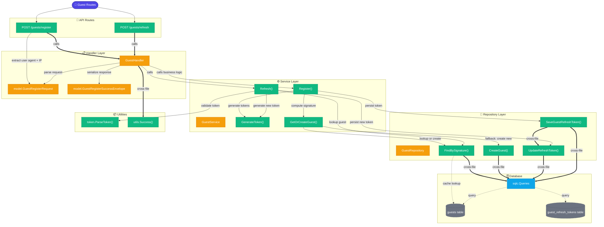

# Graph: Guest Feature Call Flow
_Generated: 2026-03-25_
_Entry: internal/guest/handler/guest_handler.go_
_Depth: 3_

## Guest Feature Architecture
The Guest feature enables anonymous user access without email/password. Guests are identified by user agent and IP address, and receive JWT tokens for subsequent authenticated requests.

## Request Flow

### Guest Registration Flow
1. **HTTP Request** → `POST /guests/register`
2. **Handler** extracts `User-Agent` and client IP from request
3. **Service** → Compute signature from user agent + IP
4. **Repository** → Check if guest already exists via signature
   - If exists: return existing guest data
   - If not: create new guest record
5. **Service** → Generate JWT tokens (access + refresh)
6. **Repository** → Save guest refresh token
7. **Handler** → Return tokens in response

### Guest Token Refresh Flow
1. **HTTP Request** → `POST /guests/refresh` with refresh token
2. **Service** → Validate and parse refresh token
3. **Repository** → Lookup guest by ID from token claims
4. **Service** → Generate new JWT token pair
5. **Repository** → Update refresh token in database
6. **Handler** → Return new tokens

## Key Differences from User Feature

| Aspect | User | Guest |
|--------|------|-------|
| **Identification** | Email/Password | User Agent + IP Signature |
| **Database Tables** | `users`, `refresh_tokens` | `guests`, `guest_refresh_tokens` |
| **Signup** | Credential validation required | Anonymous, automatic on first request |
| **Persistence** | User records stored indefinitely | Guest records based on signature |
