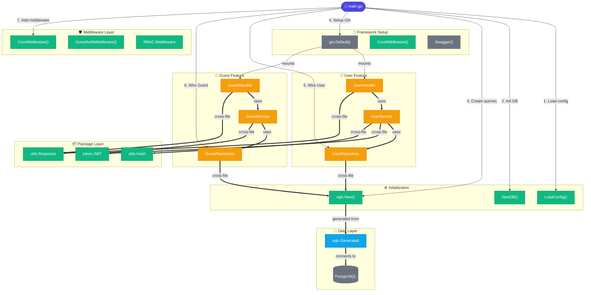

# Graph: Full Backend Architecture Overview
_Generated: 2026-03-25_
_Entry: cmd/server/main.go_
_Depth: 4_

## Architecture Overview
This Go backend uses a layered architecture with clear separation of concerns. The application follows a modular pattern with User and Guest features operating independently through their own handler → service → repository stacks.

## Key Observations

- **Layered Architecture**: Each feature (User, Guest) follows Handler → Service → Repository layers
- **Cross-file Dependencies**: Services and handlers depend on utilities in `pkg/` (jwt, hash, response)
- **Database Abstraction**: Using sqlc for type-safe database queries
- **Middleware Pipeline**: CORS and authentication middleware applied at Gin level
- **Framework**: Gin web framework for HTTP routing
