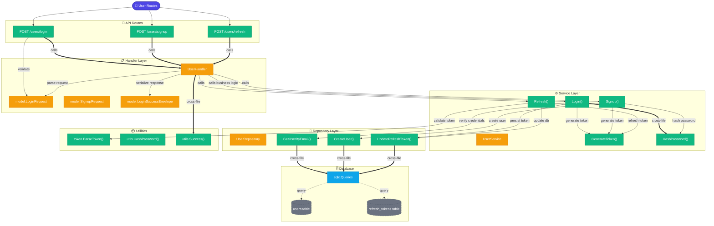

# Graph: User Feature Call Flow
_Generated: 2026-03-25_
_Entry: internal/user/handler/user_handler.go_
_Depth: 3_

## User Feature Architecture
The User feature handles authentication (login, signup) and token refresh. It follows a clean three-tier pattern with request validation, business logic, and data persistence.

## Request Flow

### Login Flow
1. **HTTP Request** → `POST /users/login` with email & password
2. **Handler** validates request model
3. **Service** → `GetUserByEmail()` from repository
4. **Service** → Hash incoming password and compare
5. **Service** → Generate JWT tokens
6. **Handler** → Return tokens in response

### Signup Flow
1. **HTTP Request** → `POST /users/signup`
2. **Service** → Hash password via `HashPassword()`
3. **Service** → `CreateUser()` in database
4. **Service** → Generate JWT tokens
5. **Handler** → Return tokens

### Refresh Flow
1. **HTTP Request** → `POST /users/refresh` with refresh token
2. **Service** → Validate and parse token
3. **Service** → Generate new JWT pair
4. **Repository** → Update refresh token in database
5. **Handler** → Return new tokens
