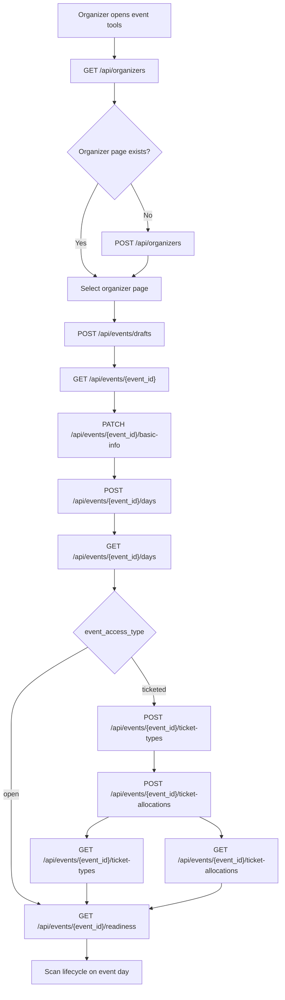

# Phase 1 Organizer Frontend and Backend Flow

_Generated: 2026-04-06_  
_Scope: Current Phase 1 + Phase 1B backend implementation only_

## Purpose

This document explains how an organizer currently interacts with the frontend during Phase 1, which backend routes are involved at each step, what those routes do, and what is intentionally out of scope for this phase.

The goal is to describe the **real implemented flow**, not the ideal future-state flow. Where the current implementation has an intentional limitation or a future-phase gap, that is called out explicitly.

## Phase Scope

Phase 1 currently covers:
- organizer page creation, listing, and patching
- draft event creation
- event basic info editing
- event day creation, listing, patching, and deletion
- ticket type creation and listing
- ticket allocation creation and listing
- readiness summary
- scan lifecycle control per event day

Phase 1 does **not** cover:
- media uploads
- public event page rendering
- publish / unpublish
- payments, orders, coupons
- RSVP / registration flows for open events
- live scan ingestion logic

## High-Level Flow



## Route Inventory

### Organizer routes

| Method | Route | Purpose |
|---|---|---|
| `GET` | `/api/organizers` | List organizer pages owned by the current user |
| `POST` | `/api/organizers` | Create an organizer page |
| `PATCH` | `/api/organizers/{organizer_id}` | Progressively patch organizer page fields |
| `GET` | `/api/organizers/{organizer_id}/events` | List events under an organizer page, optionally filtered by status |

### Event routes

| Method | Route | Purpose |
|---|---|---|
| `POST` | `/api/events/drafts` | Create a new draft event shell |
| `GET` | `/api/events/{event_id}` | Fetch the draft event shell |
| `PATCH` | `/api/events/{event_id}/basic-info` | Progressively patch event basic info |
| `GET` | `/api/events/{event_id}/readiness` | Return section completion and blocking issues |
| `POST` | `/api/events/{event_id}/days` | Create an event day |
| `GET` | `/api/events/{event_id}/days` | List event days |
| `PATCH` | `/api/events/days/{event_day_id}` | Progressively patch a single event day |
| `DELETE` | `/api/events/days/{event_day_id}` | Delete an event day |
| `POST` | `/api/events/days/{event_day_id}/start-scan` | Mark scan lifecycle as active |
| `POST` | `/api/events/days/{event_day_id}/pause-scan` | Pause scanning |
| `POST` | `/api/events/days/{event_day_id}/resume-scan` | Resume scanning |
| `POST` | `/api/events/days/{event_day_id}/end-scan` | End scanning permanently |

### Ticketing routes

| Method | Route | Purpose |
|---|---|---|
| `GET` | `/api/events/{event_id}/ticket-types` | List ticket types for an event |
| `POST` | `/api/events/{event_id}/ticket-types` | Create a ticket type |
| `GET` | `/api/events/{event_id}/ticket-allocations` | List ticket allocations for an event |
| `POST` | `/api/events/{event_id}/ticket-allocations` | Allocate a ticket type to a day and generate tickets |

## Organizer Journey

### 1. Organizer enters event creation

**Frontend behavior**

When the organizer clicks `Create Event`, the frontend should first determine which organizer pages the user already owns.

**Route used**

```http
GET /api/organizers
```

**What the backend does**

- reads the current authenticated user from `request.state.user.id`
- returns only organizer pages owned by that user
- orders them by `created_at DESC`

**Frontend decisions**

- if zero organizer pages are returned: frontend should force organizer creation first
- if one organizer page is returned: frontend can preselect it
- if multiple organizer pages are returned: frontend should show a picker

### 2. Organizer creates an organizer page if needed

**Frontend behavior**

The organizer fills brand or profile information such as name, slug, bio, visibility, and optional profile links.

**Route used**

```http
POST /api/organizers
Content-Type: application/json
```

Example request:

```json
{
  "name": "Ahmedabad Talks",
  "slug": "Ahmedabad Talks",
  "bio": "Community events in Ahmedabad",
  "logoUrl": "https://cdn.example.com/logo.png",
  "coverImageUrl": "https://cdn.example.com/cover.png",
  "websiteUrl": "https://example.com",
  "instagramUrl": "https://instagram.com/ahmedabadtalks",
  "facebookUrl": null,
  "youtubeUrl": null,
  "visibility": "public"
}
```

**What the backend does**

- normalizes the slug to lowercase kebab-case
- verifies slug uniqueness across organizer pages
- persists all currently supported organizer profile fields
- stores `owner_user_id` from the current authenticated user
- sets `status = active`

**What the response gives back**

- organizer page id
- normalized slug
- persisted profile data

### 3. Organizer can later edit organizer page fields progressively

**Frontend behavior**

The organizer can patch one field at a time, for example only the bio, only the logo, or only visibility.

**Route used**

```http
PATCH /api/organizers/{organizer_id}
Content-Type: application/json
```

Example request:

```json
{
  "bio": "Updated community bio"
}
```

**What the backend does**

- fetches the organizer page by `organizer_id` under the current owner scope
- updates only the explicitly provided fields
- keeps omitted fields untouched
- if `slug` is provided, normalizes it and rechecks uniqueness

**Important current behavior**

This route now supports true field-level progressive patching. The backend uses `exclude_unset=True`, so sending only one field does not overwrite the others with `null`.

### 4. Organizer creates the draft event shell

**Frontend behavior**

After an organizer page is chosen, the frontend creates a draft event immediately. The user is then redirected to the event editor.

**Route used**

```http
POST /api/events/drafts
Content-Type: application/json
```

Example request:

```json
{
  "organizerPageId": "uuid"
}
```

**What the backend does**

- verifies that the organizer page belongs to the current user
- creates a minimal `EventModel`
- sets:
  - `status = draft`
  - `organizer_page_id`
  - `created_by_user_id`
  - `event_access_type = ticketed` by default
  - `setup_status = {}`
- leaves progressive fields nullable:
  - `title`
  - `slug`
  - `description`
  - `event_type`
  - `location_mode`
  - `timezone`
  - `start_date`
  - `end_date`

**Why this matters**

This is the core of the draft-first UX. The event can exist before the organizer has entered the rest of the event information.

### 5. Frontend opens the draft event editor

**Frontend behavior**

Once the draft exists, the event editor screen needs the event shell and the supporting sections.

**Routes used**

```http
GET /api/events/{event_id}
GET /api/events/{event_id}/days
GET /api/events/{event_id}/ticket-types
GET /api/events/{event_id}/ticket-allocations
```

**What the backend does**

`GET /api/events/{event_id}`:
- returns the event shell
- enforces owner scope through organizer ownership
- includes `setup_status`

`GET /api/events/{event_id}/days`:
- lists event days ordered by `day_index`

`GET /api/events/{event_id}/ticket-types`:
- lists ticket types for the event

`GET /api/events/{event_id}/ticket-allocations`:
- lists allocations by joining ticket allocations to ticket types under the same event

**Important current behavior**

The event editor is not loaded through one giant bootstrap route. The frontend should compose the editor state from the event shell plus the day and ticketing list routes.

### 6. Organizer updates event basic info

**Frontend behavior**

The organizer fills fields such as:
- title
- description
- event type
- event access type (`open` or `ticketed`)
- location mode (`venue`, `online`, `recorded`, `hybrid`)
- timezone

The frontend can patch this section progressively, one field at a time.

**Route used**

```http
PATCH /api/events/{event_id}/basic-info
Content-Type: application/json
```

Example requests:

```json
{
  "title": "Ahmedabad Startup Meetup"
}
```

```json
{
  "timezone": "Asia/Kolkata"
}
```

```json
{
  "eventAccessType": "open",
  "locationMode": "venue"
}
```

**What the backend does**

- fetches the event under owner scope
- applies only the explicitly provided fields
- does not overwrite omitted fields
- recomputes `setup_status`

**Current `setup_status` rules**

`basic_info = true` when all of these are present:
- `title`
- `event_access_type`
- `location_mode`
- `timezone`

`tickets = true` when:
- `event_access_type == "open"`, or
- the event has ticket types and allocations

**Important current behavior**

The organizer is allowed to change the event from `ticketed` to `open` in this section. That choice affects ticketing requirements and readiness behavior.

### 7. Organizer adds event days

**Frontend behavior**

The organizer can add one or more event days. Each day currently supports:
- `day_index`
- `date`
- `start_time`
- `end_time`

**Route used**

```http
POST /api/events/{event_id}/days
Content-Type: application/json
```

Example request:

```json
{
  "dayIndex": 1,
  "date": "2026-04-20",
  "startTime": "2026-04-20T18:00:00",
  "endTime": "2026-04-20T21:00:00"
}
```

**What the backend does**

- verifies that the event belongs to the current organizer owner
- creates an `EventDayModel`
- initializes:
  - `scan_status = not_started`
  - `next_ticket_index = 1`
- refreshes `setup_status`

**Schedule completion rule**

`schedule = true` when the event has at least one event day.

### 8. Organizer can progressively patch event days

**Frontend behavior**

The organizer can update a single field on a day, such as only the start time, without resending the whole day object.

**Route used**

```http
PATCH /api/events/days/{event_day_id}
Content-Type: application/json
```

Example request:

```json
{
  "startTime": "2026-04-20T19:00:00"
}
```

**What the backend does**

- fetches the day under owner scope
- updates only the explicitly provided fields
- preserves omitted fields such as `date`, `end_time`, and `day_index`

### 9. Organizer can remove an event day

**Frontend behavior**

The organizer deletes a day from the draft schedule.

**Route used**

```http
DELETE /api/events/days/{event_day_id}
```

**What the backend does**

- fetches the day under owner scope
- deletes it
- refetches the parent event
- refreshes `setup_status.schedule`

### 10. Organizer chooses access behavior

The event’s access behavior is controlled by the `eventAccessType` field in the basic info patch route.

**Case A: open**

The organizer is saying:
- this event does not require ticketing

Backend effect:
- readiness treats tickets as complete
- ticket creation and ticket allocation should not be used

**Case B: ticketed**

The organizer is saying:
- this event requires ticket setup

Backend effect:
- ticketing routes are available
- readiness expects ticket setup to exist

### 11. Organizer creates ticket types

**Frontend behavior**

For a `ticketed` event, the organizer defines ticket types such as `General`, `VIP`, or `Early Bird`.

**Route used**

```http
POST /api/events/{event_id}/ticket-types
Content-Type: application/json
```

Example request:

```json
{
  "name": "General",
  "category": "PUBLIC",
  "price": 0,
  "currency": "INR"
}
```

**What the backend does**

- verifies owner access through the event
- verifies `event_access_type == "ticketed"`
- creates the ticket type
- does **not** generate concrete tickets yet

**Helpful read route**

```http
GET /api/events/{event_id}/ticket-types
```

This route lets the editor reopen and display the currently configured ticket types.

### 12. Organizer allocates ticket types to event days

**Frontend behavior**

The organizer chooses:
- a ticket type
- an event day
- a quantity

**Route used**

```http
POST /api/events/{event_id}/ticket-allocations
Content-Type: application/json
```

Example request:

```json
{
  "eventDayId": "uuid",
  "ticketTypeId": "uuid",
  "quantity": 100
}
```

**What the backend does**

- verifies owner access through the event
- verifies the event is `ticketed`
- fetches the ticket type under the same event
- fetches the event day under the same owner
- creates a `day_ticket_allocation`
- generates `quantity` concrete `tickets`
- starts ticket numbering from `event_day.next_ticket_index`
- increments `next_ticket_index`

**Helpful read route**

```http
GET /api/events/{event_id}/ticket-allocations
```

This route lets the editor reopen and display which ticket types are already allocated to which days.

### 13. Organizer checks readiness

**Frontend behavior**

At any point, the frontend can ask the backend which setup sections are complete and what is still missing.

**Route used**

```http
GET /api/events/{event_id}/readiness
```

**What the backend does**

- reads the current `setup_status`
- returns:
  - `completed_sections`
  - `missing_sections`
  - `blocking_issues`

**Current readiness sections**

- `basic_info`
- `schedule`
- `tickets`

**Current readiness messages**

- if basic info is incomplete: `Complete basic event information`
- if schedule is incomplete: `Add at least one event day`
- if tickets are incomplete for a ticketed event: `Add ticket types and allocations or switch event to open`

### 14. Organizer leaves and returns later

**Frontend behavior**

The organizer leaves the event editor and later wants to continue the same draft.

**Routes used**

```http
GET /api/organizers
GET /api/organizers/{organizer_id}/events?status=draft
GET /api/events/{event_id}
GET /api/events/{event_id}/days
GET /api/events/{event_id}/ticket-types
GET /api/events/{event_id}/ticket-allocations
GET /api/events/{event_id}/readiness
```

**What the backend does**

- lists drafts under the selected organizer page
- returns the event shell
- returns day and ticketing detail through separate section routes
- returns completion state so the frontend can resume from where the organizer stopped

## Scan Lifecycle on Event Day

Once the event is actually happening, the organizer controls scan status per `event_day`.

### Start scan

```http
POST /api/events/days/{event_day_id}/start-scan
```

Backend behavior:
- owner-scoped day fetch
- rejects only if the day is already `ended`
- sets `scan_status = active`
- sets `scan_started_at` the first time scanning is started

### Pause scan

```http
POST /api/events/days/{event_day_id}/pause-scan
```

Backend behavior:
- owner-scoped day fetch
- requires current status `active`
- sets `scan_status = paused`
- sets `scan_paused_at`

### Resume scan

```http
POST /api/events/days/{event_day_id}/resume-scan
```

Backend behavior:
- owner-scoped day fetch
- requires current status `paused`
- sets `scan_status = active`

### End scan

```http
POST /api/events/days/{event_day_id}/end-scan
```

Backend behavior:
- owner-scoped day fetch
- rejects if already `ended`
- sets `scan_status = ended`
- sets `scan_ended_at`

## Current Setup Progress Rules

The backend currently recomputes `setup_status` from actual event data rather than tracking “which screen was visited.”

Current rules:

```json
{
  "basic_info": true,
  "schedule": false,
  "tickets": false
}
```

How each field is derived:

- `basic_info`
  - true when `title`, `event_access_type`, `location_mode`, and `timezone` are all present
- `schedule`
  - true when at least one event day exists
- `tickets`
  - true when the event is `open`
  - or when the event has at least one ticket type and at least one allocation

## Important Current Behaviors and Limits

### The frontend should compose the editor state from multiple routes

`GET /api/events/{event_id}` returns only the event shell. It does not embed event days, ticket types, or ticket allocations. The frontend should fetch those sections separately.

### Progressive patching is currently supported in these three editable sections

- organizer page
- event basic info
- event days

This means the frontend can save one field at a time for those sections.

### Publishing is intentionally not part of this phase

There is no publish route in the current implementation. Phase 1 stops at draft creation, editing, readiness, and event-day scan control.

### Media and public event page are not yet part of the implemented flow

The frontend should not expect:
- banner upload
- gallery management
- public event page assembly
- FAQ management

Those are later-phase concerns.

## Recommended Frontend Call Order

If the frontend wants to follow the current backend cleanly, the practical order is:

1. `GET /api/organizers`
2. `POST /api/organizers` if the user has none
3. `POST /api/events/drafts`
4. `GET /api/events/{event_id}`
5. `PATCH /api/events/{event_id}/basic-info`
6. `POST /api/events/{event_id}/days`
7. `GET /api/events/{event_id}/days`
8. `POST /api/events/{event_id}/ticket-types` if the event is ticketed
9. `POST /api/events/{event_id}/ticket-allocations` if the event is ticketed
10. `GET /api/events/{event_id}/ticket-types`
11. `GET /api/events/{event_id}/ticket-allocations`
12. `GET /api/events/{event_id}/readiness`
13. use scan lifecycle routes on the actual event day

## Summary

Phase 1 currently gives the organizer a draft-first workflow:

- choose or create organizer page
- create a draft event shell immediately
- progressively fill event basics
- add and edit event days
- configure ticketing only when the event is ticketed
- inspect completion through readiness
- control scan status per event day

The backend is intentionally split into small, saveable actions so the frontend can support a progressive editor instead of a single giant form.
